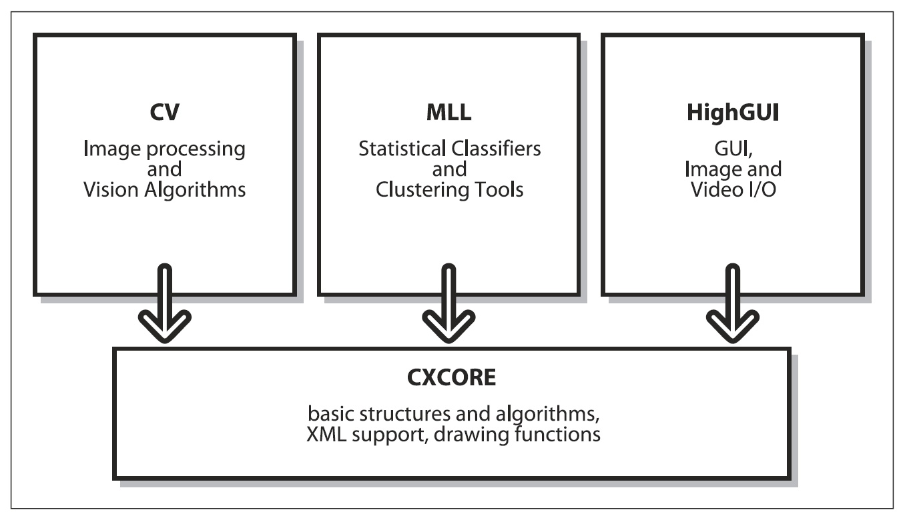

## (П]|[РС]|(РП) Структура и содержимое OpenCV

OpenCV структурирован по пяти основным компонентам, четыре из которых показаны на рисунке 1-5. Компонент CV содержит основные алгоритмы обработки изображений и высокоуровневые алгоритмы компьютерного зрения; ML - библиотеку машинного обучения, которая включает в себя средства статистической классификации и кластеризации. HighGUI содержит процедуры и функции ввода/вывода для хранения и загрузки видео и изображений. CXCore содержит основные структуры данных.

Рисунок 1-5. Базовая структура OpenCV

Рисунок 1-5 не включает CvAux, который содержит (!)несуществующие области(!) (встроенный СММ распознавания лиц), экспериментальные алгоритмы (background/foreground сегментация). CvAux не в должной мере задокументирован в Wiki и вовсе отсутствует в .../opencv/docs. CvAux содержит:

* Eigen objects, a computationally efficient recognition technique that is, in essence, a template matching procedure
* 1D и 2D скрытая марковская модель, техника статистического распознавания с использованием метода динамического программирования
* Встроенная СММ (the observations of a parent HMM are themselves HMMs)
* Распознавание жестов благодаря стерео зрению
* Расширенная триангуляция Delaunay, последовательности и т.д.
* Стерео зрение
* Форма соответствия в области контура
* Дескриптор текстур
* Слежение за глазами и ртом
* 3D tracking
* Поиск скелета (центральных линий) объектов сцены
* Искривление промежуточного обзора между двумя камерами
* Background-foreground сегментация
* Видеонаблюдение (см. Wiki FAQ для получения дополнительной информации)
* Калибровка камеры классами C++ (функции C и "движок" CV)

Некоторые из этих функций могут в дальнейшем мигрировать в CV; иные, возможно, никогда.
