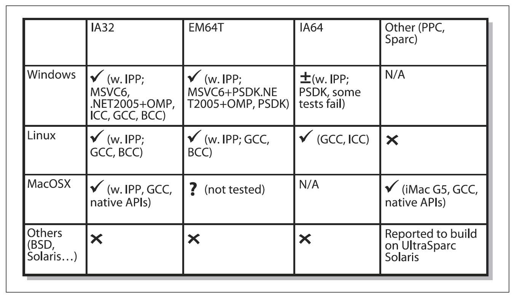

## [П]|[РС]|(РП) Переносимость

OpenCV разрабатывалась как портативная. Изначально была написана при помощи Borland C++, MSVC++, и Intel compilers. Это означало, что C и C++ код должен быть довольно стандартным для того, чтобы кроссплатформенная поддержка была легче. На Рисунке 1-6 изображены платформы, на которых OpenCV работает. Начиналось все с поддержки 32-битной архитектуры Intel (IA32) в Windows, затем на Linux с такой же архитектурой. Поддержка Mac OS X началась после того, как Apple начал использовать процессоры Intel. (Поддержка OS X не столь качественная, как у Windows или Linux, но данная ситуация резко меняется). Затем появилась поддержка 64-битной архитектуры Intel (IA64). Для Sun и других операционных систем поддержка на низком уровне.

Если архитектура или ОС отсутствуют на рисунке 1-6, это не означает, что они не поддерживают OpenCV. OpenCV была парирована почти на все коммерческие системы, включая PowerPC Macs собаки-робота. OpenCV также работает на процессорах AMD и к тому же доступна IPP для оптимизации производительности. Для этого в процессорах AMD задействуется мультимедийное расширение (MMX).

Рисунок 1-6. Руководство по OpenCV для версии 1.0: слева ОС, сверху тип архитектуры
