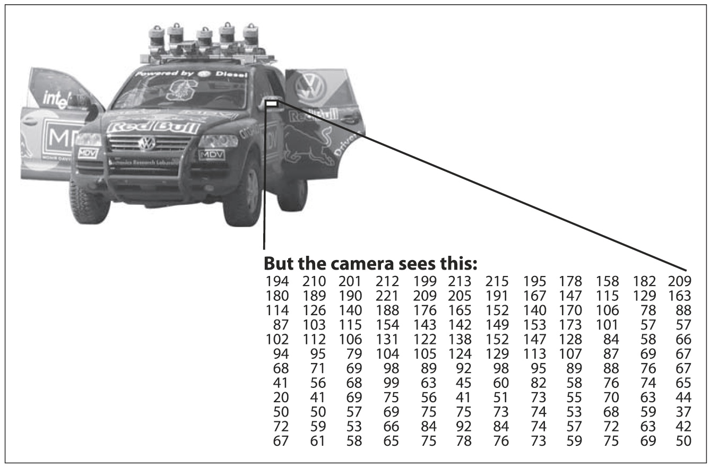

## Что такое компьютерное зрение

Компьютерное зрение - процесс преобразования данных, полученных с фотоаппаратов и видеокамер, в новое представление. Все эти преобразования делаются для достижения какой-то конкретной цели. Входные данные могут содержать некоторую контекстную информацию, такую как "камера установлена в машине" или "лазерный дальнометр определил объект в радиусе 1 метра". Решением может быть "есть человек в этой сцене" или "есть 14 опухолевых клеток на снимке". Новое представление может означать превращение цветного изображения в черно-белое или устранение движения камеры из последовательности изображений.

Не стоит себя обманывать и думать что задачи компьютерного зрения такие уж и легкие. Как труден может быть поиск, скажем, автомобиля, когда имеется только его образ? Ваша интуиция может быть весьма обманчивой. Человеческий мозг делит сигнал поступивший от зрения на множество каналов, которые впоследствии передают различные виды информации в ваш мозг. Ваш мозг устроен таким образом, что ваше внимание концентрируется только на важных участках изображения, исключая при этом остальные. Существует масса ответных сигналов, перемещающиеся в зрительном канале, которые пока плохо изучены. Сигналы поступают на ассоциативные входы, пришедшие от датчиков контроля мышц и всех других чувств, которые позволяют мозгу опираться на перекрестные ассоциации, накопленные за годы прожитых лет. За счет обратной связи в мозгу, процесс повторяется вновь и вновь и включает в себя датчик (глаз), который механически управляет освещением с помощью радужной оболочки и настаивает прием на поверхности сетчатки.

Однако, в системе машинного зрения все что получает компьютер это сетку с числами от камеры или с диска. По большей части, нет не встроенного распознавания образов, не автоматического управления фокусом и диафрагмой, не перекрестных ассоциаций с многолетним опытом работы. По большей части, системы компьютерного зрения все еще довольно наивны. На рисуноке 1-1 изображен автомобиль. На этом рисунке мы видим боковое зеркало со стороны водителя. Компьютер же "видет" только сетку с числами. Любой номер из этой сетки имеет довольно таки большую шумовую состовляющую и само по себе дает нам мало информации, однако, эта сетка чисел все что "видет компьютер. Наша задача сводиться к преобразованию сетки чисел к виду: "боковое зеркало". Рисунок 1-2 дает нам чуть больше представления о том, почему компьютерное зрение это так трудно.

Рисунок 1-1. Компьютер видит боковое зеркало авто просто как сетку чисел