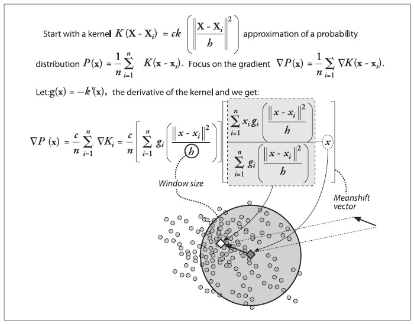
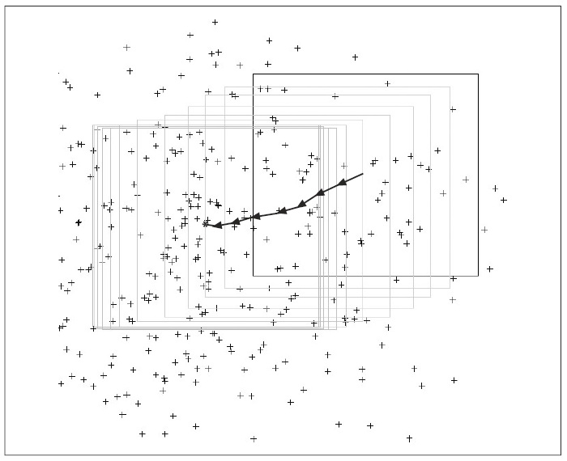

## (П]|(РС)|(РП) Mean-Shift и Camshift слежение

mode - мода (статистика), произвести замену при редактировании

В данном разделе будет рассмотрено два метода: *mean-shift* и *camfhift* (где "camfhift" означает "непрерывно адаптирующийся mean-shift"). Первый является обобщенным методом анализа данных (обсуждался в главе 9, в контексте сегментации). После введения в общую теорию метода, будет рассмотрено, как OpenCV применяет его для отслеживания на изображениях. Второй метод построен на первом методе и обеспечивает слежение за объектами, чей размер может изменяться в течение всей видео последовательности.

### Mean-Shift

Алгоритм mean-shift – это надежный метод нахождения локальных экстремумов в плотном распределении набора данных. Это простой процесс непрерывного распределения; в данном контексте это по существу просто *алгоритм поиска восхождением к вершине* применяемый к плотной гистограмме данных (слово "по существу" используется из-за наличия аспекта, зависящего от масштаба, а точнее: mean-shift эквивалентен применению свертки ядра mean-shift к непрерывному распределению c последующим применением алгоритма поиска восхождением к вершине). Однако, для дискретного набора данных это несколько менее тривиальная проблема.

Дескриптор "надежный" используется в своем формальном статистическом смысле: то есть, mean-shift игнорирует излишки данных. Это означает, что игнорируются точки данных, которые находятся далеко от пиков данных. Это происходит за счет обработки точек только локального окна данных, в котором производится вся работа.

Алгоритм mean-shift работает следующим образом:

1. Выбирается окно поиска:

    * его первоначальное расположение;

    * его тип (равномерное, полиномиальное, экспоненциальное или гауссово);

    * его форма (симметричное или ассиметричное, возможно повернутое, округлое или прямоугольное);

    * его размер (степень, при которой происходит сворачивание или отсечение).

2. Вычисляется центр масс окна (возможно взвешенного).

3. Совмещается центр окна с центром масс.

4. Возвращаться к шагу 2 до тех пор, пока окно не остановится (это происходит всегда). (Количество итераций обычно ограничено каким-то максимальным числом или каким-то эпсилон изменения сдвигаемого центра между итерациями; однако, количество, в конечном счете, гарантированно достигнет установленного значения).

Немного более формальный смысл алгоритма mean-shift: алгоритм связан с оценкой плотности ядра, где "ядро" это функция, имеющая в основном местный фокус (например, распределение Гаусса). С довольно средневзвешенными и отсортированными по величине расположения точек ядрами, можно представить распределение данных исключительно в терминах этих ядер. Mean-shift расходиться с оценкой плотности ядра, т.к. стремится оценить только градиент (направление изменений) распределения данных. Когда это изменение равное 0, то имеем стабильный (возможно локальный) максимум распределения. Около этого максимума могут быть и другие.

На рисунке 10-11 показаны уравнения, задействованные в алгоритме mean-shift. Эти уравнения могут быть упрощены, если ядро будет *прямоугольное*; благодаря данному факту сокращается векторное уравнение mean-shift, вычисляемое центр масс распределения пикселей изображения:


где нулевой момент вычисляется по следующей формуле:


а первые моменты:

 



Рисунок 10-11. Уравнения mean-shift и их смысл

Вектор mean-shift говорит о центрировании окна mean-shift в соответствии с рассчитанным центром масс этого окна. Перемещение окна изменяет все то, что находиться "под" ним, именно поэтому процесс центрирования итерационный. Такое центрирование всегда будет обеспечивать сходимость вектора mean-shift в 0 (т.е. когда центрирование более не возможно). Расположение сходимости является локальным максимумом распределения под окном. Различные размеры окна порождают различные пики, т.к. "пик" зависит от масштаба.

На рисунке 10-12 представлен пример двумерного распределения данных и инициализация (в данном случае прямоугольного) окна. Стрелки показывают процесс сходимости распределения (пик) в автономном режиме. Найденный пик статистически надежен в том смысле, что точки вне окна mean-shift не влияют на сходимость – алгоритм просто не "отвлекается" на далекие точки.



Рисунок 10-12. Алгоритм mean-shift в действии: исходное окно находиться над двумерным массивом точек и последовательно центрирует его распределение данных до сходимости

В 1998 году стало ясно, что этот алгоритм может быть использован для отслеживания движущихся объектов в видеопотоке; с тех пор алгоритм был значительно расширен. Функция OpenCV, представляющая алгоритм mean-shift, реализована в контексте анализа изображения. Это, в частности, означает, что вместо некоторого произвольного набора точек (возможно, с какой-то произвольной размерностью), в OpenCV реализован mean-shift, ожидающий в исходное изображение, представляющее плотное распределение для анализа. Это может быть представлено, как некое изображение двумерной гистограммы измерения плотности точек в некотором двумерном пространстве. Как оказалось, в рамках компьютерного зрения, это именно то, что необходимо делать большую часть времени: а именно то, как отслеживать движения кластера с интересными особенностями.

```cpp
	int cvMeanShift(
		 const CvArr* 		prob_image
		,CvRect 			window
		,CvTermCriteria 	criteria
		,CvConnectedComp* 	comp
	);
```

Параметр *prob_image*, представляющий из себя плотное распределение возможных локаций, может быть только одноканальным, но любого типа (*byte* или *float*) изображением. *window* задает начальное расположение и размер ядра окна. Критерий прекращения *criteria* был уже описан ранее и в основном содержит максимально доступное число итераций передвижения mean-shift и минимальные передвижения для которых рассчитывается расположение окна для выполнения условия сходимости. (Опять же, сходимоть наступает всегда, однако, сам процесс может быть очень медленным вблизи локального максимума распределения, если распределение является "плоским"). Связанная компонента *comp* содержит условие сходимости в *comp->rect* и сумму всех пикселей под окном в *comp->area*.

Функция *cvMeanShift()* является одним из вариантов реализации алгоритма mean-shift с прямоугольным окном, но она так же может быть использована для слежения. В этом случае, для начала необходимо составить распределение особенностей предоставленного объекта (например, цвет + текстура), затем запустить окно mean-shift над этим распределением и в заключении произвести вычисления в следующем кадре видеопотока с использованием составленного распределения. Начиная от текущего расположения окна, алгоритм mean-shift ищет новый максимум или моду распределения особенностей, которое (по-видимому) сосредоточено на объекте, производящий цвет и текстуру в первоначальном месте. Таким образом, окно mean-shift отслеживает движения объекта кадр за кадром.

### Camshift

Отличие camshift от mean-shift заключается в том, что окно поиска первого приспасабливатся к изменениям размера. Если имеется хорошо сегментированное распределение (например, особенностей лица), то данный алгоритм автоматически подстаивается под размеры лица, в зависимости от приближения или отдаления человека от камеры. Функция, реализующая данный алгоритм, выглядит следующим образом:

```cpp
	int cvCamShift(
		 const CvArr* 		prob_image
		,CvRect 			window
		,CvTermCriteria 	criteria
		,CvConnectedComp* 	comp
		,CvBox2D* 			box = NULL
	);
```

Первые четыре параметра аналогичны параметрам функции *cvMeanShift()*. Параметр *box*, если он задан, содержит недавно измененный размер окна и который также включает в себя ориентацию объекта, вычисленное при помощи моментов второго порядка. Приложения, занимающиеся слежением, будут использовать найденное измененное окно на предыдущем кадре в следующем кадре. 

	Многие люди думают, что mean-shift и camshift осуществляют слежение за счет цветных особенностей, но это не совсем правда. Оба алгоритма слеживания могут использовать любого рода особенностей, указанных в *prob_image*; следовательно они являются очень легкими, прочными и эффективными.