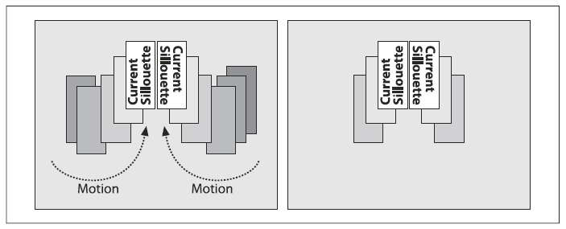

## (П]|(РС)|(РП) Шаблоны движения

Шаблоны движения были изобретены в MIT Media Lab Bobick и Davis и получили дальнейшее развитие совместно с одним из авторов: Davis, Bradski. Это довольно таки новая работа формирует основу реализации шаблонов движения в OpenCV.

Шаблоны движения являются эффективным способом отслеживания общих движений, особенно применимы при распознавании жестов. При использовании шаблонов движения необходимо наличие силуэта (или части силуэта) объекта. Силуэты объекта могут быть получены несколькими способами.

1. Простейший способ получения силуэтов объектов – это разумное использование стационарной камеры и последующего использования разностей между кадрами (как было описано в главе 9). Эти действия приводят к получению движущихся контуров объектов, которых вполне достаточно для производства работоспособных шаблонов движения.

2. Можно использовать цветные манипуляции. Например, при знании того, что фоном является все ярко зеленое, можно принять в качестве переднего плана все то, что не ярко зеленого цвета. 

3. Другой способ (также обсуждаемый в главе 9) заключается в изучении фоновой модели, благодаря которой можно выделить новые объекты/людей на переднем плане как силуэты.

4. Можно использовать активный метод определения силуэта – например, создавая стену вблизи инфракрасного света при наличии инфракрасной камеры смотрящей на эту стену. Любое попадание объекта в данное поле зрения будет отображаться как силуэт.

5. Можно использовать тепловизоры; то любой горячий объект (например, лицо) может быть рассмотрен как объект переднего плана.

6. И в заключение, можно использовать методы сегментации для создания силуэтов (например, пирамидальную или mean-shift сегментацию), описанные в главе 9.

Пусть имеется хорошо сегментированный силуэт лица в виде белого прямоугольника, рисунок 10-13(A). Белый цвет используется для указания того, что все пиксели имеют значения типа float в самый последний момент времени. Движение прямоугольника свидетельствует о захвате нового силуэта и перекрытии им (новым) предыдущего в текущий момент времени; новый силуэт соответствует белому прямоугольнику на рисунке 10-13(B) и рисунке 10-14(C). Старые перемещения показаны на рисунке 10-13 последовательно затемненные прямоугольники. Эти последовательно исчезающие силуэты фиксируются в истории, именуемая  "изображением истории перемещений", как предыдущие перемещения.


Рисунок 10-13. Диаграмма шаблона движения: (A) сегментированный объект в текущий момент времени (белый); (B) следующий временной шаг, объект переместился и был зафиксирован новый силуэт, старый отошел на задний план; (C) следующий временной шаг, объект вновь переместился, оставив старые сегменты позади в виде последовательности темных прямоугольников, тем самым сформировав изображении истории перемещений

Силуэты, временные отметки которых больше заданного значения устанавливаются в 0, рисунок 10-14. Функция, выполняющая шаблоны движения, выглядит следующим образом:

```cpp
void cvUpdateMotionHistory(
 const CvArr* silhouette
,CvArr* mhi
,double timestamp
,double duration
);
```



Рисунок 10-14. Шаблон движения силуэтов двух движущихся объектов (слева); силуэты, чьи временные отметки превышают заданного значения, устанавливаются в 0 (справа)

В *cvUpdateMotionHistory()* все массивы изображений содержат только одноканальные изображения.  *silhouette* - это изображение, в котором ненулевые пиксели представляют собой недавно сегментированные силуэты объектов переднего плана. Изображение *mhi* это вещественное изображение, которое представляет шаблон движения. Параметр *timestamp* - это текущая отметка времени (как правило, в миллисекундах), а так же продолжительность, на протяжении которой силуэт должен оставаться в *mhi*. Другими словами, любые пиксели *mhi* у которых временная отметка старше (меньше), чем *timestamp* минус *duration* устанавливаются в 0. 

После получения коллекции силуэтов объекта наложенных во времени, можно получить представлении о перемещении в целом, взяв градиент *mhi* изображения. После взятия этих градиентов (например, при помощи функций Scharr или Sobel, описанных в главе 6), некоторые градиенты будут большими и неработоспособными. Градиенты будут неработоспособными, когда старые или неактивные части изображения *mhi* будут установлены в 0, в результате чего будут получаться большие градиенты вокруг внешних границ силуэтов, рисунок 10-15(A). Поэтому, зная продолжительность временного шага, с которым заносятся новые силуэты в *mhi* через *cvUpdateMotionHistory()*, можно узнать насколько большим должен быть градиент. Таким образом, можно использовать данную величину градиента, что удалить градиенты, которые слишком велики, рисунок 10-15 (B). И в заключение, из коллекции можно выявить общее направление перемещения, рисунок 10-15(C). Все что показано на частях (A) и (B) изображения выполняет функция *cvCalcMotionGradient()*:

```cpp
void cvCalcMotionGradient(
 const CvArr* mhi
,CvArr* mask
,CvArr* orientation
,double delta1
,double delta2
,int aperture_size=3
);
```


Рисунок 10-15. Градиенты перемещения mhi изображения: (A) величины и направления градиентов; (B) устранение больших градиентов; (C) поиск общего направления движения

В *cvCalcMotionGradient()* все массивы изображения являются одноканальными. Входное изображение *mhi* является вещественным изображением истории перемещения, а входные переменные *delta1* и *delta2* являются (соответственно) минимальным и максимальным значениями градиента. Ожидаемая величина градиента – это среднее значение временной отметки между каждым силуэтом при последовательном вызове *cvUpdateMotionHistory()*; хорошие результаты можно получить при *delta1* установленного в (среднее значение)/2, а *delta2* в 3×(среднее значение)/2. Переменная *aperture_size* задает размер оператора градиента по ширине и высоте. Это значение может быть установлено в -1 (градиент 3×3, фильтр *CV_SCHARR*), 3 (по умолчанию фильтр Sobel 3×3), 5 (фильтр Sobel 5×5) или 7 (фильтр 7×7). Выходной параметр *mask* - это одноканальное 8-битное изображение, в котором ненулевые элементы указывают на валидные градиенты, *orientation* - это вещественное изображение, содержащие угол направления градиента в каждой точке.

Функция *cvCalcGlobalOrientation()* определяет общее направление движения как векторную сумму действующих направлений градиента.

```cpp
double cvCalcGlobalOrientation(
 const CvArr* orientation
,const CvArr* mask
,const CvArr* mhi
,double timestamp
,double duration
);
```

При использовании функции * cvCalcGlobalOrientation()*, в нее передаются вычисленные в * cvCalcMotionGradient()* *orientation* и * mask* вместе с *timestamp*, *duration* и конечным *mhi* из * cvUpdateMotionHistory()*; в результате будет возвращен суммарный вектор общего направления, рисунок 10-15(C). 