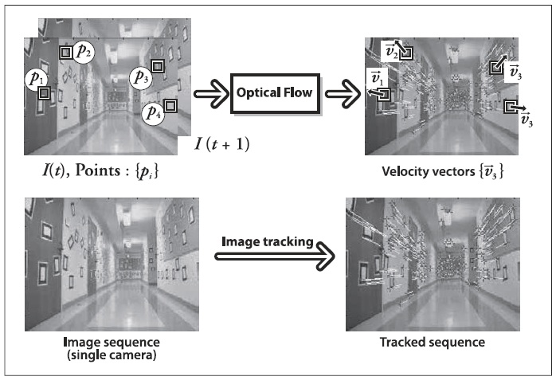
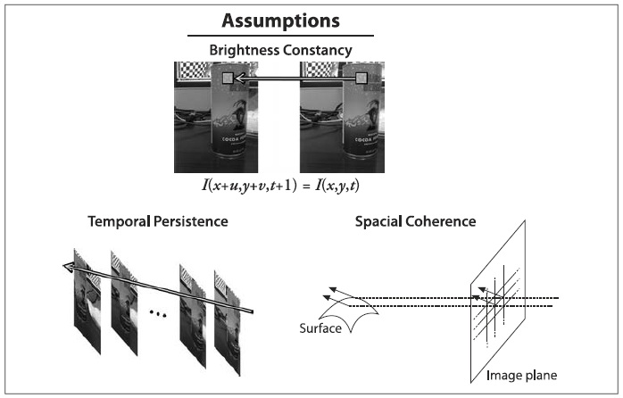
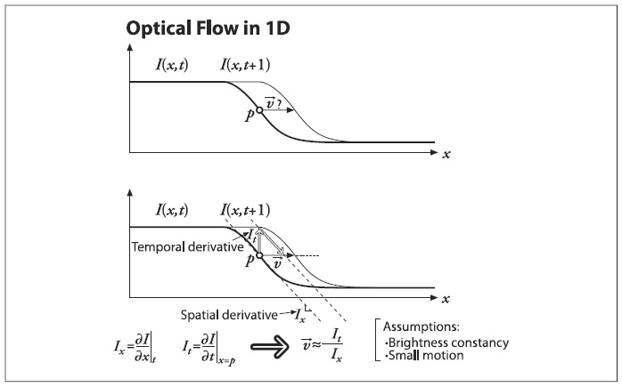
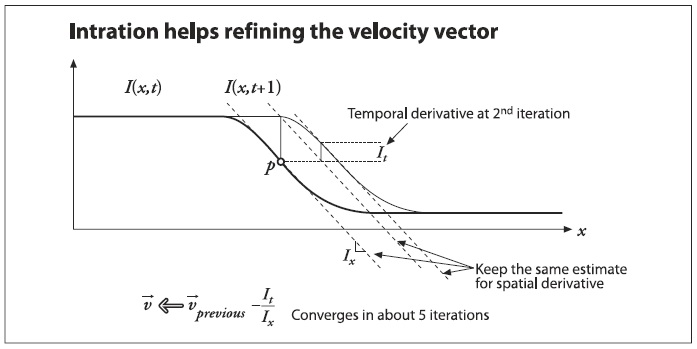
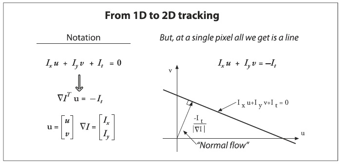
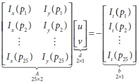
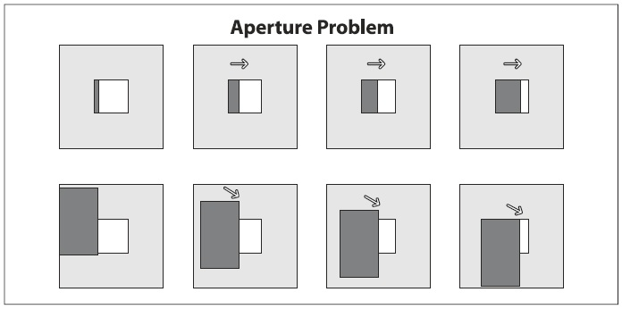

## (П]|(РС)|(РП) Оптические потоки

Ранее уже было сказано, что иногда возникает необходимость в оценке движений между двумя кадрами (или последовательностью кадров) без каких-либо других предварительно полученных знаний о содержании этих кадров. Как правило, само движение является знаком того, что происходит что-то интересное. Оптический поток представлен на рисунке 10-3.



Рисунок 10-3. Оптический поток: целевые особенности (сверху слева) отслеживаются в течение долгого времени, а их движения преобразуются в вектор скорости (сверху справа); на нижней панели представлен общий вид коридора (слева) и вектора потока (справа) того, как движется камера по коридору

Можно связать некую скорость каждого пикселя в кадре или, что эквивалентно, некоторое смещение, представляющее собой расстояние на которое сместиться пиксель при сравнении предыдущего и текущего кадра. Такая конструкция обычно именуется *плотным оптическим потоком*, который связывает скорость с каждым пикселем изображения. *Метод Horn-Schunck* пытается вычислять только скорости полей. Еще один, казалось бы, простой метод – просто пытается сопоставить окна вокруг каждого пикселя от кадра к кадру –  так же реализован в OpenCV; этот метод также известен как *блок сопоставления*. Оба представленных метода будут более детально представлены в разделе "Методы плотного слежения".

На практике рассчитать плотный оптический поток не так то и легко. Рассмотрим пример движения белого листа бумаги. Многие белые пиксели из предыдущего кадра остаются белыми и в последующем кадре. При этом изменениям могут быть подвержены лишь края и то только те, что перпендикулярны направлению движения. Как результат, плотные методы должны иметь в наличии некоторые методы интерполяции между точками, которые легче отследить для вычисления неоднозначных точек. Эти проблемы наиболее ярко проявляются в виде высоких вычислительных затратах плотного оптического потока.

Это порождает альтернативный вариант, *разряженный оптический поток*. Алгоритмы такого рода опираются на заранее заданное некоторым образом подмножество точек, которое подлежит отслеживанию. Если точки обладают заранее определенными подходящими свойствами, такими как ранее обсуждаемые "углы", то отслеживание будет относительно прочным и надежным. OpenCV может помочь при решении данного вопроса, путем предоставления процедур для выявления лучших возможностей отслеживания. На практике вычислительная стоимость от использования разряженного потока намного меньше, чем от использования плотного потока, поэтому интерес к последнему лишь академический. (Black и Anadan создали методы плотного оптического потока, которые зачастую используются при создании фильмов, в которых упор делается на получения качественной картинки. Эти методы планируется включить в более поздние версии OpenCV, глава 14).

В следующих нескольких разделах будет представлено несколько различных методов отслеживания. Вначале будет представлена наиболее популярная разряженная техники слежения, Lucas-Kanade (LK) оптический поток; этот метод также имеет вариант реализации для работы со снимками пирамид, позволяющие отслеживать быстрые движения. Затем будут представлены две плотные техники слежения, метод Horn-Schunck и метод сопоставления блоков.

### Метод Lucas-Kanade

Первоначально предполагалось (в 1981 году), что алгоритм Lucas-Kanade (LK) будет использоваться для создания плотных потоков. Но, т.к. метод было легко применить к подмножеству точек исходного изображения, он стал более важен для создания  разряженных потоков. Алгоритм LK может быть применен в контексте разряженного потока, т.к. опирается только на локальную информацию, которая является производной от некоторого небольшого окна, окружающего каждую точку, вызывающей интерес. Это главное отличие от алгоритма Horn и Schunck, где используется глобальная характеристика (подробнее об этом позже). Недостаток использования небольших локальных окон в методе Lukas-Kanade заключается в том, что большие сдвиги могут переместить точки вне локального окна, в результате чего невозможно будет осуществить поиск. Эта проблема привела к появлению "пирамидального" алгоритма LK, который начинает отслеживать от наивысшего (с низкой детализацией) к более низшему (с высокой детализацией) уровню пирамиды. Слежение при помощи пирамид позволяет поймать большие перемещения в пределах локального окна. 

Т.к. это важный и эффективный метод, то вначале будут представлены математические детали; читатели, которым данные детали не интересны, могут сразу перейти к описанию функий и разбору кода. Однако, рекомдуется все же изучить эти детали хотя бы для того, чтобы интуитивно понимать, что делать, если отслеживание работает плохо. 

**Принципы работы алгоритма Lucas-Kanade**

Основная идея алгоритма LK заключена в трех предположениях.

1. *Постоянство яркости*. Пиксель объекта на изображении не изменяется внешне (по возможности) при перемещении от кадра к кадру. Для серого изображения (LK так же можно применять и для цветного изображения) это предположение означает, что яркость пикселя не изменяется при слежении от кадра к кадру.

2. *Временное постоянство или "малые перемещения"*. Изменение движущейся поверхности патча изображения во времени происходит очень медленно. На практике это означает, что приращение времени достаточно велико относительно масштаба движения в изображении, то есть объект мало перемещается от кадра к кадру.

3. *Пространственная когерентность*. Соседние точки на сцене принадлежат одной поверхности, имеют аналогичные движения и проектируются к соседним точкам на плоскости изображения.

Представленные предположения, проиллюстрированые на рисунке 10-4, дают эффективный алготирм слежения. Первое требование, постоянство яркости, является требованием, которое свидетельствует о том, чтобы пиксели в одном отслеживаемом патче выглядели одинаково в течение долгого времени:




Рисунок 10-4. Предположения, составляющие основу оптического потока Lucas-Kanade: яркость патча, с отслеживаемым объектом в сцене, не меняется (сверху); перемещения медленные относительно частоты кадров (снизу слева); соседние точки остаются соседними (снизу справа)

Это достаточно просто и означает лишь то, что отслеживаемая интенсивность пикселя не изменяется в течение долгого времени:


Второе предположение, временное постоянство, по существу означает, что движения малы от кадра к кадру. Другими словами, можно рассматривать эти изменения как аппрокисмацию производной интенсивности по времени (т.е. изменения между текущим и следующим кадром малы). Для понимания данного предположения, рассмотрим случай с участием одной пространственной размерности.

В этом случае, все начинается с уравнения постоянства яркости с заменой яркости f(x, t) (принимая во внимание неявную зависимость x от t) на I(x(t), t) и последующим применением правила частичного дифференцирования. Все это даёт: 


где  пространственная производная первого изображения,  производная между изображениями на определенном промежутке времени и **v** скорось, которую необходимо найти. В результате получаем простое уравнение скорости оптического потока в простом одномерном случае:


Для начала необходимо разобраться с некоторыми интуитивными вещами одномерной задачи слежения. На рисунок 10-5 изображен "край" - состоящий из большого значения слева и малого значениях справа - движущиеся вправо вдоль оси x. Цель заключается в том, чтобы определить скорость **v** с которой перемещается край, что собственно изображено в верхней части рисунка 10-5. В нижней части рисунка показано, что измерение этой скорости это просто "прирост движения", где прирост это время, а движение это наклон (пространственная производная). Отрицательный знак корректирует наклон относительно x.

Рисунок 10-5 показывает еще один аспект формулировки оптического потока: ранее изложенные предположения, вероятно, не совсем верны. Т.е. яркость изображения не очень стабильна, а временные шаги (которые устанавливаются при помощи камеры) зачастую не столь быстры относительно движения, как хотелось бы. В результате получаемая скорость не точна. Тем не менее, если быть "достаточно близкими", то можно справиться с проблемой итерационно. Итерация показана на рисунке 10-6, где используется первоначальная (неточная) оценка скорости как отправная точка для последующих итераций с неоднократными повторами. Можно сохранить ту же пространственную производную по оси x, вычисленную в первом кадре, за счет предположения постоянства яркости – как результат, перемещение пикселей по оси x неизменно. Повторное использование уже вычисленной пространственной производной дает значительную вычислительную экономию. Производная по времени должна повторно вычисляться для каждой итерации и каждого кадра, однако, если быть достаточно близко к началу, то сходимость (почти точная) достигается в пять итераций. Данный подход более известен как *метод Ньютона*. Если первая оценка не была достаточно близка, то метод Ньютона будет давать неверный ответ.



Рисунок 10-5. Оптический поток Lucas-Kanade для одного измерения: можно оценить скорость движущегося края (сверху) путем измерения отношения производной по времени к производной пространственной интенсивности



Рисунок 10-6. Итерационное уточнение решения оптического потока (метод Ньютона): используя два изображения и одну и ту же пространственную производную (наклон) для них, ищется производная по времени; сходимость к устойчивому решению, как правило, происходит по истечению нескольких итераций

Рассмотрев решение для одного измерения, можно перейти к рассмотрению случая с двумя измерениями. На первый взгляд это может показаться просто: всего то нужно добавить координату y. Небольшие изменения в обозначении и связь компоненты y со скоростью v и компоненты x со скоростью u, получаем следующее уравнение:


К сожалению, это уравнение с двумя неизвестными для любого пикселя. Это означает, что использование измерений на уровне одного пикселя является недостаточным условием и потому не позволяет получить уникальное решение двумерного движения точки. В таком случае, решение возможно получить только для движущейся компоненты, которая перпендикулярна или "нормальна" к линии, описанной уравнением потока. На рисунке 10-7 представлены математические и геометрические детали.



Рисунок 10-7. Двумерный оптический поток одного пикселя: оптический поток одного пикселя не определён и может привести к большему перемещению, которое перпендикулярно ("нормально") к линии, описанной уравнением потока

Результаты нормального оптического потока от *проблемы отверстия*, возникающей при наличии небольшого отверстия или окна, в котором производятся измерения движения. Чаще всего при слежении за движениями в малом отверстии можно увидеть только края, а не углы. Однако наличие только края является недостаточным условием для точного определения того, как (т.е. в каком направлении) перемещается весь объект, рисунок 10-8.

И все же, как обойти проблему, при которой по одному пикселю невозможно определить все перемещение? Для решения проблемы необходимо обратиться к последнему предположению. Если локальный патч пикселей перемещается когерентно, то вполне легко можно рассчитать движение центрального пикселя при помощи окружающих пикселей, составив систему уравнений. Например, при использовании окна 5×5 (конечно окно может быть и 3×3 и 7×7 или еще каким-либо; если размер окна слишком большой, то это может привести к нарушению когерентности; если окно будет слишком маленьким, то вновь возникнет проблема отверстия) со значениями яркости (а можно и утроить для основного цветного оптического потока) на текущем пикселе для вычисления его движения, то можно составить 25 уравнений следующего вида:





Рисунок 10-8. Проблема отверстия: через отверстие окна (верхний ряд) можно отследить движения края вправо, однако движения вниз отследить не возможно (нижний ряд)

Теперь для имеющейся ограниченной системы можно найти решение, если она будет содержать в окне 5×5 нечто большее, чем просто край. Для решения данной системы необходимо провести исследование на минимум методом наименьших квадратов, решив  в стандартной форме:


Из этого соотношения можно получить компоненты движения v и u. Вот более подробное представление данного соотношения:


Решение данного уравнения выглядит следующим образом:


При каких условиях можно найти решение? – когда  обратимо. А  обратимо, когда у него полный ранг матрицы (2), что осуществимо при наличии двух больших собственных векторов. Это случается в регионах изображения, в которых есть текстуры, использующиеся как минимум в двух направлениях. В этом случае   будет иметь хорошие свойства тогда, когда окно слежения будет центрироваться в угловой области изображения. В данном случае вспоминается ранее обсуждаемый угловой детектор Harris. На самом деле, эти углы являются "хорошими особенностями для отслеживания" (см. ранее рассмотренные замечания, касающиеся *cvGoodFeaturesToTrack()*) именно потому, что  обладает двумя большими собственными векторами! Чуть позже будет показано, что все эти вычисления можно произвести при помощи функции *cvCalcOpticalFlowLK()*.

Читатели, которые понимают последствия предположения о малых и когерентных движениях могут быть обеспокоены тем фактом, что для большинства камер, работающих с частотой 30 Гц, наличие больших и некогерентных движений является обычным явлением. На самом деле оптический поток Lukas-Kanade сам по себе не очень хорошо работает именно по этой причине: стремление использовать большое окно для отслеживания большей составляющей движений слишком часто нарушает предположение о когерентности движения! Чтобы обойти эту проблему, можно сначала произвести слежение в больших пространственных масштабах, используя пирамиду изображения, а затем улучшать предположительную начальную скорость движения, прокладывая путь вниз по уровням пирамиды пока не будут достигнуты необработанные пиксели изображения.

Следовательно, рекомендуемый метод вначале найдет решение для оптического потока в верхнем слое, а затем использует полученные оценки движения в качестве отправной точки в последующем нижележащем слое. Спуск по пирамиде осуществляется, таким образом, до тех пор, пока не будет достигнут последний слой. Таким образом, нарушения предположений сводятся к минимуму, и потому отслеживание движений осуществляется быстрее и дольше. Эта более сложная функция известна как пирамида Lucas-Kanade оптического потока, рисунок 10-9. Функция *cvCalcOpticalFlowPyrLK()* реализует пирамиду Lucas-Kanade оптического потока.

**Не пирамидальный оптический поток Lucas-Kanade**

Функция, реализующая алгоритм не пирамидального плотного оптического потока Lucas-Kanade:

```cpp
void cvCalcOpticalFlowLK(
 const CvArr* imgA
,const CvArr* imgB
,CvSize winSize
,CvArr* velx
,CvArr* vely
);
```

Результирующие массивы этой функции будут заполнены только теми пикселями, для которых возможно вычислить минимальную ошибку. Для пикселей, для которых не может быть вычислена эта ошибка (и таким образом смещение), связанная с ними скорость будет установлена в 0. В большинстве случаев, данная функция не используется. Следующий метод, основанный на пирамиде, в большинстве случаев дает намного лучшие результаты.

**Пирамидальный оптический поток Lucas-Kanade**

