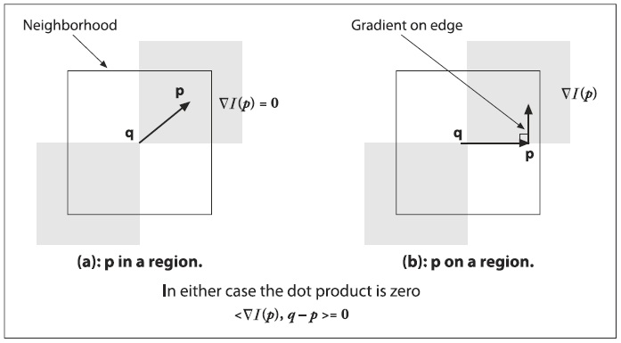

## [П]|[РС]|(РП) Углы субпикселя

Если изображения обрабатываются с целью извлечения геометрических измерений, то в отличие от выделения особенностей необходимо выполнить нечто большее, чем просто выделить пиксель. При работе с пикселями приходиться иметь дело с целочисленными координатами, хотя иногда возникает необходимость и в вещественных координатах (например, пиксель (8.25, 117.16)).

Если допустить, что необходимо взглянуть на острый пик в значениях изображения, то окажется, что расположение пика почти никогда не будет точно в центре пикселя камеры. Чтобы это исправить, можно подобрать кривую (например, параболу) к значениям изображения, а затем использовать немного математики, чтобы найти местоположение пика между пикселями. Все методы обнаружения субпикселя используют данную хитрость. В общем, измерения изображения используются для отслеживания трехмерных перестроений, калибровки камеры, деформации частично перекрытых сцен для того, чтобы сшить их вместе в более естественный вид, и для поиска внешнего сигнала (например, точного местоположения здания на изображении со спутника).

Местоположение угла субпикселя является обобщенным измерением и используется для калибровки камер, или для отслеживания перестроений траектории камеры или трехмерной структуры отслеживаемого объекта. Теперь, зная как искать местоположение угла в целочисленной сетке пикселей, вот хитрость, которую необходимо использовать для уточнения местоположения субпикселя: все сводится к использованию математического факта - скалярное произведение между вектором и ортоганалью вектора равно 0; данный факт имеет место для местоположения углов, показанных на рисунке 10-2.



Рисунок 10-2. Поиск углов с точностью до субпикселей: (a) область изображения вокруг точки p является однородной и потому её градиент равен 0; (b) градиент края это ортоганальный вектор q-p; в любом случае, скалярное произведение между градиентом p и вектором q-p равно 0

На рисунке начальные координаты местоположения угла q находятся вблизи фактического местоположения угла субпикселя. Рассматривая вектор q-p и принимая во внимание, что p расположено вблизи однородного или "ровного" региона, градиент равен 0. С другой стороны, если вектор q-p совпадает с краем, то градиент p этого края ортоганален вектору q-p. В любом случае, скалярное произведение между градиентом p и вектором q-p равно 0. Можно подобрать много таких пар градиента для соседей точки p и связанных с ней векторов q-p, задать скалярное произведение равное 0 и решить получившуюся систему уравнений; решение предоставит более точную информацию о местоположении субпикселя q и о его corner (угол).

Функция, которая осуществляет поиск угла, выглядит следующим образом:

```cpp
void cvFindCornerSubPix(
	 const CvArr* 		image
	,CvPoint2D32f* 		corners
	,int 				count
	,CvSize 			win
	,CvSize 			zero_zone
	,CvTermCriteria 	criteria
);
```

*image* - это исходное одноканальное 8-битное серое изображение. Структура *corners* содержит целочисленные местоположения пикселя, полученные от *cvGoodFeaturesToTrack()* и которые принято считать в качестве исходных местоположений углов; *count* содержит количество точек, участвующих в вычислениях.

Фактически при вычислении местоположения субпикселя используется система выражений скалярного произведения равные 0 (рисунок 10-2), где каждое уравнение возникает из рассмотрения одного пикселя в регионе вокруг p. Параметр *win* определяет размер окна, за счет которого эти уравнения будут сгенерированы. Это окно центрируется на исходном целочисленном местоположении угла и распространяется во всех направлениях на то количество пикселей, что указано в *win* (например, если *win.width = 4*, тогда область поиска будет равна 4 + 1 + 4 = 9 пикселям). Эти уравнения образуют линейную систему уравнений, которая может быть решена путем инверсии одной автокорреляционной матрицы (это  не та автокорреляционная матрица, которая уже была рассмотрена при обсуждении углов Harris). На практике эта матрица не всегда обратима вследствие малых собственных значений, возникающих от пикселей близких к p. Для решения данной проблемы необходимо просто отказаться от рассмотрения пикселей близких к p. Параметр *zero_zone* определяет окно (аналогичное *win*, но всегда меньшего размера), которое не учитывается в системе сдерживающих уравнений и соответственно в автокорреляционной матрице тоже. Если параметр *zero_zone* не требуется, то он должен быть установлен в *cvSize(-1, -1)*.

После нахождения нового местоположения для q, алгоритм приступает к перебору, используя данное значение в качестве отправной точки, до тех пор, пока не будет выполнено условие остановки, определенное пользователем. Условие может быть типа *CV_TERMCRIT_ITER* или типа *CV_TERMCRIT_EPS* (или оба) и, как правило, создано при помощи функции *cvTermCriteria()*. *CV_TERMCRIT_EPS * используется для указания точности значения субпикселя. Таким образом, если будет указано 0.10, то точность значения субпикселя составит одна десятая пикселя.