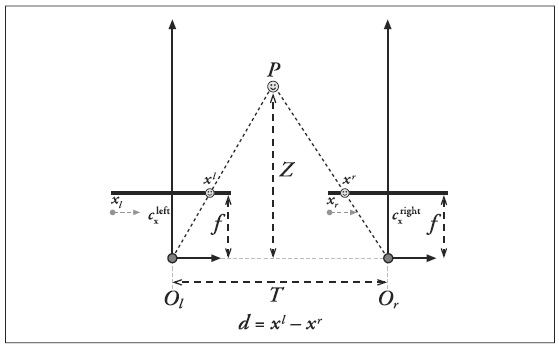
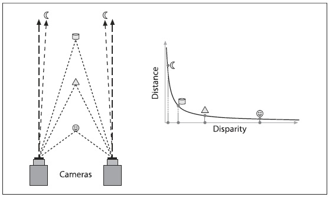

## (П]|(РС)|(РП) Стерео зрение

Теперь все готово для рассмотрения *стерео зрения*. (В данном разделе будет рассмотрена только "верхушка айсберга". Для получения более подробной информации лучше всего обратиться к статьям: Trucco и Verri, Hartley и Zisserman, Forsyth и Ponce, и Shapiro и Stockman.) Всем нам знакомы возможности стерео зрения, которые дают нам наши глаза. Возникает вопрос: до какой степени возможно подражать этой возможности в вычислительных системах? Компьютеры выполняют данную задачу за счет нахождения соответствия между точками, которые видны на одном фотоприёмнике и теме же точками на другом фотоприёмнике. За счет этого соответствия и заранее известного базового разделения между камерами, возможно вычислить трехмерное расположенеи точек. Хотя поиск соотвествующих точек вычислительно дорогая опреация, можно воспользоваться знаниями о геометрии системы для наиболее возможного сужения пространства поиска. На практике, стерео зрение реализуется в четыре этапа при помощи двух камер.

1. Математически удалить радиальные и тангенциальные искажения объектива (глава 11). На выходе будет получено неискаженное изображение.

2. НАстройка углов и расстояния между камерами, так называемый процесс *уточнения*. На выходе будут получены выровненные по строкам (это означает, что два изображения плоскости компланарны и что строки изображения будут выровнены точно, т.е. в одном направлении имеют одинаковую y-координату) и уточненные изображения.

3. Поиск особенностей на представлениях левой и правой камер (каждый раз при упоминании на левую и правую камеры также подразумевает вертикально ориентированные верхняя и нижняя камеры, где диспропорция возникает по y-координате, а не по x), так называемый процесс *соответствия*. На выходе будет получена *карта несоответствий*, где различия будут соответствовать различиям в x-координате плоскости изображения для одного и того же рассматриваемого признака левой и правой камер: .

4. Зная геометрическое расположенеи камер, можно развернуть карту несоответствий за счет *триангуляции*. Это так называемое *перепроецирование*, в результате чего получается карта глубины.

Для начала будет рассмотрен последний шаг, являющийся причиной появления первых трех.

### Триангуляция

Пусть имеется совершенно неискаженная, выравненная и измеренная стерео установка, показанная на рисунке 12-4: две камеры, чьи плоскости изображения компланары с точно параллельными оптическими осями (оптическая ось - это луч, выходящий из центра проекции *O* и проходящий через основные точки *c*, более известный как *основной луч*), для которых известно расстояние между ними, и с одинаковыми фокальными расстояниями . Кроме того, пусть *основные точки*  уже откалиброваны, чтобы иметь теже координаты пикселей, что и соответствующие левому и правому изображениям. При этом ни в коем случае не нужно путать основные точки с центром изображения. Основной точкой является той, что соответствует пересечению главного луча и плоскости изображения. Это пересечение зависит от оси объектива. Как уже было показано в главе 11, плоскость изображения крайне редко выравнивается именно с объективом, поэтому почти всегда центр фотоприёмника не совпадает с основной точкой. 

Рисунок 12-4. Совершенно неискаженная, выравненная стерео установка с извстными соответствиями, глубина Z може тбыть найдена при помощи подобия треугольнико; основные лучи начинаются от центра проекции  и проходят через основные точки двух плоскостей изображения 

Теперь пусть строки изображений выровнены, т.е. пиксель строки одной камеры выровнен в соответствии с пикселем строки другой камеры (). Такая камера именуется *фронтально параллельно расположенной*. Так же пусть имеется возможность найти точку P материального мира на левом и правом изображениях , которые имеют соответствующие горизонтальные координаты .

Для данного упрощенного случая  - это горизонтальные позиции точек левого и правого фотоприёмника (соответственно), позволяющие показать, что глубина обратно пропорциональна различию между этими представлениями, где различие определяется довольно таки просто . Данный случай показан на рисунке 12-4, благодаря которому можно с легкостью вывести глубину Z из подобия треугольников. Ссылаясь на рисунок, имеем:

(Эта формула основывается на основных лучах, пересекающихся в бесконечности. Однако, как будет показано в следующем разделе, стерео исправления получаются по отношению к основным точкам . Для данной формулы основные лучи пересекаются в бесконечности, а основные точки имеют одинаковые координаты. Тем не менее, если основные лучи пересекаются на конечном расстоянии, то основные точки имеют разные координаты и потому уравнение глубины принимает следующий вид .)

Так как глубина обратно пропорциональна d, то очевидна нелинейная связь между этими двумя элементами. Когда d близко к 0, то небольшие различия приводит к большим различиям глубины. Когда d велико, то небольшие различия не на много изменяют глубину. Как следствие из всего этого, системы стерео зрения имеют высокое разрешение глубины только в случае объектов, расположенных неподалеку от камеры (рисунок 12-5).

Рисунок 12-5. Глубина и различия связаны обратно пропорционально, поэтому измерения глубины ограничиваются близлежащими объектами

До этого уже были показаны многие системы координат в рамках обсуждения процесса калибровки в главе 11. На рисунке 12-6 показаны двух и трех мерные системы координат, используемые в OpenCV для стерео зрения. При этом стоит обратить внимание на тот факт, что это правые системы координат: если направить указательный палец правой руки вдоль оси X, а средний палец правой руки согнуть в направлении оси Y, то большой палец будет указывать в направлении основного луча. Пиксели левого и правого изображения фотоприёмников представлены на рисунке в верхнем левом углу и обозначаются координатами , соответственно. Центры проекции  с основными лучами пересекают плоскость изображения в основной точке (не центре) . После математических исправлений, камеры становятся выровненными по строкам (компланарными и горизонтально выровненными) и отдаленными друг от друга на расстояние *T* и с фокусным расстоянием *f*.

Рисунок 12-6. Системы координат, используемые в OpenCV для неискаженных выпрямленных камер: координаты пикселей относительно верхнего левого угла изображения и две выравненные плоскости; координаты камеры относительно центра проекции левой камеры

При таком расположении относительно легко найти расстояние. Теперь необходимо приложить немного усилий для понимания того, как сопоставить настройки геометрии камеры в реальном времени. В реальном мире камеры почти никогда не выровнены точно фронтально параллельно (рисунке 12-4). Вместо этого, необходимо математически рассчитать проекции изображения и карты искажений, которые поправят левое и правое изображения до фронтально параллельного расположения. При проектировании стерео устройства лучше всего расположить камеры примерно фронтально параллельно и, насколько это возможно, горизонтально выровнено.  Физические преобразования благоприятно сказываются на математических вычислениях. Если камеры не выровнены хотя бы приблизительно, то в результате математического выравнивания может быть получено крайне искаженное изображение, тем самым снизиться или пропадет зона стерео перекрытия в конечном изображении. Для получения хорошего результата так же необходимо синхронизировать камеры. Если это не выполняется, то будут возникать проблемы при появлении движений в сцене (в том числе самих камер).

Рисунок 12-7 отражает реальную ситуацию между двумя камерами и необходимое математическое выравнивание. Для выполнения математического выравнивания необходимо больше информации о геометрии представления сцен двух камер. После получения данной геометрии и некой терминологии и обозначений, можно вернуть к проблеме выравнивания.

Рисунок 12-7. Целью данного изображения является показать, как математически (а не физически) совместить две камеры в одном представлении плоскости так, что пиксели строк между камерами в точности выровнены друг относительно друга

### Эпиполярная геометрия

В основе геометрии системы компьютерного зрения лежит *эпиполярная геометрия*. В сущности, эта геометрия сочетает в себе две модели камеры обскуры (по одной для каждой камеры) и некоторые интересные новые точки, именуемые как *керновые точки* (рисунок 12-8). Перед объяснением того, чем хороши эти точки, будет рассмотрен процесс их определения и добавлена связанная с ними терминология. После всего этого, будет краткое общее понимание этой геометрии, а также значительно сужен набор точек соответствующих двум камерам. На практике это дополнение очень важное.

Для каждой камеры имеется отдельный центр проекции  и пару соответствующих проекционных плоскостей . Точка P материального мира проецируется на каждую из проекционных плоскостей . Наибольший интерес представляют новые точки – керновые точки. 