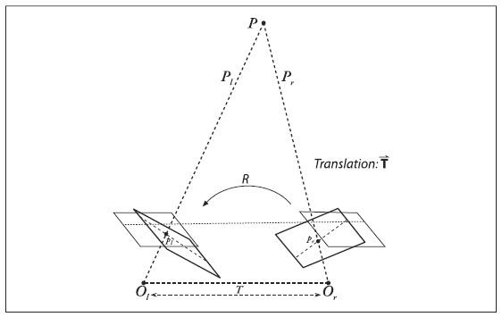
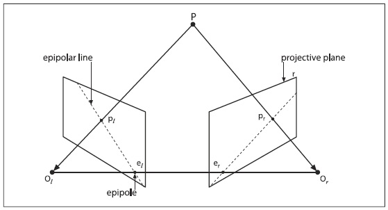
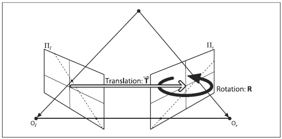

## (П]|(РС)|(РП) Стерео зрение

Теперь все готово для рассмотрения *стерео зрения*. (В данном разделе будет рассмотрена только "верхушка айсберга". Для получения более подробной информации лучше всего обратиться к статьям: Trucco и Verri, Hartley и Zisserman, Forsyth и Ponce, и Shapiro и Stockman.) Всем нам знакомы возможности стерео зрения, которые дают нам наши глаза. Возникает вопрос: до какой степени возможно подражать этой возможности в вычислительных системах? Компьютеры выполняют данную задачу за счет нахождения соответствия между точками, которые видны на одном фотоприёмнике и теме же точками на другом фотоприёмнике. За счет этого соответствия и заранее известного базового разделения между камерами, возможно вычислить трехмерное расположенеи точек. Хотя поиск соотвествующих точек вычислительно дорогая опреация, можно воспользоваться знаниями о геометрии системы для наиболее возможного сужения пространства поиска. На практике, стерео зрение реализуется в четыре этапа при помощи двух камер.

1. Математически удалить радиальные и тангенциальные искажения объектива (глава 11). На выходе будет получено неискаженное изображение.

2. НАстройка углов и расстояния между камерами, так называемый процесс *уточнения*. На выходе будут получены выровненные по строкам (это означает, что два изображения плоскости компланарны и что строки изображения будут выровнены точно, т.е. в одном направлении имеют одинаковую y-координату) и уточненные изображения.

3. Поиск особенностей на представлениях левой и правой камер (каждый раз при упоминании на левую и правую камеры также подразумевает вертикально ориентированные верхняя и нижняя камеры, где диспропорция возникает по y-координате, а не по x), так называемый процесс *соответствия*. На выходе будет получена *карта несоответствий*, где различия будут соответствовать различиям в x-координате плоскости изображения для одного и того же рассматриваемого признака левой и правой камер: .

4. Зная геометрическое расположенеи камер, можно развернуть карту несоответствий за счет *триангуляции*. Это так называемое *перепроецирование*, в результате чего получается карта глубины.

Для начала будет рассмотрен последний шаг, являющийся причиной появления первых трех.

### Триангуляция

Пусть имеется совершенно неискаженная, выравненная и измеренная стерео установка, показанная на рисунке 12-4: две камеры, чьи плоскости изображения компланары с точно параллельными оптическими осями (оптическая ось - это луч, выходящий из центра проекции *O* и проходящий через основные точки *c*, более известный как *основной луч*), для которых известно расстояние между ними, и с одинаковыми фокальными расстояниями . Кроме того, пусть *основные точки*  уже откалиброваны, чтобы иметь теже координаты пикселей, что и соответствующие левому и правому изображениям. При этом ни в коем случае не нужно путать основные точки с центром изображения. Основной точкой является той, что соответствует пересечению главного луча и плоскости изображения. Это пересечение зависит от оси объектива. Как уже было показано в главе 11, плоскость изображения крайне редко выравнивается именно с объективом, поэтому почти всегда центр фотоприёмника не совпадает с основной точкой. 

Рисунок 12-4. Совершенно неискаженная, выравненная стерео установка с извстными соответствиями, глубина Z може тбыть найдена при помощи подобия треугольнико; основные лучи начинаются от центра проекции  и проходят через основные точки двух плоскостей изображения 

Теперь пусть строки изображений выровнены, т.е. пиксель строки одной камеры выровнен в соответствии с пикселем строки другой камеры (). Такая камера именуется *фронтально параллельно расположенной*. Так же пусть имеется возможность найти точку P материального мира на левом и правом изображениях , которые имеют соответствующие горизонтальные координаты .

Для данного упрощенного случая  - это горизонтальные позиции точек левого и правого фотоприёмника (соответственно), позволяющие показать, что глубина обратно пропорциональна различию между этими представлениями, где различие определяется довольно таки просто . Данный случай показан на рисунке 12-4, благодаря которому можно с легкостью вывести глубину Z из подобия треугольников. Ссылаясь на рисунок, имеем:

(Эта формула основывается на основных лучах, пересекающихся в бесконечности. Однако, как будет показано в следующем разделе, стерео исправления получаются по отношению к основным точкам . Для данной формулы основные лучи пересекаются в бесконечности, а основные точки имеют одинаковые координаты. Тем не менее, если основные лучи пересекаются на конечном расстоянии, то основные точки имеют разные координаты и потому уравнение глубины принимает следующий вид .)

Так как глубина обратно пропорциональна d, то очевидна нелинейная связь между этими двумя элементами. Когда d близко к 0, то небольшие различия приводит к большим различиям глубины. Когда d велико, то небольшие различия не на много изменяют глубину. Как следствие из всего этого, системы стерео зрения имеют высокое разрешение глубины только в случае объектов, расположенных неподалеку от камеры (рисунок 12-5).

Рисунок 12-5. Глубина и различия связаны обратно пропорционально, поэтому измерения глубины ограничиваются близлежащими объектами

До этого уже были показаны многие системы координат в рамках обсуждения процесса калибровки в главе 11. На рисунке 12-6 показаны двух и трех мерные системы координат, используемые в OpenCV для стерео зрения. При этом стоит обратить внимание на тот факт, что это правые системы координат: если направить указательный палец правой руки вдоль оси X, а средний палец правой руки согнуть в направлении оси Y, то большой палец будет указывать в направлении основного луча. Пиксели левого и правого изображения фотоприёмников представлены на рисунке в верхнем левом углу и обозначаются координатами , соответственно. Центры проекции  с основными лучами пересекают плоскость изображения в основной точке (не центре) . После математических исправлений, камеры становятся выровненными по строкам (компланарными и горизонтально выровненными) и отдаленными друг от друга на расстояние *T* и с фокусным расстоянием *f*.

Рисунок 12-6. Системы координат, используемые в OpenCV для неискаженных выпрямленных камер: координаты пикселей относительно верхнего левого угла изображения и две выравненные плоскости; координаты камеры относительно центра проекции левой камеры

При таком расположении относительно легко найти расстояние. Теперь необходимо приложить немного усилий для понимания того, как сопоставить настройки геометрии камеры в реальном времени. В реальном мире камеры почти никогда не выровнены точно фронтально параллельно (рисунке 12-4). Вместо этого, необходимо математически рассчитать проекции изображения и карты искажений, которые поправят левое и правое изображения до фронтально параллельного расположения. При проектировании стерео устройства лучше всего расположить камеры примерно фронтально параллельно и, насколько это возможно, горизонтально выровнено.  Физические преобразования благоприятно сказываются на математических вычислениях. Если камеры не выровнены хотя бы приблизительно, то в результате математического выравнивания может быть получено крайне искаженное изображение, тем самым снизиться или пропадет зона стерео перекрытия в конечном изображении. Для получения хорошего результата так же необходимо синхронизировать камеры. Если это не выполняется, то будут возникать проблемы при появлении движений в сцене (в том числе самих камер).

Рисунок 12-7 отражает реальную ситуацию между двумя камерами и необходимое математическое выравнивание. Для выполнения математического выравнивания необходимо больше информации о геометрии представления сцен двух камер. После получения данной геометрии и некой терминологии и обозначений, можно вернуть к проблеме выравнивания.

Рисунок 12-7. Целью данного изображения является показать, как математически (а не физически) совместить две камеры в одном представлении плоскости так, что пиксели строк между камерами в точности выровнены друг относительно друга

### Эпиполярная геометрия

В основе геометрии системы компьютерного зрения лежит *эпиполярная геометрия*. В сущности, эта геометрия сочетает в себе две модели камеры обскуры (по одной для каждой камеры) и некоторые интересные новые точки, именуемые как *керновые точки* (рисунок 12-8). Перед объяснением того, чем хороши эти точки, будет рассмотрен процесс их определения и добавлена связанная с ними терминология. После всего этого, будет краткое общее понимание этой геометрии, а также значительно сужен набор точек соответствующих двум камерам. На практике это дополнение очень важное.

Рисунок 12-8. Эпиполярная плоскость определяется наблюдаемой точкой P и двумя центрами проекции ; керновые точки располагаются в точках пересечения линии, соединяющая центры проекции и две проекционные плоскости

Для каждой камеры имеется отдельный центр проекции  и пару соответствующих проекционных плоскостей . Точка P материального мира проецируется на каждую из проекционных плоскостей . Наибольший интерес представляют новые точки – керновые точки. Керновая точка  () на плоскости  () определяется как центр проекции изображения другой камеры  (). Плоскость пространства, образованная фактическими представлениями точки P и двумя керновыми точками  и  (или, что эквивалентно, двумя центрами проекции ), именуется *эпиполярной плоскостью*, а линии  и  (от точки проекции до соответствующей эпиполярной точки) *эпиполярными линиями*.

Для осознания того, насколько полезна эпиполярность, необходимо вспомнить следующий факт: на самом деле точка материального мира, проецирующая на правую (или левую) плоскость изображения, может быть расположена в любом месте вдоль всей линии точек луча, идущего от  через  (или от  через ), т.к. для одной из камер не известно расстояние до рассматриваемой точки. Например, имеется точка P, которую видно на правой камере. Т.к. камера видит только  (проекцию P на ), по факту точка P может быть расположена в любом месте на линии, образованной  и . Очевидно, что эта линия содержит P, но она так же содержит и другие точки. Однако, что интересно, как выглядит проекция этой линии на левой плоскости изображения ; по факту это эпиполярная линия, определяемая  и . Изображение все возможных *точек*, отображенных на одном фотоприёмнике, это *линия*, проходящая через соответствующую точку и керновые точки другого фотоприёмника.

Краткий список некоторых фактов об эпиполярной геометрии стереокамер (и почему этому уделено внимание).

* Каждая трехмерная точка представлений камер располагается на эпиполярной плоскости, которая пересекает каждое изображение по эпиполярной линии.

* Учитывая особенности одного изображения, соответствующее представление другого изображения *должно* лежать вдоль соответствующей эпиполярной линии. Это известно как *эпиполярное ограничение*.

* Эпиполярное ограничение означает, что возможно преобразовать двумерный поиск для сопоставления особенностей двух фотоприёмников в одномерный поиск вдоль эпиполярных линий при условии наличия знаний о геометрии стереоустановки. Это не только огромное сокращение операций вычисления, но и отбрасывание из рассмотрения точек, которые могли бы привести ложным соответствиям.

* Порядок сохранения. Если точки A и B видны на обоих изображениях и горизонтально попадают в указанном порядке на один фотоприёмник, то они горизонтально попадают в указанном порядке т на другой фотоприёмник. (Из-за преград и областей перекрытия представления, важно, чтобы обе камеры не видели одни и те же точки. Тем не менее, порядок должен поддерживаться. Так, если точки A, B и C располагаются слева направо на левом фотоприёмнике и если B не видно на правом фотоприёмнике из-за наличия перекрытия, то правый фотоприёмник по-прежнему должен видеть точки A и C слева направо.)

### Существенная и фундаментальная матрицы

Осталось рассмотреть ещё два ингредиента, прежде чем переходить к функциям OpenCV, которые вычисляют эпиполярные линии. Это существенная матрица E и фундаментальная матрица F. Матрица E содержит информацию о перемещении и вращении двух связанных камер в материальном пространстве (рисунок 12-9), а F содержит такую же информацию, как и E плюс информацию о внутренних параметрах, относящихся к двум камерам в пиксельных координатах. Т.к. F содержит информацию о внутренних параметрах, то связь между двумя камерами выражается в пиксельных координатах.

Рисунок 12-9. В основе геометрии стерео зрения лежит захват существенной матрицы E, содержащей всю информацию о перемещении T и вращении R, которые описывают положение второй камеры относительно первой в глобальных координатах

Существенная матрица E является чисто геометрической, при этом ничего не знающая о фотоприёмнике. Она сопоставляет расположение, в материальных координатах, точки P в одной точке, в чём можно убедиться при просмотре этой точки с левой и правой камер (т.е. связь  к ). Фундаментальная матрица F связывает точки плоскости изображения одной камеры в координатах изображения (в пикселях) с точками плоскости изображения другой камеры в координатах изображения (в дальнейшем будут использоваться обозначения  и ).

**Математика для существенной матрицы**

Пусть имеется точка P и необходимо получить соотношение, соединяющее отслеживаемые положения  и  точки P на двух фотоприёмниках. Эта связь служит оберткой определения существенной матрицы. Для начала будет рассмотрена связь между  и , при этом материальное расположение точки будет рассматриваться в координатах двух камер. Эта связь может быть представлена при помощи эпиполярной геометрии, как уже было показано ранее. (При этом не стоит путать  и , которые являются точками на проекционной плоскости изображения, с  и , которые являются положениями точки P в системе координат двух камер.)

Теперь необходимо выбрать один набор координат, левый или правый, для работы и выполнения расчетов. Пусть выбор падет на координаты сосредоточенные на  левой камеры. Согласно этим координатам положение отслеживаемой точки будет , а начальное положение другой камеры располагается на расстоянии T. Точка P, как видно на правой камере , имеет координаты этой камеры, где . Ключевым шагом является введение эпиполярной плоскости, которая как уже известно связывает все эти вещи. Конечно возможно представить плоскость множеством способов, но для рассматриваемого случая необходимо вспомнить, что уравнение для всех точек **x** на плоскости с нормальным вектором **n**, проходящим через точку **a**, необходимо соблюдать следующее ограничение:

Эпиполярная плоскость содержит векторы  и T; таким образом, если есть перпендикулярный (векторное произведение векторов дает третий вектор, ортогональный к двум первым; направление определяется "правилом правой руки": если указательный палец соответствует направлению *a*, а средний палец направлению *b*, то векторное произведение *axb* перпендикулярно к *a* и *b* и соответствует направлению большого пальца) к обоим векторам вектор (например xT), то можно использовать его в **n** уравнениях плоскости. Так, уравнение для все возможных точек  прохожящей через точку T и содержащей оба вектора имеет вид (за счет замены скалярного произведения на матричное перемножение транспанированного и нормального векторов):

Не стоит забывать, что оснавная цель заключается в том, чтобы связать  и  для начала в соотношении  и . Отрисовка  на рисунке осуществляется за счет равенства , которое для удобства лучше переписать следующим образом . Выполнив подстановку и используя  уравнение примет следующий вид:

Векторное произведение можно переписать в (несколько громоздкое) перемноженеи матриц. Таким образом матрица **S** примет следующий вид:

После подстановки уравненеи примет следующий вид:

*RS* - это существенная матрица E, тогда уравнение принимает компактный вид:

В результате получено связь между точками, которые наблюдаются на фотоприёмниках, но это только первый шаг. За счет выполнения замены при помощи проекционных уравнений  и  и последующего разделения на , уравнение примет окончательный вид:

На первый взгляд может показаться, что уравнение определяется элементом *p*, если остальное известно, но E это обертка ранг-неполной матрицей (существенная матрица 3x3  ранга 2) и как следствие все заканчивается линейным уравнением. (Для квадратной nxn мтарицы E, ранг неполня оценка означает, что имеется менее чем n ненулевых собственных значения. В результате система линейных уравнений, указанных в ранг-неполной матрице, не имеет единственного решения. Если ранг (число ненулевых собственных значений) это n-1, то это будет строка, образованная набором точек, ккоторые все без исключения удовлетворяют системе уравнений. Система определяется матрицей ранга n-2, образуя плоскость, и так далее.) Существенная матрица содержит пять параметров - три для вращения и два для направленного перемещения (без установки масштаба) - и два ограничения: (1) определитель равен 0, т.к. это ранк-неполная матрица (3x3 с рангом 2); (2) два ненулевых сингулярных разложения равны, потому что матрица S кососимметричная, а R это матрица вращения. В общей сложности это даёт семь ограничений. При этом, ещё раз, не стоит путать данную E с внутренними параметрами E камеры; таким образом, связанные точки выржаются в материальных координатах или координатах камеры, а не в пиксельных координатах.

**Математика для фундаментальной мтарицы**

Матрица E содержит всю информацию о геометрии двух камер относительно друг друга, но не о самих камерах. На практике, наибольший интерес вызывают пиксельные координаты. Для поиска связи между пикселем одного изображения и соответствующей эпиполярной линией другого изображения, необходимо ознакомиться с внутренней информацией о двух камерах. Для того, чтобы это сделать, для *p* (в пиксельных координатах) необходимо подставить 