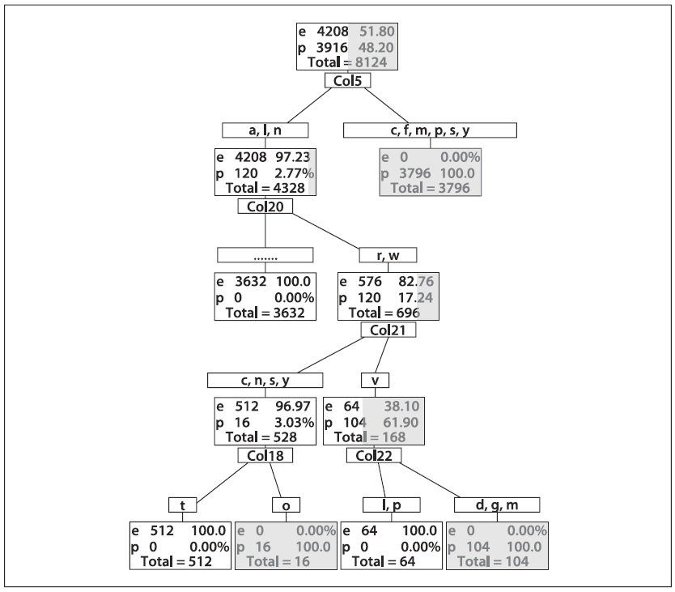
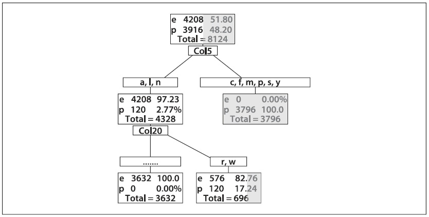
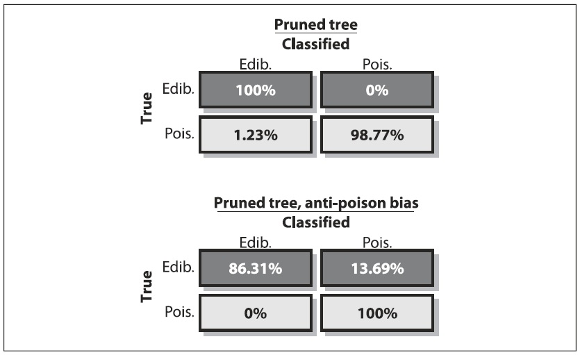
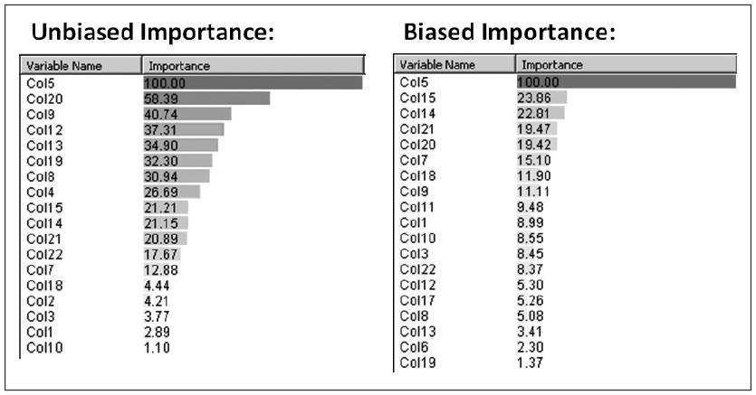

## (П]|(РС)|(РП) Binary Decision Trees

Decision trees будут рассмотрены более подробно, т.к. они являются весьма полезными и используют большую часть функциональности библиотеки машинного обучения (можно сказать являются таким неким учебным пособием для изучения библиотеки ML). Binary decision trees были придуманы Leo Breiman и коллеги (L. Breiman, J. Friedman, R. Olshen b C. Stone, Classification and Regression Trees (1984), Wadsworth), которые назвали их алгоритмами *classification and regression tree* (CART). В OpenCV реализован алгоритм *decision tree*. Суть алгоритма заключается в определении нечистой метрики (примеси) относительно данных каждого узла дерева. Например, для использования подходящей функции регресси, можно использовать сумму квадратов разности между истинным и прогнозируемым значениями. В дальнейшем может потребоваться свести к минимуму эту сумму разности ("примеси") каждого узла дерева. В случае категориальных меток необходимо определить меру, которая будет минимальна, когда большинство значений в узле имеют один и тот же класс. Как правило, используют три меры - энтропию, индекс Gini и неправильную классификацию (далее все эти меры будут более детально рассмотрены в этом разделе). После получения метрики, binary decision tree выполняет поиск по вектору особенностей в поисках объединенной особенности, которая совместно с пороговым значением наилучшим образом очищает данные. Согласно заранее оговоренным условиям, особенности, которые выше порогового значения являются "правдивыми" и, таким образом, классифицируются в левую ветку; в противном случае в правую. В последующем данная процедура выполняется рекурсивно вниз по каждой ветки дерева до тех пор, пока данные не станут достаточно чистыми или пока не будет достигнуто минимально установленное число точек в узле.

Далее будет рассмотрено уравнение узла примеси *i(N)* для двух случаев: регрессия и классификация.

###  Регрессия примеси

Для регрессии или функции соответствия уравнение узла примеси - это просто квадрат разности между значением узла *y* и значением данных *x*:


### Классификация примеси

В случае классификации, decision trees зачастую используют один из трех методов: *entropy impurity*, *Gini impurity* или *misclassification impurity*. Для разъяснения этих методов будут использоваться следующие обозначения:  обозначет долю шаблонов в узле N класса . Каждая примесь имеет несколько различных эффектов в момент принятия решения о разделении. Метод Gini является наиболее часто используемым, при этом все методы без исключения стремятся свести к минимуму примеси в узле. На рисунке 13-7 показан график примесей, которые необходимо свести к минимуму.

**Entropy impurity**


**Gini impurity**


**Misclassification impurity**


Рисунок 13-7. Decision tree примесей

Decision trees является, пожалуй, наиболее широко используемой технологией классификации. Это связано с простотой реализации и интерпритации результатов, гибкостью к различным типам данных (категоричные, численные и ненормализованные + их сочетания), способностью обрабатывать недостающие данные за счет суррогатного разделения и естественного способа присвоения важности особенностям в порядке разделения. Decision trees являются основой для других алгоритмов таких как *boosting* и *random trees*, которые будут рассмотрены чуть позже.

### Использование decision tree

Далее будет представлено более чем достаточное описание работы decision trees. При этом стоит знать, что существует множество других способов получения доступа к узлам, изменения разделителей и так далее. Для сформирования наиболее полного уровня (который, возможно, когда то может потребоваться читателю) представления, необходимо обратиться к руководству пользователя *.../opencv/docs/ref/opencvref_ml.htm*, в частности, к классу *CvDTree{}*, классу обучения *CvDTreeTrainData{}* и классам, ответственные за узлы и разделители *CvDTreeNode{}* и *CvTreeSplit{}*, соответственно.

При переходе от теории к практике, стоит начать с рассмотрения конкретного примера. В папке *.../opencv/samples/c* имеется файл *mushroom.cpp*, в котором представлена реализация *decision trees* на данных, расположенных в файле *agaricuslepiota.data*. Файл с данными состоит из меток "p" или "e" (обозначающие poisonous (ядовитые) или edible (съедобные), соответственно) в совокупности с 22 категориями (каждая представлена одной буквой) признаков. При этом стоит заметить, что файл с данными имеет формат CVS, где значения особенностей разделены точкой с запятой. Файл *mushroom.cpp* содержит не совсем корректную функцию *mushroom_read_database()*, которая читает содержимое файла с данными. Эта функция довольно таки специфична и "хрупка", при этом с основной задачей - заполнить три массива - она справляется следующим образом:

1. Матрица вещественного типа *data[][]*, которая имеет размерность: число строк = числу точек, число колонок = числу особенностей (в рассмтариваемом случае 22), при этом все буквенные обозначения особенностей преобразуются в вещественное число

2. Матрица символьного типа *missing[][]*, где значения "true" или 1 указывают на недостающее значение, которое помечено в строке файла с данными вопросительным знаком, а 0 на все оствшиеся.

3. Вектор вещественного типа *responses[]* содержит ответ "p" (ядовитый) или "e" (съедобный).

Далее будет представлен подробный разбор всего того, что используется, напрямую или косвенно из файла *mushroom.cpp*, в главной функции *main()*.

**Обучение дерева**

Для выполнения обучения дерева необходимо заполнить структуру *CvDTreeParams{}*:

```cpp
struct CvDTreeParams {
	int 			max_categories;			// До предварительной кластеризации
	int 			max_depth;				// Максимальный уровень дерева
	int 			min_sample_count;		// Не делить узел, если меньше
	int 			cv_folds;				// Обрезка дерева с K кратной 
											// кросс-проверкой
	bool 			use_surrogates;			// Альтернативные разделители для
											// отсутствующих данных
	bool 			use_1se_rule;			// Грубое удаление
	bool 			truncate_pruned_tree;	// Не "запоминать" отброшенные ветки
	float 			regression_accuracy;	// Один из критериев "стоп-разделителя"
	const float* 	priors;					// Вес каждой предсказанной категории

	CvDTreeParams(): 
		 max_categories(10)
		,max_depth(INT_MAX)
		,min_sample_count(10)
		,cv_folds(10)
		,use_surrogates(true)
		,use_1se_rule(true)
		,truncate_pruned_tree(true)
		,regression_accuracy(0.01f)
		,priors(NULL)
		{ ; }

	CvDTreeParams(
		 int 			_max_depth
		,int 			_min_sample_count
		,float 			_regression_accuracy
		,bool 			_use_surrogates
		,int 			_max_categories
		,int 			_cv_folds
		,bool 			_use_1se_rule
		,bool 			_truncate_pruned_tree
		,const float* 	_priors
	);
}
```

В данной структуре параметр *max_categories* имеет значение по умолчанию равное 10. Это ограниченние для категориальных значений до которого decision tree будет выполнять предварительную кластеризацию так, чтобы проверить не более  возможных значений подмножества. 

(*На заметку* более детальное сопоставление категориальных и упорядоченных разделителей: в то время, как разделение упорядоченной переменной происходит следующим образом: "если x < a, то перемещаем влево, иначе вправо", разделение категориальной переменной происходит следующим образом: "если , то перемещаем влево, иначе вправо", где  это некоторое возможное значение переменной. Таким образом, если категориальная переменная имеет N возможных значений то для наилучшего разделения необходимо попробовать  подмножеств (пустое или полное подмножества необходимо исключить). Таким образом, алгоритм аппроксимации определяет каким образом все N значений нужно сгруппировать в K <= *max_categories* кластеров (алгоритм K-mean), основываясь на статистике образка текущего анализируемого узла. После этого алгоритм пытается произвести различные сочетания кластеров и выбрать наилучший разделитель, который даёт хорошие результаты чаще других. При этом для двух наиболее распространенных задач, классификация и регрессия с двумя классами, оптимальный категориальный разделитель (т.е. наилучшее подмножеством значений) может быть эффективно найден без кластеризации. Соответственно кластеризацию необходимо применять только в случае *n > двух классов проблем классификации для категориальных переменных при N > max_categories возможных значений. Таким образом, необходимо подумать дважды, прежде чем устанавливать *max_categories* более чем 20, т.к. это будет означать более миллиона операций для каждого разделителя!)

Это не проблема для упорядоченных или пронумерованных особенностей, где алгоритм просто должен найти порог согласно которому производилось бы разделение налево и направо. Переменные, которые в большей степени категориальны, чем *max_categories*, будут равны кластеру значений, которые меньше *max_categories* возможных значений. Таким образом, *decision trees* должны протестировать не более чем *max_categories* уровней за раз. Если данный параметр имеет маленькое значение, то это приводит к уменьшению вычислений за счет понижения точности.

Остальные параметры имеют комментарии, которых вполне достаточно для объяснения их смысла. Последний параметр *priors* в некоторых случаях может быть ключевым. Он задает относительный вес, который будет задан неверной классификации. Т.е. если вес первой категории имеет 1, а вес второй категории равен 10, то каждая ошибка предсказаний во второй категории дает эквивалентные 10 ошибок при прогнозировании в первой категории. В рассматриваемом примере были съедобные и ядовитые грибы; таким образом, "наказание" для ошибки в случае, когда ядовитый гриб определился как съедобный, в 10 раз больше "наказания" для ошибки в случае, когда съедобный гриб определился как ядовитый.

Далее показан шаблон метода обучения *decision tree*. В общем имеется два варианта метода: первый используется непосредственно для работы с *decision trees*; второй используется для формирования ансамблей (используются в *boosting*) или лесов (используются в *random trees*).

```cpp
	// Работа непосредственно с decision trees:
	bool CvDTree::train(
		 const CvMat* 	_train_data
		,int 			_tflag
		,const CvMat* 	_responses
		,const CvMat* 	_var_idx 		= 0
		,const CvMat* 	_sample_idx 	= 0
		,const CvMat* 	_var_type 		= 0
		,const CvMat* 	_missing_mask 	= 0
		,CvDTreeParams 	params 			= CvDTreeParams()
	);

	// Метод использует ансамбль decision trees, 
	// перебирая в процессе обучения каждое дерево
	// из ансамбля
	bool CvDTree::train(
		 CvDTreeTrainData* 	_train_data
		,const CvMat* 		_subsample_idx
	);
```

Первый параметр метода *_train_data[][]* является матрицей вещественного типа. Если *_tflag = CV_ROW_SAMPLE*, то каждая строка состоит из указателя, который содержит вектор особенностей, формирующие столбцы матрицы. Если *tflag = CV_COL_SAMPLE*, то значения строк и столбцов меняются местами. Аргумент *_responses[]* является вектором вещественного типа значения которого могут быть предсказаны с учетом особенностей. Остальные аргументы являются необязательными. Вектор *_var_idx* содержит особенности, а вектор *_sample_idx* содержит наблюдения; оба вектора либо целочисленные списки значений пропусков (0), либо 8-битные маски активов (1) или пропусков (0) (ранее в данной главе это уже обсуждалось при рассмотрении метода *train()*). Вектор *_var_type* типа *byte* (*CV_8UC1*) - это маска для каждого типа особенности (*CV_VAR_CATEGORICAL* или *CV_VAR_ORDERED*, где CV_VAR_ORDERED тоже самое, что и CV_VAR_NUMERICAL); размерность данного вектора равна числу особенностей плюс 1 (для записи типа ответа). Матрица *_missing_mask[][]* типа *byte* используется для фиксации отсутствующих значений как 1 (в противном случае как 0). В примере 13-2 детально показан процесс создания и обучения *decision tree*.

Пример 13-2. Созданние и обучение *decision tree*

```cpp
	float 	priors[] = { 1.0, 10.0}; // Вес съедобный относительно веса ядовитый
	CvMat* 	var_type;
	var_type = cvCreateMat( data->cols + 1, 1, CV_8U );
	cvSet( var_type, cvScalarAll(CV_VAR_CATEGORICAL) ); // все значения категориальные

	CvDTree* dtree;
	dtree = new CvDTree;
	dtree->train(
		 data
		,CV_ROW_SAMPLE
		,responses
		,0
		,0
		,var_type
		,missing
		,CvDTreeParams(
			 8 		// максимальная глубина
			,10 	// минимальное число образцов
			,0 		// точность регрессии: используется N/A 
			,true 	// вычислять ли суррогатный разделитель 
					// из-за наличия недостающих данных
			,15 	// максимальное число категорий
					// (алгоритм не оптимален в случае
					// больших чисел
			,10 	// перекрестная проверка
			,true 	// использовать ли правило 1SE => небольшое дерево
			,true 	// отбрасывать ли отброшенные ветви дерева
			,priors // массив priors, где чем больше 
					// p_weight, тем больше вероятность того, что
					// ядовитый
		)
	);
```

В начале представленного примера происходит объявление *decision tree* как *dtree* и выделение необходимого объема памяти. Затем происходит вызов метода *dtree->train()*. Для рассматриваемого случая вектор *responses[]* будет заполнен соответствующими ASCII символами "p" (ядовитый) или "e" (съедобный) для каждого наблюдения. После выполнения метода *train()*, *dtree* готово к использованию для прогнозирования новых данных. Так же *decision tree* может быть сохранено на диск или прочитано с него. В промежутке, между сохранением и загрузкой, дерево сбрасывается и обнуляется при помощи метода *clear()*.

```cpp
	dtree->save( "tree.xml", "MyTree" );
	dtree->clear();
	dtree->load( "tree.xml", "MyTree" );
```

Методы сохранения и загрузки используют файл *tree.xml*. (Расширение .xml указывает на XML формат файла; если бы использовалось расширение .yml или .yaml, то это указывало бы на YAML формат файла). Дополнительный параметр "MyTree" является тегом, который маркирует дерево из файла tree.xml. Как и в других статистических моделях, в модуле "машинное обучение" есть несколько объектов, которые не могут быть сохранены в одном .xml или .yml файле при использовании *save()*; для сохранения таких объектов необходимо использовать *cvOpenFileStorage()* и *write()*. Между тем функция *load()* это совсем другая история: данная функция может загрузить объект по его имени, даже если в файле присутствуют другие данные, не относящиеся к объекту.

Функция предсказания выглядит следующим образом:

```cpp
	CvDTreeNode* CvDTree::predict(
		 const CvMat* 	_sample
		,const CvMat* 	_missing_data_mask 	= 0
		,bool 			raw_mode 			= false
	) const;
```

Параметр *_sample* является вектором вещественного типа и содержит особенности используемые в предсказании; параметр *_missing_data_mask* является вектором типа *byte* той же длинны и ориентации (под "та же ... ориентация" имеется ввиду, что если образец является вектором 1xN, то маска должна быть размера 1xN, а если образец имеет размерность Nx1, то маска должна быть размера Nx1), как и вектор *_sample*, в котором (*_missing_data_mask*) ненулевые ненулевые значения указывают на недостающие особенности. Параметр *raw_mode* указывает на нормализацию входных категориальных данных: "false" - ненормализовывать (по умолчанию), "true" - нормализовать. Данный параметр как правило используется в случае ансамблей деревьев для ускорения процесса предсказания. Данные нормализуются в пределах интервала (0, 1) для ускорения процесса вычисления, т.к.таким образом алгоритму будут известны пределы, в которых данные могут колебаться. Такая нормализация никак не сказывается на точности. Метод *predict()* возвращает узел дерева через который можно получить доступ к значению предсказания при помощи *(CvDTreeNode *)->value*:

```cpp
	double r = dtree->predict( &sample, &mask )->value;
```

И в заключении можно вызвать метод *var_importance()* для определения важности каждой особенности. Эта функция возвращает вектор размера Nx1 типа *double* (*CV_64FC1*), содержащий каждую особенность относительно важности для прогнозирования, где значение 1 указывает на высокий уровень важности, а 0 на абсолютную неважность или полезность для предсказания. В дальнейшем неважные особенности могут быть отброшены при втором проходе обучения. 

```cpp
	const CvMat* var_importance = dtree->get_var_importance();
```

Как показано в файле *.../opencv/samples/c/mushroom.cpp*, доступ к отдельному элементу вектора значимости можно получить за счёт следующей конструкции

```cpp
	double val = var_importance->data.db[i];
```

большинство пользователей используют только метод *train()* при использовании *decision tree*, однако продвинутым пользователям или исследователям может иногда потребоваться изучить и/или модифицировать узлы дерева или критерии разделения. Как уже было сказано в начале данного раздела, информация о том, как это сделать при помощи ML описано в поставляемой с OpenCV документации *.../opencv/docs/ref/opencvref_ml.htm#ch_dtree*, доступ к которой можно так же получить через [OpenCV Wiki](http://opencvlibrary.sourceforge.net/). Разделы представляющие интерес в случае выполнения анализа: структура класса *CvDTree{}*, структура обучения *CvDTreeTrainData{}*, структура узла *CvDTreeNode{}* и структура, содержащая разделитель *CvDTreeSplit{}*.

### Результаты decision tree

Используя ранее описанный код, можно узнать несклько интересных вещей о съедобных и ядовитых грибах, информации о которых храниться в файле agaricus-lepiota.data. Если выполнить просто обучение decision tree (без отсечения), то можно получить вполне хорошие данные (дерево для данного случая представлено на рисугке 13-8). Хоть выполнение полного цикла обучения decicion tree на наборе для обучения и дает лучшие результаты, не стоит забывать и об уроке, показанного на рисунке 13-2 (переобучение). Сделанное и показанное на рисунке 13-8 выполнено с целью запоминания данных вместе со своими ошибками и шумом. Таким образом, маловероятно, что будут хорошие результаты на реальных данных. Вот почему decision trees и деревья типа CART в OpenCV, как правило, включают в себя дополнительные шаги "наказывания" сложных деревьев и их обрезку до момента достижения должного уровня сложности. Есть и другие варианты реализации decision tree, которые "выращивают" деревья до тех пор, пока не будет сбалансирована сложность, а так же за счет объединения фазы обрезания с фазой обучения. Тем не менее, в ходе разработки библиотеки ML было обнаружено, что деревья, которые полностью выращены, а затем обрезаны (так реализовано в OpenCV), лучше тех деревьев, которые сочетают обучение с обрезкой в фазе generation.



Рисунок 13-8. Полное decision tree для ядовитых (p) или съедобных (e) грибов: данное дерево было построено с 0% ошибок на наборе для обучения, которое, возможно, страдает от проблем с дисперсией на наборах для тестирования или на реальных данных (темная часть треугольника соответствует ядовитым грибам на данном этапе категоризации)

На рисунке 13-9 показано обрезанное дерево, которое достаточно хорошо (но не идеально) справляется с набором для обучения, но, возможно, ещё лучше справляется с реальными данными, т.к. дерево обладает лучшим балансом между смещением и дисперсией. Однако, данный классификатор обладает серьёзным недостатком: ядовитые грибы определяются съедобными в 1.23% времени. Возможно, можно быть более счастливым, имея классификатор похуже, который помечал бы многие съедобные грибы как ядовитые, при условии, что никогда бы не предлагал есть ядовитые грибы! Данный классификатор может быть специально создан для умышленного смещения классификатора и/или данных. Иногда это именуется *добаленной стоимостью* к классификатору. В рассматриваемом случае (с грибами) необходимо повысить стоимость неправильной оценки ядовитых грибов относительно стоимости неправильной оценки съедобных грибов. Дополнительная стоимость может быть "наложена внутри" классификатора за счёт изменения весов, а именно изменения соотношения нескольких "плохих" точек относительно одной "хорошей". OpenCV позволяет выполнить это за счет регулирования вектора *priors* в структуре *CvDTreeParams{}*, передаваемая методу *train()*, как уже было показано ранее. Даже не вдаваясь в подробности кода классификатора, можно предложить вариант с наложением приоритетной стоимости путем дублирования (или повторной выборки) "плохих" данных. Дублирование "плохих" данных неявно приводит к увеличению веса "плохих" данных (данная техника может работать с любым классификатором).


Рисунок 13-9. Обрезанное decision tree для ядовитых (p) и съедобных (e) грибов: несмотря на то, что это обрезанное дерево, оно дает низкий процент ошибок на наборе для обучения и, скорее всего, хороно отработает на реальных данных

На рисунке 13-10 показано дерево, где навязано 10 кратное смещение вопреки ядовитым грибам. Это дерево не совершает ошибок при выборе ядовитых грибов, т.к. стоимость ядовитых грибов намного превышает стоимость съедобных грибов - случай "береженого бог бережет". Матрицы неточностей для (обрезанных) деревьев, имеющие и не имеющие смещение, показаны на рисунке 13-11.



Рисунок 13-10. Decision tree съедобного гриба с 10 кратным смещением вопреки неверному определению ядовитых грибов как съедобных; нижний правый прямоугольник хотя и содержит в подавляющем большинстве съедобные грибы, он все же не содержит 10 кратное большинство, которое будет классифицироваться как несъедобное



Рисунок 13-11. Матрицы неточностей для (обрезанных) decision trees съедобных грибов: дерево без смещения дает лучшую общую производительность (верхняя часть рисунка), при этом иногда происходит неверная классификация съедобных грибов как ядовытые; дерево со смещением не влияет на общую производительность (нижняя часть рисунка) и никогда не классифицирует ядовитые грибы ошибочно

Итого: о данных можно узнать чуть больше при помощи переменной важности, которая содержиться в OpenCV классификаторах, основанных на деревьях (переменная важности может быть использована с любым классификатором, но на момент написания книги в OpenCV была реализована только в методах, основывающиеся на деревьях). Методы измерения переменной важности уже были рассмотрены в предыдущем подразделе, и суть их сводиться к последовательному перебору каждой особенности и последующего измерения влияния на производительность классификатора. Особенности, которые в большей степени влияют на производительность, важнее. Кроме того, важность в decision trees показана за счет разделителей: первые разделители, скорее всего, более важные, чем более поздние. Разделители могут быть полезным индикатором важности, но они действуют в "алчной" манере - нахождения разделяют наиболее чистые данные *в текущий момент времени*. Зачастую случается так, что плохое разделение в начале приводят к лучшим разделениям в дальнейшем, но деревья об этом уже не будут знать (OpenCV вычисляет важную переменную сквозь все разделения, включая и суррогатные, стремящиеся снизить негативный эффект, который имеет алчный алгоритм разделения CART, оценивающий важную переменную). Переменная важности для ядовитых грибов показана на рисунке 13-12 для деревьев имеющих и не имеющих смещение. Порядок переменных важности изменяется в зависимости от смещения деревьев.



Рисунок 13-12. Переменная важности для съедобных грибов, измеренная при помощи дерева без смещения (левая часть рисунка), и дерева со смещением по отношению к ядовитым (правая часть рисунка)