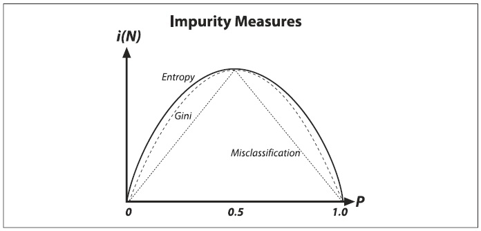

## (П]|(РС)|(РП) Binary Decision Trees

Decision trees будут рассмотрены более подробно, т.к. они являются весьма полезными и используют большую часть функциональности библиотеки машинного обучения (можно сказать являются таким неким учебным пособием для изучения библиотеки ML). Binary decision trees были придуманы Leo Breiman и коллеги (L. Breiman, J. Friedman, R. Olshen b C. Stone, Classification and Regression Trees (1984), Wadsworth), которые назвали их алгоритмами *classification and regression tree* (CART). В OpenCV реализован алгоритм *decision tree*. Суть алгоритма заключается в определении нечистой метрики (примеси) относительно данных каждого узла дерева. Например, для использования подходящей функции регресси, можно использовать сумму квадратов разности между истинным и прогнозируемым значениями. В дальнейшем может потребоваться свести к минимуму эту сумму разности ("примеси") каждого узла дерева. В случае категориальных меток необходимо определить меру, которая будет минимальна, когда большинство значений в узле имеют один и тот же класс. Как правило, используют три меры - энтропию, индекс Gini и неправильную классификацию (далее все эти меры будут более детально рассмотрены в этом разделе). После получения метрики, binary decision tree выполняет поиск по вектору особенностей в поисках объединенной особенности, которая совместно с пороговым значением наилучшим образом очищает данные. Согласно заранее оговоренным условиям, особенности, которые выше порогового значения являются "правдивыми" и, таким образом, классифицируются в левую ветку; в противном случае в правую. В последующем данная процедура выполняется рекурсивно вниз по каждой ветки дерева до тех пор, пока данные не станут достаточно чистыми или пока не будет достигнуто минимально установленное число точек в узле.

Далее будет рассмотрено уравнение узла примеси *i(N)* для двух случаев: регрессия и классификация.

###  Регрессия примеси

Для регрессии или функции соответствия уравнение узла примеси - это просто квадрат разности между значением узла *y* и значением данных *x*:

### Классификация примеси

В случае классификации, decision trees зачастую используют один из трех методов: *entropy impurity*, *Gini impurity* или *misclassification impurity*. Для разъяснения этих методов будут использоваться следующие обозначения:  обозначет долю шаблонов в узле N класса . Каждая примесь имеет несколько различных эффектов в момент принятия решения о разделении. Метод Gini является наиболее часто используемым, при этом все методы без исключения стремятся свести к минимуму примеси в узле. На рисунке 13-7 показан график примесей, которые необходимо свести к минимуму.

**Entropy impurity**

**Gini impurity**

**Misclassification impurity**

Рисунок 13-7. Decision tree примесей

Decision trees является, пожалуй, наиболее широко используемой технологией классификации. Это связано с простотой реализации и интерпритации результатов, гибкостью к различным типам данных (категоричные, численные и ненормализованные + их сочетания), способностью обрабатывать недостающие данные за счет суррогатного разделения и естественного способа присвоения важности особенностям в порядке разделения. Decision trees являются основой для других алгоритмов таких как *boosting* и *random trees*, которые будут рассмотрены чуть позже.

### Использование decision tree

