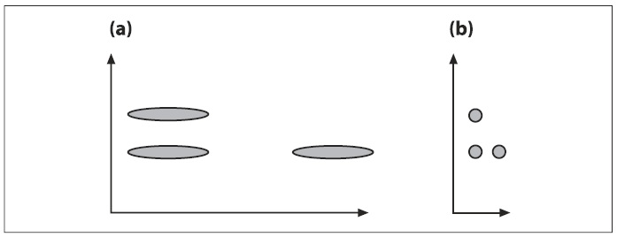

## (П]|(РС)|(РП) Расстояние Mahalanobis

*Расстояние Mahalanobis* является мерой расстояния, которая рассчитывается для ковариации или для "растягивания" пространства, в котором лежат данные. Если известна *Z-оценка*, то можно представить расстояние Mahalanobis как многомерный аналог Z-оценки. На рисунке 13-4(a) показано начальное распределение между тремя наборами данных, при этом вертикальные наборы располагаются ближе друг к другу. После нормализации пространства данных ковариации, как показано на рисунке 13-4(b), на самом деле ближе друг к другу горизонтальные наборы. Такого рода вещи встречаются часто; например, если сравнить рост людей в метрах с их возростом в днях, то можно заметить очень малое отклонение в росте относительно большой дисперсии в возрасте. Нормализовав дисперсию, можно получить более реалистичное сравнение переменных. Некоторые классификаторы, такие как K-nearest neighbors плохо обрабатывают различия в дисперсии, в то время как другие алгоритмы (такие как decision trees) не обращают на это внимания.



Рисунок 13-4. Вычисленое расстояние Mahalanobis позволяет по-новому интерпретировать ковариационные данные - как "растяжение" пространства: (a) расстояние по вертикале между строками меньше горизонтального расстояния; (b) после нормализации расстояние по горизонтале меньше расстояния по вертикале

Собственно на рисунке 13-4 уже дана подсказка относительно того, как получить расстояние Mahalanobis (); необходимо каким-то образом делить ковариацию пока измеряется расстояние. Для начала необходимо понять что такое ковариация. Имея список X из N точек, где каждая точка может иметь размерность (длину вектора) K, и средний вектор  (состоящий из отдельных средних ), получаем, что ковариацией является матрица KxK, определяемая по следующей формуле:


где  является оператором математического ожидания. При помощи OpenCV легко вычислить матрицу ковариации за счет следующий функции:

```cpp
	void cvCalcCovarMatrix(
		 const CvArr** 	vects
		,int 			count
		,CvArr* 		cov_mat
		,CvArr* 		avg
		,int 			flags
	);
```

Эта функция в определенной степени мудреная. Параметр *vects* является укащателем на указатель *CvMat*. Это означает, что имеется vects[0] до vects[count-1], но на самом деле данный факт зависит от значения *flags*? оисание которого будет представлено чуть позже. В принципе, имеется два случая:

1. *vects* является одномерным вектором указателей на одномерную или двумерную матрицы (два измерения для изображений). Т.е. каждый *vects[i]* может указывать на одномерный или двумерный вектор, если не установлены и не *CV_COV_ROWS* и не *CV_COV_COLS*. Вычисленное накопление ковариации масштабируется или разделяется на число точек в соответсвии с *count*, если установлено *CV_COVAR_SCALE*.

2. Зачастую имеется только один входной вектор, поэтому используется только *vects[0]*, если задано CV_COVAR_ROWS или CV_COVAR_COLS. Если этот параметр установлен, то величина масштабирования не зависит от *count*, а только от числа векторов, содержащихся в *vects[0]*. Тогда все точки располагаются в:

a. строках *vects[0]*, если задано *CV_COVAR_ROWS*

b. столбцах *vects[0]*, если задано *CV_COVAR_COLS*. Невозможно одновременное использование двух флагов (более подробная информация представлена в описании флага).

*vects* может иметь тип 8UC1, 16UC1, 32FC1 или 64FC1. В любом случае, *vects* содержит список K-мерных точек. Итак: в случае 1 (не задано CV_COVAR_ROWS и CV_COVAR_COLS) параметр *count* предназначен для указания того, как много векторов в *vects[]*; в случае 2a и 2b (задано CV_COVAR_ROWS или CV_COVAR_COLS), параметр *count* не используется, а используется действительное число векторов в *vects[0]*. Результатом является ковариационная матрица KxK, возвращаемая в *cov_mat* и имеющая тип *CV_32FC1* или *CV_64FC1*. Не зависимо от того будет ли использован вектор *avg*, он зависит от настройки *flags*. Если параметр *avg* используется, то он имеет тот же тип, что и *vects* и содержит средние значения K-особенностей *vects*. Параметр *flags* может иметь множество различных комбинаций настройки, образующихся за счет добаления значений друг к другу (для более сложных ситуаций, обратитесь к документации *.../opencv/docs/ref/opencvref_cxcore.htm*). В общем, *flags* может иметь одно из следующих значений:

*CV_COVAR_NORMAL*

Обычно ковариация вычисляется согласно ранее показанному уравнению. Среднее значение результата зависист параметра *count*, если не задано *CV_COVAR_SCALE*; d противном случае, результат ззависит от среднего числа точек в *vects[0]*.

*CV_COVAR_SCALE*

Нормализация вычисленой ковариационной матрицы.

*CV_COVAR_USE_AVG*

Используется матрица *avg* вместо автоматически вычисляемого среднего значения каждой особенности. Установка этого значения экономит время вычислений при наличии средних значений (например, после использования *cvAvg()*); в противном случае, функции придётся вычислять эти средние значения (должно быть передано предварительно вычисленное среднее значение, если пользователь имеет более статистически обоснованное среднее значение или если матрица ковариации выисляется по частям). 

Чаще всего данные объединяются по строчно в одну большую матрицу; тогда *flags* должно иметь следующее значение: *CV_COVAR_NORMAL | CV_COVAR_SCALE | CV_COVAR_ROWS*.

Теперь имеется ковариационная матрица. Но этого не достаточно для нахождения расстояния Mahalanobis, потому что необходимо ещё разделить пространство дисперсии и найти обратную матрицу ковариации. Последняя легко выполнима за счет использования следующий функции:

```cpp
	double cvInvert(
		 const CvArr* 	src
		,CvArr* 		dst
		,int 			method = CV_LU
	);
```

Матрица *src* должна быть матрицей ковариации, вычисленная до передачи в функцию, а матрица (содержит обратную матрицу) *dst* должна быть того же размера, что и *src*. Можно использовать значение *method* по умолчанию - *CV_LU* -, но лучше использовать *method = CV_SVD_SYM* (так же может быть использован метод *CV_SVD*, но он медленне *CV_SVD_SYM*. Должен быть использован метод *CV_SVD_SYM* даже если он медленнее *CV_LU*, при условии, что размерность пространства намного меньше числа точек. В таком случае общее время вычислений согласно *cvCalcCovarMatrix()* должно преобладать в любом случае. Так что возможо стоит потратить немного времени на вычисление более точной (при условии, что множество точек сосредоточено в подпространстве меньшей размерности) обратной матрицы ковариации. В общем, метода *CV_SVD_SYM* является лучшим выбором для выполнения данной задачи).

Теперь, после определения обратной мтарицы ковариации , можно перейти к определению расстояния Mahalanobis. Эта мера определяется почти также, как и Евклидовая метрика - квадратный корень из суммы квадратов разности между двумя векторами **x** и **y** - плюс деление на матрицу ковариации:


Данное расстояние это просто число. Если матрица ковариации является единичной матрицей. то расстояние Mahalanobis равно Евклидовой метрике. Теперь осталось рассмотреть непосредственно саму функцию, которая вычисляет расстояние Mahalanobis. Данная функция принимает два вектора - *vec1* и *vec2* - и обратную ковариационную матрицу *mat*, а возвращает расстояние как число типа *double*:

```cpp
	double cvMahalanobis(
		 const CvArr* 	vec1
		,const CvArr* 	vec2
		,CvArr* 		mat
	);
```

Расстояние Mahalanobis является важной мерой сходства между двумя различными точками в многомерном пространстве, а не алгоритмом кластеризации или классификатором. Далее будет рассмотрен наиболее часто используемый алгоритм кластеризации: **K-means**.