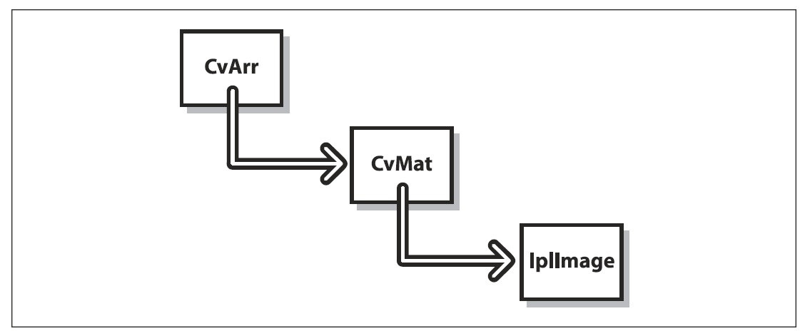

# Знакомство с OpenCV
## [П]|[РС]|(РП) Примитивные типы данных в OpenCV

OpenCV включает в себя множество примитивных типов данных. Эти данные не являются примитивными с точки зрения C, но являются самыми элементарными с точки зрения OpenCV. Посмотреть, как устроены все эти структуры, можно в файле *cxtypes.h* в директории *.../OpenCV/cxcore/include*.

Самый простейший тип - *CvPoint*. Это простая структура состоит только из двух полей x и y типа *int*. *CvPoint2D32f* содержит два поля x и y типа *float*. *CvPoint3D32f* содержит три поля x, y и z типа *float*.

*CvSize* содержит два поля width и height типа *int*. *CvSize2D32f* содержит два поля width и height типа *float*.

*CvRect* содержит четыре поля x, y, width и height типа *int*.

*CvScalar* содержит четыре переменные типа *double*. На самом деле *CvScalar* включает в себя одно поле val, которое является указателем на массив, содержащий четыре числа типа *double*.

Все эти типы данных имеют конструкторы с именами похожими на cvSize (обычно именуются так же, как и структуры, только первая буква – строчная). Помните, что это C, а не C++, и все эти "конструкторы" всего лишь inline функции, принимающие список аргументов и возвращающие желаемую структуру со значениями установленными соответствующим образом. 

Конструкторы для типов данных из таблицы 3-1 - cvPointXXX(), cvSize(), cvRect(), cvScalar() - чрезвычайно полезны, потому что упрощают ваш код. Например, чтобы нарисовать белый прямоугольник с координатами углов (5, 10) и (20, 30), достаточно написать следующий код:

	cvRectangle(
		 myImg					// Изображение
		,cvPoint(5,10)			// Верхний левый угол
		,cvPoint(20,30)			// Нижний правый угол
		,cvScalar(255,255,255)	// Цвет
	);

Таблица 3-1. Структура точки, размера, прямоугольника и скаляра
| Структура | Поля | Описание |
| -- | -- | -- |
| CvPoint | int x, y | Пиксель |
| CvPoint2D32f | float x,y | 2D точка |
| CvPoint3D32f | float x, y, z | 3D точка |
| CvSize | int width, height | Размер изображения |
| CvRect | int x, y, width, height | Часть изображения |
| CvScalar | double val[4] | Значение RGBA |

*cvScalar* в отличии от всех остальных структур содержит три конструктора. Первый может принимать один, два, три или четыре аргумента и присваивать их соответствующим элементам val[]. Второй конструктор *cvRealScalar()* принимает один аргумент и устанавливает соответствующее значение val[0], остальные элементы устанавливаются в 0. Третий конструктор *cvScalarAll()* так же принимает один аргумент и инициализирует все элементы val[] этим значением.

### Типы изображений, представленные матрицами

На рисуноке 3-1 представлена иерархия классов или структур трёх типов изображений. При использовании OpenCV, неоднократно будет использован тип *IplImage*. *IplImage* это базовая структура, используемая для кодирования того, что мы называем "изображения". Эти изображения могут быть чёрно-белыми, цветными, 4-х канальными (RGB+Alpha), и каждый канал может содержать либо целые, либо вещественные значения. Следовательно, этот тип является более общим, чем вездесущие 3-х канальные 8-битные изображения, которые сразу приходят на ум.

OpenCV располагает обширным арсеналом операторов для работы с этими изображениями, которые позволяют изменять размеры изображений, извлекать отдельные каналы, складывать два изображения, и т.д. В этой главе такие операторы будут рассмотрены более тщательно. 

Рискунок 3-1. Не смотря на то, что OpenCV написана на C, структуры, используемые в OpenCV, объектно-ориентированные; в действительности, *IplImage* происходит от *CvMat*, которая является производной от *CvArr*.

Прежде, чем перейти к деталям, необходимо взглянуть на другой тип данных: *CvMat*, структура для матриц. Хотя OpenCV полностью написана на C, относительная взаимосвязь между *CvMat* и *IplImage* похожа на наследование в C++. *IplImage* можно рассматривать как производную от *CvMat*. Класс *CvArr* можно рассматривать как абстрактный базовый класс. В прототипах функций зачастую будет указано CvArr (точнее CvArr*). В таких случаях вместо *CvArr* можно использовать и *CvMat** и *IplImage**.
