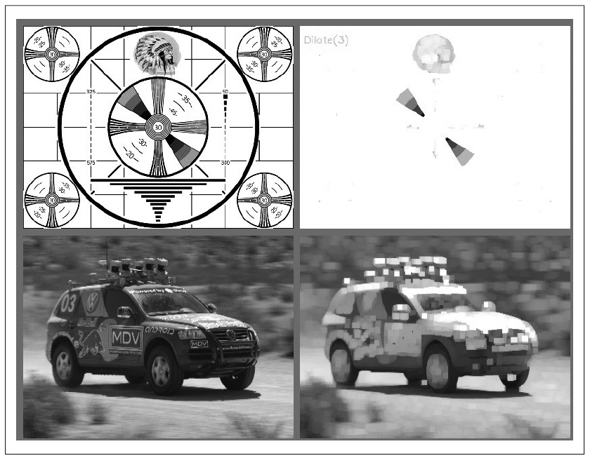

## (П]|(РС)|(РП) Морфологические преобразования

OpenCV предоставляет быстрый и простой в использовании интерфейс для выполнения морфологических преобразований над изображениями. Основные морфологические преобразования - расширение и размытие (сужение) - могут возникнуть в различных контекстах, в таких, как удаление шума, выделение отдельных элементов и соединение разнородных элементов на изображении. (!) Морфологические преобразования так же могут быть использованы для поиска неровностей интенсивности или отверстий и градиент изображения. (!)

### Расширение и размытие

Раширение - светка некоторого изображения (или области изображения), которое именуются **A**, с некоторорым ядром, которое именуется **B**. Ядро, которое может быть любой формы и размера, имеет одну определенную точку привязки (якорь). Чаще всего ядро это небольшой сплошной квадрат или диск с якорем в центре. Ядро можно рассматривать в качестве шаблона или маски, и его эффект на расширение зависит от оператора локального максимума. При сканировании изображения ядром **B** происходит вычисление локального максимума пикселя, пееркрываемого **B**, и затем значение пикселя, лежащего под опорной точкой заменяется этим максимальным значением. Это приводит к появлению ярких областей на изображении, схематично этот рост показан на рисунке 5-6. Этот рост именуется "расширением оператора". 


Рисунок 5-6. Морфологическое расширение

Размытие - обратная операция. Действие оператора размытия заключается в вычислении локального минимума под ядром. Данный оператор создаёт новое изображение на основе исходного по следующему алгоритму: при сканировании изображения ядром **B** происходит вычисление локального минимума пикселя, пееркрываемого **B**, и затем значение пикселя, лежащего под опорной точкой заменяется этим минимальным значением. Схематично сужение показано на рисунке 5-7.

*Морфологические преобразования чаще всего делаются на бинарных изображениях, полученные с помощью порогового преобразования.*

Расширение расширяет область **A**, размытие уменьшает облать **A**. К тому же, расширение применяется, как правило, чтобы сгладить вкрапления, а размытие, чтобы сгладить выступы. И все же конечный результат будет зависеть от ядра.

В OpenCV для выполнения этих преобразований используются функции *cvErode()* и *cvDilate()*:

```cpp
	void cvErode(
		 IplImage*		src
		,IplImage*		dst
		,IplConvKernel*	B 			= NULL
		,int			iterations 	= 1
	);

	void cvDilate(
		IplImage*		src
		IplImage*		dst
		IplConvKernel*	B 			= NULL
		int 			iterations 	= 1
	);
```


Обе функции допускают использование одного и тогоже изображения в качестве исходного и результирующего. Третий аргумент - ядро, которое по умолчанию равно NULL. Если ядро рано NULL, то используется ядро 3x3 с якорем в центре. Четвертый аргумент - количество итераций. Если указанное значение не равно 1, то операция будет применяться несколько раз в течение одного вызова функции. Результат размытия показан на рисунке 5-8, а расширения на рисунке 5-9. Операция размытия зачастую используется для устранения "вкраплений" шума на изображении. Суть операции сужения в том, что вкрапления и шумы размываются, в то время как большие и соответственно более значимые регионы не затрагиваются. Операция расширения зачастую используется при попытке найти связные компоненты (т.е. большие отдельные области аналогичного цвета или интенсивности). Полезность расширения возникает во многом из-за того, что, как правило, большая область разбита на несколько более мелких частей шумами, тенями или какими то аналогичными эффектами. Применение небольшого растягивания приводит к тому, что эти области "плавятся" в одну. 


Рисунок 5-8. Результат размытия



Рисунок 5-9. Результат расширения 

Напоминание: во время выполнения функции *cvErode()* значение некоторой точки *p* устанавливается в минимальное значение всех точек охватываемых ядром, выровненного относительно *p*, и наоборот в *cvDilate()* значение устанавливается в максимальное: 


Может показаться странным, зачем знать столь сложную формулу, когда ранее описанного эврестического подхода вполне достаточно. Некоторые читатели на самом деле предпочитают знать эти формулы, но что более важно, формулы охватывают некоторые утверждения общего характера, которые не проявляются в качественном описании. Если изображение не бинарное, то операторы размытия и расширения работают менее тривиально. В качестве наглядного подтвержения данного утверждения обратитесь еще раз к рисункам 5-8 и 5-9.

### Создание собственного ядра

