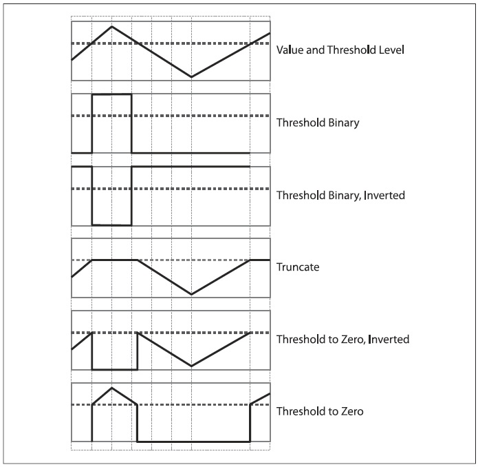

## [П)|(РС)|(РП) Пороговое преобразование

Зачастую после обработки изображения, возникает потребность, чтобы пиксели в конечном изображение были выше или ниже определенного значения. В OpenCV для решения данной проблемы существует функция *cvThreshold()*. Основная идея заложенного алгоритма заключается в том, чтобы в конечный массив попали только те пиксели, которые выше или ниже определенного значения. 

```cpp
	double cvThreshold(
		 CvArr* 	src
		,CvArr* 	dst
		,double 	threshold
		,double 	max_value
		,int 		threshold_type
	);
```

Как показано в таблице 5-5 каждому типу порога соответствует своя операция сравнения между *i*-ным пикселем исходного изображения () и порогом (обозначен как *T*). В зависимости от соотношения между значением пикселя на исходном изображении и значением порога, значение пикселя на конечном изображении  может быть установлено в 0,  или *max_value* (обозначено как *M*). 

Таблица 5-5. Значения threshold_type функции cvThreshold()

| Тип порога | Операция |
| -- | -- |
| CV_THRESH_BINARY |  = (  > T ) ? M :0 |
| CV_THRESH_BINARY_INV |  = (  > T ) ? 0: M |
| CV_THRESH_TRUNC |  = (  > T ) ? M : |
| CV_THRESH_TOZERO_INV |  = (  > T ) ? 0: |
| CV_THRESH_TOZERO |  = (  > T ) ?  :0 |

Формула 5-23 должен прояснить последствия каждого типа преобразования.



Рисунок 5-23. Результаты применения типов порогового преобразования. горизонтальная линия показывает значение порога, на первой диаграмме представленно исходное изображение, а на 5 последующих влияние применения типов порогового преобразования.

Рассмотрим небольшой пример (пример 5-2). В данном примере представлен процесс суммирования трех каналов исходного изображения с последующим удалением всех значений выше 100.

Пример 5-2. Пример использования функции cvThreshold()
```cpp
#include <stdio.h>
#include <cv.h>
#include <highgui.h>
 
void sum_rgb( IplImage* src, IplImage* dst ) {
	// Создание изображений для каждого канала
	IplImage* r = cvCreateImage( cvGetSize(src), IPL_DEPTH_8U, 1 );
	IplImage* g = cvCreateImage( cvGetSize(src), IPL_DEPTH_8U, 1 );
	IplImage* b = cvCreateImage( cvGetSize(src), IPL_DEPTH_8U, 1 );
	 
	// "Разделение" исходного изображения на составляющие
	cvSplit( src, r, g, b, NULL );
	 
	// Временное изображение
	IplImage* s = cvCreateImage( cvGetSize(src), IPL_DEPTH_8U, 1 );
	 
	// Средневзвешенная сумма
	cvAddWeighted( r, 1./3., g, 1./3., 0.0, s );
	cvAddWeighted( s, 2./3., b, 1./3., 0.0, s );
	 
	// Усечение значений до 100
	cvThreshold( s, dst, 100, 100, CV_THRESH_TRUNC );

	cvReleaseImage( &r );
	cvReleaseImage( &g );
	cvReleaseImage( &b );
	cvReleaseImage( &s );
}
 
int main(int argc, char** argv)
{
	// Создание окна
	cvNamedWindow( argv[1], 1 );
	 
	// Создание исходного и конечного изображение
	IplImage* src = cvLoadImage( argv[1] );
	IplImage* dst = cvCreateImage( cvGetSize(src), src->depth, 1);

	// Обработка исходного изображения
	sum_rgb( src, dst);
	 
	// Вывод конечного изображения на экран
	cvShowImage( argv[1], dst );
	 
	// Ожидание нажатия клавиши "Esc"
	while( 1 ) { 
		if( (cvWaitKey( 10 )&0x7f) == 27 ) 
			break; 
	}
	 
	// Освобождение ресурсов
	cvDestroyWindow( argv[1] );
	cvReleaseImage( &src );
	cvReleaseImage( &dst );
}
```

В данном примере показано несколько довольно таки важных идей. Во-первых к 8-битному массиву ничего не добавляется, иначе произойдет переполение. Вместо этого используется средневзвешенное суммирование трех каналов с последующим усечением результата по насыщенности  до 100. Функция *cvThreshold()* работает только с черно-белыми, 8-битными или вещественными изображениями. Конечное изображение должно соответствовать исходному изображению или 8-битным. Кроме того, функция позволяет использовать входное изображение и как исходное и как конечное изображение. В примере в качестве промежуточного изображения использовано изображение вещественного типа для того, что бы часть обработки можно было заменить кодом из примера 5-3. Стоит обратить внимание на функцию *cvAcc()*, которая может складывать изображения целого и вещественного типа, чего в свою очередь не может делать функция *cvADD()*. 

Пример 5-3. Альтернативный метод
```cpp
	IplImage* s = cvCreateImage(cvGetSize(src), IPL_DEPTH_32F, 1);
	cvZero(s);
	cvAcc(b,s);
	cvAcc(g,s);
	cvAcc(r,s);
	cvThreshold( s, s, 100, 100, CV_THRESH_TRUNC );
	cvConvertScale( s, dst, 1, 0 );
```

### Адаптивное пороговое преобразование

Существует еще модифицированный метод порогового преобразования, при котором пороговый уровень - это сама переменная. 

```cpp
	void cvAdaptiveThreshold(
		 CvArr* 	src
		,CvArr* 	dst
		,double 	max_val
		,int 		adaptive_method	= CV_ADAPTIVE_THRESH_MEAN_C
		,int 		threshold_type 	= CV_THRESH_BINARY
		,int 		block_size 		= 3
		,double 	param1 			= 5
	);
```

Функция реализует два варианта адаптивного порогового преобразования за счет параметра *adaptive_method*. В обоих случаях адаптивный порог *T(x, y)* устанавливает попиксельно средневзвешенное, вычисляемое в регионе *bxb* вокруг каждого пикселя минус константа, где *b* это аргумент *block_size*, а константа это *param1*. Если установлен метод *CV_ADAPTIVE_THRESH_MEAN_C*, тогда все пиксели области взвешиваются одинаково. Если установлен метод *CV_ADAPTIVE_THRESH_GAUSSIAN_C*, тогда пиксели в регионе вокруг *(х, y)* взвешиваются в соответствии с Гауссовой функциtq их расстояния от центральной точки.

Аргумент *threshold_type* может принимать любое значение из таблицы 5-5. 

Адаптивный порог полезен в тех случаях, когда изображение содержит засветки или отражённые градиенты, а также, если нужно, чтобы порог работал по отношению к общей интенсивности, а не с каждым пикселем в отдельности. Функция работает только с одноканальными, 8-битными и вещественными изображениями и требует, чтобы исходное и конечное изображения были различными. 

Исходный код для сравнения *cvAdaptiveThreshold()* и *cvThreshold()* приведён в примере 5-4. 