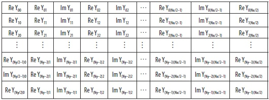

## (П]|(РС)|(РП) Дискретное преобразование Фурье (ДПФ)

Для произвольного набора значений, который проиндексирован дискретным (целочисленным) параметром, возможно определить дискретное преобразование Фурье (ДПФ) (Джозеф Фурье был первым, кто обнаружил, что некоторые функции могут быть разложены в бесконечный ряд других функций - это привело к появлению раздела, называнного анализ Фурье. Некоторые ключевые моменты, связанные с разложением функций в ряд Фурье, можно найти у Morse для физиков в частности и у Papoulis в общем. Быстрое преобразование Фурье было изобретено Cooley и Tukeye в 1965, хотя основные моменты самой идеи были предложены еще Карлом Гауссом в 1805. Первое упоминание об использовании разложения в ряд Фурье в компьютерном зрении можно найти у Ballard и Brown), аналогичное по виду преобразованию Фурье для непрерывной функции. Для N комплексных чисел  одномерное ДПФ определяется по следующей формуле (где i=):


Подобное преобразование может быть определено для двумерного массива чисел (разумеется существуют аналоги и для массивов более высших порядков):


В общем, можно ожидать, что на вычисление N разных членов  потребуется O() операций. На самом деле, существует несколько алгоритмов *быстрого преобразования Фурье* (БПФ), способных вычислять эти величины за время O(NlogN). Функция OpenCV *cvDFT()* реализует один из таких алгоритмов БПФ. Функция *cvDFT()* вычисляет БПФ для одномерных и двумерных исходных массивов. Для последнего случая, может быть вычислено двумерное преобразование, либо, если указано, одномерное преобразование для каждого независимого ряда (эта опреация намного быстрее, чем вызов *cvDFT()* для каждого отдельного случая).

```cpp
	void cvDFT(
		 const CvArr* 	src
		,CvArr* 		dst
		,int 			flags
		,int 			nonzero_rows = 0
	);
```

Исходный и конечный массивы могут быть вещественного типа одно- или двухканальными. В случае одноканального массива (исходный), элементами являются действительные значения, а выходные значения будут упакованы в специальный, компактный формат (унаследованного от старой библиотеки IPL, так же как и структура *IplImage*). В случае двухканального массива (исходный), два канала будут интерпритироваться как действительные и мнимые компоненты входных данных. В этом случае не будет никакого особенного упаковывания результатов; тем самым будет потеряно некоторое пространство, заполненное множеством нулей как в исходном, так и в конечном массивах (При использовании этого метода необходимо явно устанавливать мнимые компоненты в нули в двухканальном представлении. Простой способ сделать это - создать матрицу заполненную нулями при помощи *cvZero()* для мнимой части, а затем вызвать *cvMerge()* вместе с матрицей действительных чисел, чтобы сформировать временный массив комплексных чисел и выполнить *cvDFT()*. Эта процедура приведет к выводу полноразмерной, неупакованной, комплексной матрицы спектра).

Формат специально упакованных выходных данных для случая с одноканальным выходным массивом.

Для одномерного массива:


Для двумерного массива:



Стоит заострить внимание на индексах этих массивов. Проблема в том, что некоторые значения гарантированно нулевые (если более точно, то некоторые значения  гарантированно только действительные). При этом стоит отметить, что последний ряд таблицы будет присутствовать только если  нечетно, а последняя колонка будет присутствовать только если  нечетно. (В случае двумерного массива, рассматриваемого как  одномерных массивов, вместо полноценного двумерного преобразования, все выходные строки будут аналогичны единственной строке одномерного массива).

Третий аргумент *flags* определяет тип операции. *Прямое преобразование* устанавливается флагом *CV_DXT_FORWARD*. *Обратное преобразование* (При обратном преобразовании, входные данные упаковываются в специальный формат. Это имеет смысл, т.к. если вызвать прмое ДПФ, а затем обратное ДПФ, то результатом должны быть исходные данные - это произойден только в том случае, если используется флаг *CV_DXT_SCALE*) определяется схожим образом, за исключением смены знака у экпоненты и масштабного коэффициента. Для выполнения обратного преобразования без масштабного коэффициента, используется флаг *CV_DXT_INVERSE*. 