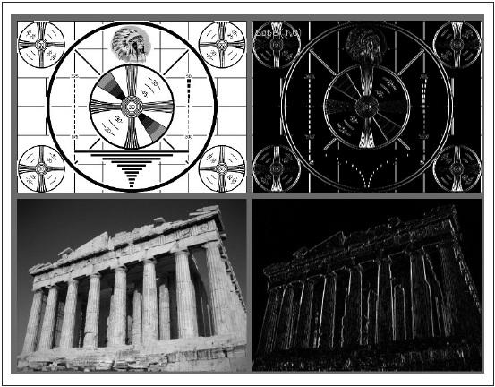
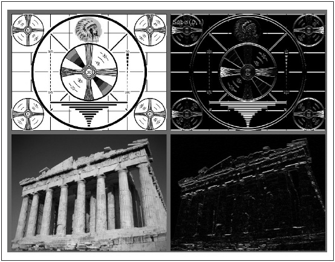

## (П]|(РС)|(РП) Градиенты и производная Собеля

Вычисление производных (или их апроксимация) - это одна из наиболее важных базовая свертка. Есть множество способов сделать это, но далеко не все из них хорошо подходят к конкретной ситуации. 

В общем, самым распространенным оператором, используемый для представления диффернцирования, являеся производная Собеля (рисунок 6-3 и 6-4). Существуют операторы Собеля для любого порядка производной, а так же для смешанных частных производных ().



Рисунок 6-3. Результат применения оператора Собеля, используемый для аппроксимации производной по оси x



Рисунок 6-4. Результат применения оператора Собеля, используемый для аппроксимации производной по оси y

```cpp
	cvSobel(
		 const CvArr*	src
		,CvArr*			dst
		,int			xorder
		,int			yorder
		,int			aperture_size = 3
	);
```

Аргументы *src* и *dst* - исходное и конечное изображения, а аргументы *xorder* и *yorder* - порядки производной. Обычно используется 0, 1 или максимум 2 производная; значение 0 означает, что производная в указанном направлении браться не будет (при этом хотя бы одно из направлений должно быть не нулевым). Аргумент *aperture_size* должен быть нечетным числом и задает ширину (и высоту) квадратного фильтра. На момент написания книги поддерживаемые размеры апертуры 1, 3, 5 и 7. Если исходное изображение 8-битное, тогда конечное изображение должно быть глубиной *IPL_DEPTH_16S*, чтобы избежать переполнения.

Производные Собеля обладают хорошим свойством в том смысле, что могут быть определены для ядер любого размера, которые в свою очередь могут быть быстро построены. Более крупные ядра дают лучшую аппроксимацию производной, потому что мелкие ядра очень чувствительны к шуму. 

Что бы это осознать, нужно понимать, что производная Собеля в действительности производной не является. Это все потому, что оператор Собеля определен в дискретном пространстве. Что в действительности представляет собой оператор Собеля, так это подгонку под полином. Так что, производная Собеля второго порядка по сои x на самом деле не вторая производная, а локальная подгонка под параболическую функцию. Это объясняет необходимость использования ядра большего размера, т.к. большее ядро производит подгонку над большим количеством пикселей. 

### Фильтр Щарра

В действительности существует множество способов аппроксимировать производную для случая дискретной сетки. Недостатком аппроксимации с использованием оператора Собеля является то, что она менее точна для маленьких ядер. Для больших ядер, где используется больше точек для аппроксимации, эта проблема менее значительна. Эти неточности не видны для X и Y фильтров, используемые в *cvSobel()*, потому что они точно совпадают с осями *x* и *y*. 