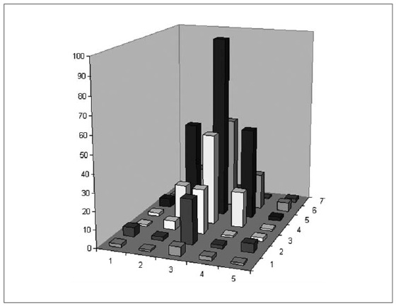

## (П]|(РС)|(РП) Интегральное изображение

OpenCV позволяет легко рассчитывать интегральное изображение с помощью ункции *cvIntegral()*. *Интегральное изображение* - это структура данных, которая позволяет быстро суммировать области. Такое суммирование полезно во многих приложениях; одним из значимых является вычисление *вейвлеты Хаара*, которые используются при распознавание лиц и подобных алгоритмах.

```cpp
	void cvIntegral(
		 const CvArr* 	image
		,CvArr* 		sum
		,CvArr* 		sqsum = NULL
		,CvArr* 		tilted_sum = NULL
	);
```

Аргументами *cvIntegral()* являются оригинальное изображение, а так же указатели на результаты. Аргумент *sum* обязателен; остальные, *sqsum* и *tilted_sum*, могут быть использованы по необходимости. (На самом деле, аргументы могут быть не изображениями, они могут быть и матрицами, хотя на практике, как правило, это изображения). Если исходное изображение 8-битное беззнаковое, то *sum* или *tilted_sum* могут быть 32-битными целыми или вещественными массивами. Для всех остальных случаев, *sum* или *tilted_sum* должны быть вещественными (32 или 64 битными). Результат всегда должен быть вещественного типа. Если исходное изображение имеет размер WxH, то конечное изображение должно иметь размер (W + 1)x(H + 1) (потому что необходимо поместить в буфер нулевые значения по осям x и y для более эфективного процесса вычисления).

Интегральное изображение *sum* имеет форму:


Необязательное изображение *sqsum* представляет собой сумму квадратов:


*tilted_sum* схоже с *sum* за исключением того, что оно повернуто на 45 градусов:


Используя эти интегральные изображения можно вычислить суммы, среднее значение и стандартное отклонение по произвольной вертикале или "наклонной" прямоугольной области изображения. В качестве простого примера просуммируем простую прямоугольную область, заключенную в угловых точках (x1, y1) и (x2, y2), где x2>x1 и y2>y1; вычисления произодятся по следующей формуле:


Таким образом можно выполнить быстрое размытие и аппрокимацию градиента, вычислить среднее значение и стандартное отклонение, а так же выполнить быструю настройку переменных, отвечающих за размеры окна. Что бы стало более понятнее, рассмотрим изображение 7x5, показанное на изображение 8-18; взятый регион показан в виде гистограммы, в которой высота столбиков отображает значения яркости пикселей. Эта же информация показана на рисунке 6-19, численно слева и интегрально справа. Интегральное изображение (I') вычисляется путем прохода по строкам, строка за строкой, с использованием ранее вычисленных интегральных значений вместе с текущей не обработанной строкой (I) значений I(x, y) для вычисления следующего целого значения изображения:




Рисунок 6-18. Изображение 7x5, показанное в виде гистограммы

Последнее слагаемое необходимо чтобы избежать двойного учета при добавлении второго и третьего слагаемого. Это можно проверить, протестировав некоторые значения на рисунке 6-19. 

(!) При использовании интегрального изображения для вычисления региона, как показано на рисунке 6-19 и для вычисления центральной прямоугольной области, ограниченной 20-ю, необходимо 398 – 9 – 10 + 1 = 380. (!) Таким образом, прямоугольник любого размера может быть вычислен с использованием четырех измерений (в результате чего вычислительная сложность равна O(1)).


Рисунок 6-19. Изображение 7x5 численно показано слева и интегрально справа