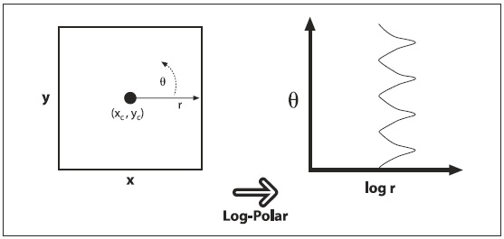
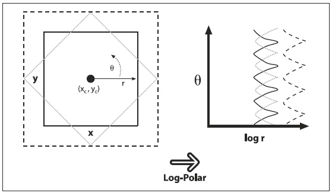
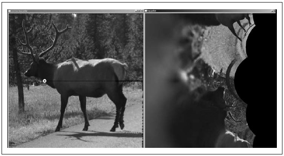

## (П]|(РС)|(РП) LogPolar

Для двухмерных изображений логарифмически-полярное (далее лог-полярное) преобразование - перевод из декартовых в полярные координаты: , где  и exp(iθ) = exp( i⋅arctan(y/x) ). Для выделения полярных координат в пространство (ρ, θ), которое соотносится с некоторой центральной точкой (, ), необходимо взять логарифм так, чтобы  и . Применительно к изображению - чтобы "уместить" интересные части изображения в памяти - необходимо применять масштабный коэффициент *m* к *ρ*. На рисунке 6-15 показан квадрат (слева) и его перекодирование в лог-полярное пространство.



Рисунок 6-15. Лог-полярное отображение (x, y) в (log(r), θ)

Несомненно, возникает вопрос "Зачем все это делать?". Лог-полярное преобразование берет свои корни от зрительной системы человека. Глаз имеет небольшой, но плотно покрытый фоторецепторами центр (*ямка*), при этом при отдалении от него плотность фоторецептором резко сокращается (экспоненциально). Попробуйте смотреть на некоторую точку на стене и держать ваш палец на расстоянии вытянутой руки на линии поля вашего зрения. Затем, продолжайте смотреть на точку и медленно отводите оттуда палец, - обратите внимание, как быстро снижается детальность при отдалении изображения вашего пальца от ямки. Эта структура также имеет хорошие математические свойства (выходящие за рамки этой книги), согласно которым происходит сохранение углов пересечения линий. 

Наиболее важным является то, что лог-полярное преобразование может быть использовано для создания двумерного инвариантного представления вида объекта путем сдвига центра масс трансформированного изображения в фиксированную точку на лог-полярной плоскости (рисунок 6-16). Слева имеется три формы, которые необходимо распознать как "квадрат". Проблема в том, что они выглядят по-разному. Один намного больше остальных, а один повернут. Лог-полярное преобразование показано на рисунке 6-16 справа. Стоит обратить внимание на то, что отличие в размере на плоскости (x, y) преобразуется в сдвиг по оси log(r) лог-полярной плоскости, а отличия в повороте преобразуются в сдвиг по оси θ на лог-полярной плоскости. 

Если взять преобразованный центр каждого преобразованного квадрата на лог-полярной плоскости, а затем перецентрировать в некоторое фиксированное положение, тогда все квадраты будут выглядеть одинаково на лог-полярной плоскости. Это приводит к инвариантности двумерного поворота и масштабирования (В главе 13 речь пойдет об распознавании. Сейчас достаточно будет знать, что получение лог-полярного преобразования для всего объекта не является хорошей идеей, т.к. подобные преобразования достаточно чувствительны к подбору их центральной точки. Более работоспособным вариантом является последовательное определение набора ключевых точек (таких как положение углов и впадин) вокруг объекта, отсечение лишнего по краю вокруг этих точек и использование центров ключевых точек в роли лог-полярных центров. Эти местные лог-полярные преобразования могут быть затем использованы для того, чтобы создать местные признаки, которые (частично) инвариантны (не зависимы) от вращения и масштабирования, и которые могут быть ассоциированы с видимым объектом).



Рисунок 6-16. Лог-полярное преобразование повернутого и масштабированного квадрата: размер влияет на сдвиг по оси log(r), а поворот - на сдвиг по оси θ.

*cvLogPolar()* - функция OpenCV для лог-полярных преобразований:

```cpp
	void cvLogPolar(
		 const CvArr* 	src
		,CvArr* 		dst
		,CvPoint2D32f 	center
		,double 		m
		,int 			flags = CV_INTER_LINEAR | CV_WARP_FILL_OUTLIERS
	);
```

*src* и *dst* - это одноканальные или трехканальные цветные или серые изображения. Параметр *center* это центральная точка (, ) лог-полярного преобразования; *m* коэффициент масштабирования, который должен быть выставлен таким образом, чтобы главные черты изображения доминировали в доступной области изображения. Параметр *flags* разрешает использование различных методов интерполяции. Можно использовать методы интерполяции из того же набора стандартных методов интерполяции, доступных в OpenCV (таблица 6-1). Методы интерполяции могут быть комбинированы с одним или обоими флагами *CV_WARP_FILL_OUTLIERS* (чтобы заполнить точки, которые иначе были-бы неопределенными) или *CV_WARP_INVERSE_MAP* (чтобы вычислить обратное преобразование из лог-полярных в прямоугольные координаты). 

Пример лог-полярного кодирования показан в примере 6-4, который демонстрирует прямое и обратное (инверсное) лог-полярное преобразование. Результаты обработки фотографии показаны на рисунке 6-17. 

Пример 6-4. Пример лог-полярного преобразования

```cpp
// logPolar.cpp : Определяет точку входа для консольного приложения
//
#include <cv.h>
#include <highgui.h>

int main(int argc, char** argv) {
	IplImage* 	src;
	double 		M;

	if( argc == 3 && (( src=cvLoadImage(argv[1],1)) != 0 )) {
		M = atof(argv[2]);

		IplImage* dst 	= cvCreateImage( cvGetSize(src), 8, 3 );
		IplImage* src2 	= cvCreateImage( cvGetSize(src), 8, 3 );
		
		cvLogPolar(
			 src
			,dst
			,cvPoint2D32f(src->width/4,src->height/2)
			,M
			,CV_INTER_LINEAR+CV_WARP_FILL_OUTLIERS
		);

		cvLogPolar(
			 dst
			,src2
			,cvPoint2D32f(src->width/4, src->height/2)
			,M
			,CV_INTER_LINEAR | CV_WARP_INVERSE_MAP
		);

		cvNamedWindow( "log-polar", 1 );
		cvShowImage( "log-polar", dst );

		cvNamedWindow( "inverse log-polar", 1 );
		cvShowImage( "inverse log-polar", src2 );
		cvWaitKey();
	}
	return 0;
}
```



Рисунок 6-17. Пример лог-полярного преобразования над изображением лося с центром показанным белым кругом на левом изображении. Результат преобразования - справа.
