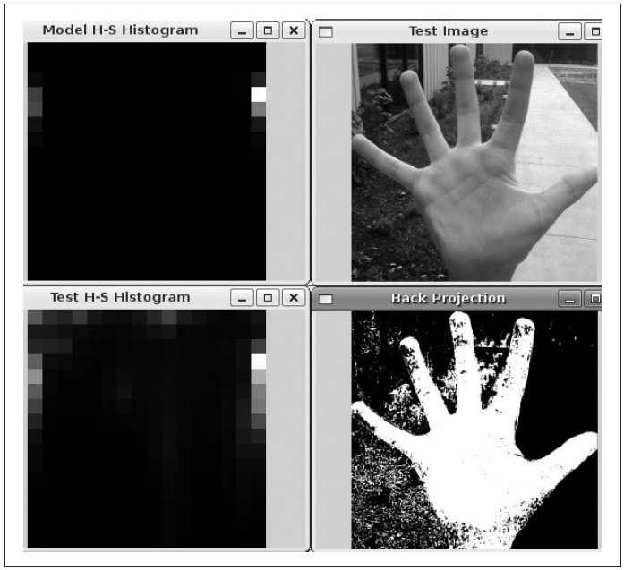
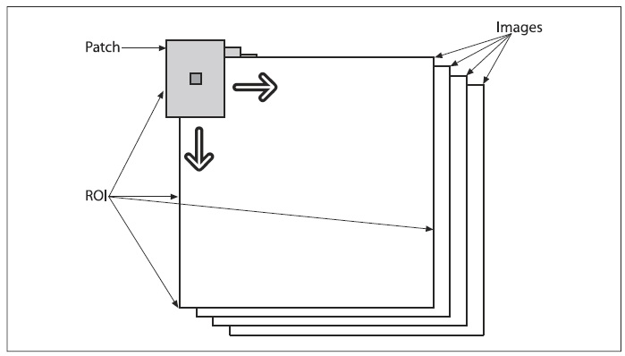
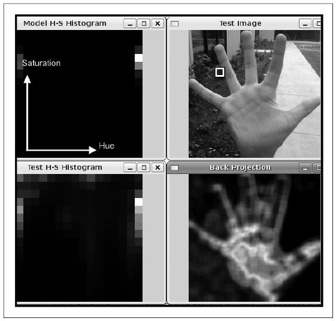
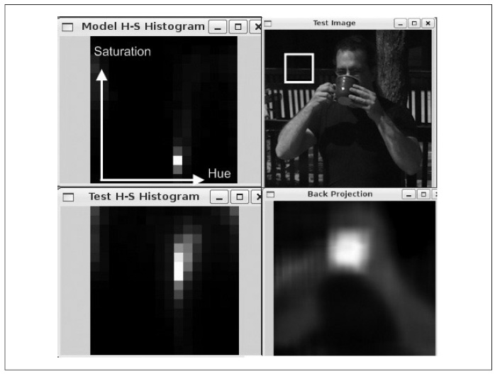

## (П]|(РС)|(РП) Более сложные манипуляции

Всё, что было рассмотрен до сих пор было достаточно простым. Каждая из функций несла очевидную необходимость. В совокупности, они образуют хорошую основу для всего того, что можно сделать с гистограммами в контексте компьютерного зрения (или же в каких-либо других контекстах). В данном разделе речь пойдет о более сложных процедурах, которые имеются в OpenCV и которые чрезвычайно полезны в некоторых приложениях. Эти процедуры включают в себя более сложные методы сравнения двух гистограмм, а так же инструменты для вычисления и/или визуализации частей изображения, которые соответствуют заданной части гистограммы. 

### Earth Mover’s Distance

Изменение освещения может привести к сдвигу цветовых значений (рисунок 7-5), хотя такой сдвиг, как правило, не изменяет форму гистограммы значений цвета, но при изменении положения цветовых значений, схемы сравнения гистограмм обречены на провал. Однако, если вместо гистограмм *сравнения* использовать гистограммы *расстояния*, то можно сравнить две гистограммы несмотря на сдвиг одной гистограммы относительно другой на малые расстояния. Earth mover’s distance (EMD) явлется метрикой; по сути это мера работы необходимой для преобразования одной или нескольких гистограмм в новое положение. Она работает с любым количеством измерений.

Если снова взглянуть на рисунок 7-4, то можно увидеть характер изменения расстояния EMD. Точное совпадение соответствует расстоянию равное 0. (!)Совпадение на половину это половина "полной лопаты" - то количество, которое потребуется, чтобы разнести половину левой гистограммы в соседний слот.(!) И наконец, для перемещения всей гистограммы на один шаг вправо потребует вся единица расстояния (например, для изменения гистограммы в "совершенно несовпадающую " гистограмму).

Алгоритм EMD имеет весьма общий характер; это позволяет пользователям устанавливать собственную дистанционную метрику или собственную матрицу стоимости перемещения. (!)Можно зафиксировать, где гистограмма "material" изменяется при переходе от одной гистограммы к другой или можно воспользоваться нелинейными показателями расстояния, полученные из предварительной информации о данных.(!) В OpenCV EMD соответствует функция *cvCalcEMD2()*:

```cpp
	float cvCalcEMD2(
		 const CvArr* 			signature1
		,const CvArr* 			signature2
		,int 					distance_type
		,CvDistanceFunction 	distance_func 	= NULL
		,const CvArr* 			cost_matrix 	= NULL
		,CvArr* 				flow 			= NULL
		,float* 				lower_bound 	= NULL
		,void* 					userdata 		= NULL
	);
```

Функция *cvCalcEMD2()* имеет достаточно много аргументов. Можно воспринять это решение довольно таки сложным для такой интуитивной функции, но сложность проистекает от возможности тонкой настройки алгоритма (если есть необходимость в знание всех "кровавых" подробностей, то необходимо изучить статью S. Peleg, M. Werman и H. Rom 1989 года "A Unified Approach to the Change of Resolution: Space and Gray-Level", а затем заглянуть в руководство OpenCV и изучить файл *...\opencv\docs\ref\opencvref_cv.htm*). К счастью, функция может быть использована в более обобщенной и интуитивно понятной форме без большинства аргументов (на это указывает "= NULL" в определении функции). В примере 7-2 показана упращенная версия этой функции.

Пример 7-2. Упращенная версия функции cvCalcEMD2()

```cpp
	float cvCalcEMD2(
		 const CvArr* signature1
		,const CvArr* signature2
		,int distance_type
	);
```

Параметр *distance_type* для упращенной версии *cvCalcEMD2()* может быть либо *расстоянием Manhattan* (*CV_DIST_L1*) или *расстоянием Euclidean* (*CV_DIST_L2*). Хотя EMD и используется для гистограмм, интерфейс упрощенной версии функции предполагает использвание в терминологии первых двух аргументов массивов. 

Эти массивы всегда типа *float* и состоят из строк, содержащие количество контейнеров гистограммы и их координаты. Для одномерной гистограммы (рисунок 7-4) сигнатуры (перечислимые строки массива) левой колонки гистограммы (пропускная модель) будет выглядеть следующим образом: верхняя [1, 0; 0, 1]; средняя [0.5, 0; 0.5, 1]; нижняя [0, 0; 1, 1]. Если взять контейнер трехмерной гистограммы с 537 контейнерами (x, y, z), то сигнатура строки с индексом (7, 43, 11) будет [537, 7; 43, 11]. Это необходимый шаг преобразования гистограммы в сигнатуры.

В качестве примера, предположим, что имеется две гистограммы *hist1* и *hist2*, которые необходимо преобразовать в сигнатуры *sig1* и *sig2*. Для усложнения задачи, будут использованы двумерные гистограммы размерностью *h_bins x s_bins*. Пример 7-3 отопражает процесс преобразования этих двух гистограмм в две сигнатуры. 

Пример 7-3. Создание сигнатур гистограмм для EMD сравнения

```cpp
// Преобразование гистограмм в сигнатуры для EMD сравнения
// На входе имеются двумерные гистограммы hist1 и hist2
// обе имеют размерности h_bins x s_bins (хотя для EMD,
// гистограммы не должны совпадать по размеру)
//
CvMat* sig1,sig2;
int numrows = h_bins*s_bins;

// Создание матриц для хранения сигнатур
//
sig1 = cvCreateMat(numrows, 3, CV_32FC1); // 1 count + 2 coords = 3
sig2 = cvCreateMat(numrows, 3, CV_32FC1); // sig1 и sig2 имеют тип float

// Заполнение сигнатур для двух гистограмм
//
for( int h = 0; h < h_bins; h++ ) {
    for( int s = 0; s < s_bins; s++ ) {
    float bin_val = cvQueryHistValue_2D( hist1, h, s );
    cvSet2D(sig1,h*s_bins + s,0,cvScalar(bin_val)); 	// значение контейнера
    cvSet2D(sig1,h*s_bins + s,1,cvScalar(h)); 			// Coord 1
    cvSet2D(sig1,h*s_bins + s,2,cvScalar(s)); 			// Coord 2
 
    bin_val = cvQueryHistValue_2D( hist2, h, s );
    cvSet2D(sig2,h*s_bins + s,0,cvScalar(bin_val)); 	// значение контейнера
    cvSet2D(sig2,h*s_bins + s,1,cvScalar(h)); 			// Coord 1
    cvSet2D(sig2,h*s_bins + s,2,cvScalar(s)); 			// Coord 2
    }
}
```

В этом примере (Использование  cvSetReal2D() или cvmSet() было бы более компактным и эффективным, но пример проясняет выбранный вариант: дополнительные накладные расходы малы по сравнению с фактическими расчетами расстояния в EMD) функция *cvSet2D()* принимает *CvScalar()*, чтобы задать значения массива, хотя каждая запись в данной матрице имеет тип *float*. Для удобства используется встроенный макрос CvScalar(). После получения сигнатур можно вычислять меру расстояния. В примере 7-4 показано вычисление расстояния Euclidean.

Пример 7-4. Использование EMD для измерения сходства между распределениями

```cpp
	float emd = cvCalcEMD2( sig1, sig2, CV_DIST_L2 );
	printf( "%f; ", emd );
```

### Обратная проекция

Обратная проекция это способ записи пикселей (*cvCalcBackProject()*) или участка пикселей (*cvCalcBackProjectPatch(*), соответствующие распределению пикселей в модели гистограммы. Например, имея гистограмму телесного цвета можно воспользоваться обратной проекцией, чтобы найти цвета на изображении, соответствующие кожному цвету. Функция, выполняющая подобного рода поиск:

```cpp
	void cvCalcBackProject(
		 IplImage** 		image
		,CvArr* 			back_project
		,const CvHistogram* hist
	);
```

Ранее уже было рассказано о массиве одноканальных изобрабений *IplImage*** при разборе функции *cvCalcHist()* (раздел "Базовые манипуляции над гистограммами"). Число изображений в этом массиве точно такое же - и в том же порядке - что использовалось при построении модели гистограммы *hist*. В примере 7-1 показано, как преобразовать изображение в одноканальные кадры и сделать из них массив. Изображение или массив *back_project* это одноканальное 8-битное или вещественное изображение того же размера, что и входное изображение. Значения *back_project* устанавливаются в значения контейнеров *hist*. Если гистограмма нормализована, тогда эти значения могут быть связаны с условной вероятностью значения (т.е. вероятность того, что пиксели в изображении - члены типа характеризуемые гистограммой *hist*)*. На рисунке 7-6 показана гистограмма телесных цветов для получения вероятности телесного изображения.



Рисунок 7-6. Обратная проекция гистограммы оценивает каждый пиксель основываясь на значение его цвета: гистограмма телесного цвета HSV (сверху слева) используется для преобразования изображения руки (сверху справа) в изображение вероятностей телесных цветов (внизу справа); нижнее левое изображение - это гистограмма изображения руки

	* В частности, в случае гистограммы H-S, если C это цвет пикселя и F это вероятность того, что пиксель соответствует телесному цвету, тогда имеем вероятность p(C|F) того, что цвет пикселя действительно соответствует телесному цвету. Но это не значит, что p(F|C) - это вероятность того, что телесный цвет соответствует цвету пикселя. Тем не менее эти две вероятности связаны теоремой Байеса и если в целом известна вероятность встречи объекта телесного цвета на сцене а так же общая вероятность попадания в диапазон телесного цвета, тогда можно вычислить p(F|C) от p(C|F). В частности, теорема Байеса устанавливает следующее соответствие:

	

Когда *back_project* - это изображение типа byte, а не float, то либо гистограмму не нужно нормализовывать, либо это изображение необходимо масштабировать перед использованием. Причина этого в том, что максимально возможное значение нормализованной гистограммы 1, так что, все что меньше будет округлено до 0 в 8-битном изображении. Так же, возможно, потребуется масштабировать *back_project* для того, чтобы можно было увидеть собственными глазами разницу в высоте контейнеров гистограммы. 

**Обратная проекция основанная на метках**

Базовый метод обратной проекции может быть использован для моделирования является ли пиксель членом определенного типа объекта (когда данный тип объекта был смоделирован гистограммой). Это не совсем так же, как вычисление вероятности наличия конкретного объекта. Альтернативный метод предполагает рассмотрение субрегиона изображения и признака (напрмер, цвета) гистограммы в этом субрегионе и проверку на соответствие гистограммы субрегиона гистограмме модели; затем можно связать с каждым субрегионом вероятность того, что моделируемый объект присутствует в данном субрегионе. 

Таким образом, так же, как *cvCalcBackProject()* позволяет нам вычислять является ли пиксель частью заданного объекта, *vCalcBackProjectPatch()* позволяет узнавать, является ли пиксель субрегиона частью заданного объекта. Как показано на рисунке 7-7, функция *cvCalcBackProjectPatch()* использует скользящее окно по всему исходному изображению. В каждом месте исходного массива изображения, все пиксели субрегиона используются для установки одного пикселя в конечном изображении. Это важно, поскольку многие свойства изображения, например, такое как текстура, не могут быть определены на уровне отдельных пикселей, только на уровне группы пикселей.



Рисунок 7-7. Обратная проекция: скользящее окно по поверхности исходного изображения используется для установки соответствующего пикселя в конечном изображении; для нормализованной гистограммы изображение может быть интерпретировано как карта вероятности с указанием вероятного места присутствия объекта

Для упрощения описанных примеров, цвет был подобран для создаваемой модели гистограммы. Таким образом, на рисунке 7-6 вся рука "светится", потому что пиксели соответствуют модели гистограммы телесного цвета. (!)Использование субрегионов помогает при обнаружении статистических свойств, которые появляются в локальных областях при изменении локальной интенсивности, при этом текстура формируется до конфигурирования свойств, формирующие весь объект.(!) Существует два варианта использования *cvCalcBackProjectPatch()*: в качестве обнаружения региона, когда окно выборки меньше объекта и в качестве детектора объекта, когда окно выборки соизмеримо с объектом. Рисунок 7-8 отображает использование *cvCalcBackProjectPatch()* для поиска региона. 

Начиная с модели гистограммы телесных цветов и передвигая небольшое окно вдоль изображения так, что в каждый пиксель обратной проекции записывается вероятность того, что текущий пиксель соответствует телесному цвету при учете всех окружающих окно пикселей в оригинальном изображении. На рисунке 7-8 рука намного больше сканирующего окна, что является преимуществом при распознавании региона ладони. На рисунке 7-9 показана гистограмма соответствующая распознаной синей кружке. В отличие от рисунка 7-8, где был обнаружен регион, рисунок 7-9 показывает как *cvCalcBackProjectPatch()* может быть использована для обнаружения объекта. Когда размеры окна примерно такого же размера, как объект, который требуется найти на изображении, то искомый объект "светится" на изображении обратной проекции. Поиск пиковых значений на изображении обратной проекции соответствует поиску местоположения объекта (на рисунке 7-9 это кружка).

```cpp
	void cvCalcBackProjectPatch(
		 IplImage** 	images
		,CvArr* 		dst
		,CvSize 		patch_size
		,CvHistogram* 	hist
		,int 			method
		,float 			factor
	);
```


Рисунок 7-8. Обратная проекция используемая для постоения гистограммы объекта телесного цвета, где окно (маленький белый квадрат в верхней правой части окна) намного меньше руки; гистограмма соответствует распределению телесных цветов с пиковыми значениями преимущественно в центре руки



Рисунок 7-9. Использование cvCalcBackProjectPatch () для поиска объекта (чашки кофе), размер которого примерно соответствует размеру *patch* (белый квадрат в верхнем правом изображении): гистограмма оттенок насыщенность для искомого объекта (левый верхний угол), которая может быть сопоставлена с HS гистограммой для изображения в целом (нижний левый угол); результат (нижний правый угол) показывает, что объект удалось довольно таки легко определить в силу своего вета

Аргумент *images* - это тот же массив одноканального изображения, которое было использовано в *cvCalcHist()* при создании гистограммы. Тем не менее, конечное изображении *dst* отличается: оно может быть только одноканальным вещественным изображением размера *( images[0][0].width – patch_size.x + 1, images[0][0].height – patch_size.y + 1 )*. Указанный размер объясняется тем, что центральный пиксель в *patch* используется для указания места для результата в конечном изображении *dst*, поэтому теряется половина разера *patch* по краям изображения со всех сторон. Параметр *patch_size* задает размер *patch* и может быть установлен с помощью удобного макроса *cvSize(width, height)*. Параметр гистограмма *hist* были уже рассмотрен ранее. Параметр метода сравнения *method* принимает все теже значения, что и в случае с *cvCompareHist()* (раздел "Сравнение двух гистограмм") (Необходимо соблюдать осторожность при выборе метода, потому что некоторые отображают наилучший результат как 1, а некоторые как 0). Последний аргумент *factor* задает уровень нормализации; этот параметр так же был описан при рассмотрении *cvNormalizeHist()*. По умолчанию он соответствует 1, любое более высокое значение помогает при визуализации. Благодаря этому параметру существует возможность нормализовать *hist* перед использованием *cvCalcBackProjectPatch()*.

И в заключении остался один не решенный вопрос: после того, как найдено изображение вероятности объекта, как этим изображением можно воспользоваться, что бы найти искомый объект? Для поиска можно воспользоваться функцией *cvMinMaxLoc()*, о которой шла речь в главе 3. Максимальные значения (если при этом еще и сгладить изображение), скорее всего, укажут на искомый объект.

### Сравнение шаблонов

