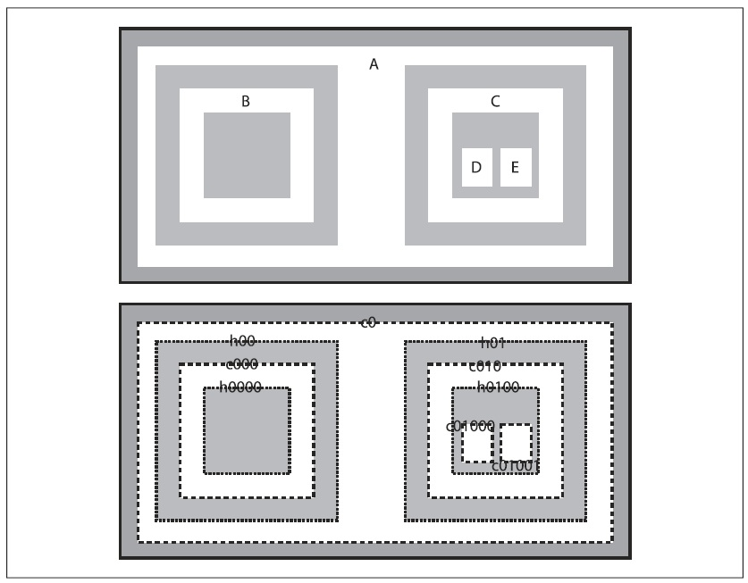

## (П]|(РС)|(РП) Поиск контуров

Теперь настало время поговорить о *контурах*. Для начала необходимо дать точное определение тому, что такое контур. Контур – это список точек, которые в той или иной форме представляют кривую на изображении. Это представление может быть различным в зависимости от обстоятельств. Есть множество способов для представления кривой. В OpenCV контуры представлены последовательностями, в которых каждая запись содержит информацию о нахождении следующей точки кривой. Чуть позже будут рассмотрены детали, а сейчас достаточно понимать, что контур в OpenCV представлен последовательностью *CvSeq*, которая, так или иначе, является последовательностью точек.

Функция *cvFindContours()* вычисляет контуры из бинарных изображений. Она может принимать изображения, созданные при помощи *cvCanny()*, которые имеют граничные пиксели или изображения, созданные при помощи *cvThreshold()* или *cvAdaptiveThreshold()*, у которых края представлены в виде границы между положительными и отрицательными регионами.

Перед переходом к прототипу функции, необходимо осознать, что такое контур. При разборе работы функции будет введено понятие дерево контура для понимания того, что функция *cvFindContours()* будет возвращать в качестве результата.

На рисунке 8-2 показана функциональность функции *cvFindContours()*. В верхней части рисунка находится тестовое изображение, содержащее несколько белых регионов (обозначены от *A* до *E*) на тёмном фоне. (Для ясности на рисунке тёмные области изображены серым, так проще представить, что изображение подвергнуто пороговому преобразованию, так что серые области устанавливаются в черный цвет только при передачи в функцию *cvFindContours()*). В нижней части рисунка находится тоже изображение, но уже с выделенными контурами, которые обозначены *cX* или *hX*, где «c» расшифровывается как «contour» (контур), «h» расшифровывается как «hole» (отверстие), а «X» это некое число. Некоторые из этих контуров нарисованы пунктирной линией; они представляют *внешние границы* белых регионов (т.е. ненулевых регионов). OpenCV и *cvFindContours()* различают эти внешние границы и пунктирные линии, которые можно представить как *внутренние границы* или как внешние границы *отверстий* (т.е. нулевых регионов).

Рисунок 8-2. Тестовое изображение (сверху) переданное cvFindContours() (снизу): найденные контуры могут быть одного из двух типов, внешние контуры (штриховые линии) или отверстия (пунктирные линии)

Концепция вложенности играет важную роль во многих приложениях. По этой причине OpenCV может собрать найденные контуры в *дерево контуров*, которое отражает отношение вложенности контуров в своей структуре. Дерево контуров для тестового изображения будет иметь контур *c0* как корневой узел, с отверстиями *h00* и *h01* в качестве потомков. Эти отверстия в свою очередь так же будут иметь потомков и т.д.

