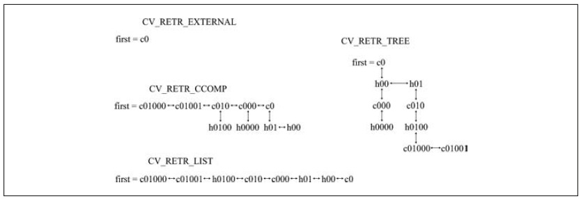

## (П]|(РС)|(РП) Поиск контуров

Теперь настало время поговорить о *контурах*. Для начала необходимо дать точное определение тому, что такое контур. Контур – это список точек, которые в той или иной форме представляют кривую на изображении. Это представление может быть различным в зависимости от обстоятельств. Есть множество способов для представления кривой. В OpenCV контуры представлены последовательностями, в которых каждая запись содержит информацию о нахождении следующей точки кривой. Чуть позже будут рассмотрены детали, а сейчас достаточно понимать, что контур в OpenCV представлен последовательностью *CvSeq*, которая, так или иначе, является последовательностью точек.

Функция *cvFindContours()* вычисляет контуры из бинарных изображений. Она может принимать изображения, созданные при помощи *cvCanny()*, которые имеют граничные пиксели или изображения, созданные при помощи *cvThreshold()* или *cvAdaptiveThreshold()*, у которых края представлены в виде границы между положительными и отрицательными регионами.

Перед переходом к прототипу функции, необходимо осознать, что такое контур. При разборе работы функции будет введено понятие дерево контура для понимания того, что функция *cvFindContours()* будет возвращать в качестве результата.

На рисунке 8-2 показана функциональность функции *cvFindContours()*. В верхней части рисунка находится тестовое изображение, содержащее несколько белых регионов (обозначены от *A* до *E*) на тёмном фоне. (Для ясности на рисунке тёмные области изображены серым, так проще представить, что изображение подвергнуто пороговому преобразованию, так что серые области устанавливаются в черный цвет только при передачи в функцию *cvFindContours()*). В нижней части рисунка находится тоже изображение, но уже с выделенными контурами, которые обозначены *cX* или *hX*, где "c" расшифровывается как "contour" (контур), "h" расшифровывается как "hole" (отверстие), а "X" это некое число. Некоторые из этих контуров нарисованы пунктирной линией; они представляют *внешние границы* белых регионов (т.е. ненулевых регионов). OpenCV и *cvFindContours()* различают эти внешние границы и пунктирные линии, которые можно представить как *внутренние границы* или как внешние границы *отверстий* (т.е. нулевых регионов).


Рисунок 8-2. Тестовое изображение (сверху) переданное cvFindContours() (снизу): найденные контуры могут быть одного из двух типов, внешние контуры (штриховые линии) или отверстия (пунктирные линии)

Концепция вложенности играет важную роль во многих приложениях. По этой причине OpenCV может собрать найденные контуры в *дерево контуров*, которое отражает отношение вложенности контуров в своей структуре. Дерево контуров для тестового изображения будет иметь контур *c0* как корневой узел, с отверстиями *h00* и *h01* в качестве потомков. Эти отверстия в свою очередь так же могут иметь потомков и т.д.

	Последствия использования *cvFindContours()* на изображении, генерируемое *cvCanny()* или аналогичными детекторами краев, относительны к бинарному изображению, такому как тестовое изображение на рисунке 8-1. На самом деле *cvFindContours()* ничего не знает о контурах. Это означает, что для *cvFindConours()* "край" это просто очено тонкая "белая" область. В результате для каждого внешнего контура имеется почти точно совпадающий внутренний контур. На самом деле этот внутренний контур просто находится внутри внешней границы. Можно думать об этом как о переходе от белого к черному, который отмечает внутренний край края. 

Теперь пришло время перейти к рассмотрению самой функции *cvFindContours()*: выяснить как передать ей то что нужно и как интерпритировать результаты.

```cpp
	int cvFindContours(
		 IplImage* 					img
		,CvMemStorage* 				storage
		,CvSeq** 					firstContour
		,int 						headerSize = sizeof(CvContour)
		,CvContourRetrievalMode 	mode = CV_RETR_LIST
		,CvChainApproxMethod 		method = CV_CHAIN_APPROX_SIMPLE
	);
```

Первый аргумент - это исходное изображение; оно должно быть 8-ми битным одно-канальным изображением и интерпритироватья как бинарное (т.е. все ненулевые пиксели должны быть эквивалентны друг к другу). После запуска процесса вычмслений, функция *cvFindContours()* использует это изображение как рабочее пространство, поэтому, если необходимо иметь неизмененное исходное изображение, то в функцию необходимо передать копию изображения. Следующий аргумент *storage* указывает место, где функция может найти память для сохранения контуров. Это хранилище должно быть создано с помощью функции *cvCreatememStorage()*. Следующий аргумент *firstContour* является указателем на *CvSeq**. Функция *cvFindContours()* сама инициализирует этот указатель. Поэтому достаточно только передать указатель на указатель. Операции выделения/удаления (*new/delete* или *malloc/free*) не нужны. Именно этот аргумент (*firstContour*) является указателем на корень дерева контуров. (Деревья контуров являются лишь одним из способ организации найденных контуров. В любом случае они будут организованы с помощью элементво контуров *CV_TREE_NODE_FIELDS*, про которые шла речь в самом начале знакомства с последовательностями). Функция возвращает общее количесвто найденных контуров. 

```cpp
	vSeq* firstContour = NULL;
	cvFindContours( ..., &firstContour, ... );
```

Аргумент *headerSize* сообщает *cvFindContours()* о размерах объктов, которые функция будет создавать; он может быть установлен в *sizeof(CvContour)* или в *sizeof(CvChain)* (последний используется при установленном методе аппроксимации в *CV_CHAIN_CODE*). (Фактически *headerSize* может быть любым числом, которое больше или равно перечисленным значениям). И в заключении, аргументы *mode* и *method* уточняют что должно быть вычислено и как (соответственно).

Аргумент *mode* может быть установлен в одно из следующих значений: *CV_RETR_EXTERNAL*, *CV_RETR_LIST*, *CV_RETR_CCOMP* или *CV_RETR_TREE*. Значение *mode* указывает *cvFindContours()* какие контуры необходимо найти и в каком виде необходимо получить результат. В частности, способ использования переменных узлов дерева (*h_prev*, *h_next*, *v_prev* и *v_next*) для "соединения" найденных контуров определяется значением *mode*. Рисунок 8-3 отображает результирующие топологии для всех четырех возможных значений *mode*. В каждом из случаев, структуры могут рассматриваться как "уровни", которые связаны "горизонтальными" связями (*h_next* и *h_prev*) и отделены друг от друга *вертикальными* связями (*v_next* и *v_prev*).



Рисунок 8-3. Способы соединения переменных вершин дерева, найденных *cvFindContours()*

*CV_RETR_EXTERNAL*
	