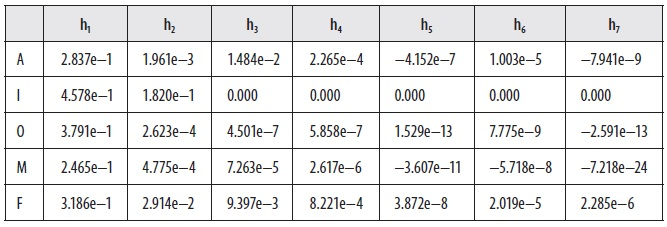

## (П]|(РС)|(РП) Сопоставление контуров

Теперь, имея довольно таки хорошее представление о том, что такое контур и как с ними работать, можно перейти к рассмотрению применения этих знаний на практике. Наиболее распространённой задачей является *сопоставление контуров* тем или иным способом. Может потребоваться сравнить два вычисленных контура между собой или сравнить вычисленный контур с каким-то абстрактным шаблон. Собственно далее пойдет речь именно об этих двух случаях.

### Моменты

Наиболее простым способом сравнения двух контуров является вычисление *моментов контура*. Грубо говоря, момент – это грубая характеристика контура, вычисляемая путем интегрирования (или суммирования) по всем пикселям контура. В общем, момент контура (p, q) определяется следующим образом:


где *p* порядок *x*, *q* порядок *y*, а термин *порядок* означает степень, в которую возводится компонента суммы. Суммирование ведется по всем пикселям границы контура (обозначено в уравнение как *n*). Если *p* и *q* равны 0, то момент  равен длине пикселей контура. (Математики-пуристы могут возразить, что  на самом деле не длина, а площадь контура. Но так как в рассмотрение берется только контур, а не весь многоугольник, длина и площадь, на самом деле, одно и тоже в дискретном пространстве пикселей (по крайней мере, для соответствующего дистанционного критерия в данном пространстве пикселей). Так же существует функция для вычисления моментов *IplImage* изображения; в этом случае,  будет фактически равен площади ненулевых пикселей).

Следующая функция вычисляет моменты контура:

```cpp
void cvContoursMoments(
 CvSeq* contour
,CvMoments* moments
)
```

Первый аргумент это контур, а второй это указатель на структуру, который необходимо создать для хранения возвращаемых данных. Структура *CvMoments* выглядит следующим образом:

```cpp
typedef struct CvMoments {

// пространственные моменты
double m00, m10, m01, m20, m11, m02, m30, m21, m12, m03;

// центральные моменты
double mu20, mu11, mu02, mu30, mu21, mu12, mu03;

// m00 != 0 ? 1/sqrt(m00) : 0
double inv_sqrt_m00;

} CvMoments;
```

Функция *cvContoursMoments()* использует только элементы *m00, m01, . . ., m03*; элементы с именами * mu00, . . .* используются при работе с другой функцией.

При работе со структурой *CvMoment*можно использовать вспомогательную функцию, которая будет возвращать конкретный момент из структуры:

```cpp
double cvGetSpatialMoment(
CvMoments*	moments
int 		x_order
int 		y_order
);
```

При первом вызове функция *cvContoursMoments()* вычисляет все моменты до третьего порядка (т.е.  и  будут вычислены после  и , но перед ).

### Подробнее о моментах

Только что описанное вычисление моментов дает некоторые элементарные характеристики контура, которые могут быть использованы для сравнения двух контуров. Тем не менее, моменты, получаемые из этих вычислений, в большинстве практических приложений не являются наилучшим способом для сравнения контуров. В частности, наиболее популярным подходом является использование *нормированных моментов* (так, объекты одинаковой формы, но разных размеров дают схожие значения). 

OpenCV предоставляет функции для вычисления нормированных моментов, а также *Hu инвариантного момента*. Структура *CvMoments* может быть вычислена при помощи *cvMoments()* или *cvContourMoments()*. Более того, для данного случая * cvContourMoments()* является псевдонимом для *cvMoments()*.

Стоит отметить один трюк, связанный с использованием *cvDrawContours()*: вызов одной из функций для работы с моментами на результате применения функции рисования контура позволяет контролировать заполнение контура.

```cpp
void cvMoments(
 const CvArr* image
,CvMoments* moments
,int isBinary = 0
);

double cvGetCentralMoment(
 CvMoments* moments
,int x_order
,int y_order
);

double cvGetNormalizedCentralMoment(
 CvMoments* moments
,int x_order
,int y_order
);

void cvGetHuMoments(
 CvMoments* moments
,CvHuMoments* HuMoments
);
```

Первая функция аналогична *cvContoursMoments()* за исключением того, что принимает изображение (вместо контура) и один дополнительный аргумент. Этот дополнительный аргумент, если он установлен в *CV_TRUE*, говорит *cvMoments()* рассматривать все пиксели либо как 1, либо как 0, где 1 присваивается любому пикселю отличному от нуля. При вызове этой функции все моменты вычисляются сразу, в том числе и центральные (см. следующий параграф).

*Центральные моменты* вычисляются почти так же, как и пространственные, за исключением того, что значения *x* и *y* имеют смещение на значение их среднего:


где  и .

Нормированные моменты вычисляются почти так же, как и центральные, за исключением того, что необходимо еще разделить на соответствующую степень  (под «соответствующей» подразумевается, что момент масштабируется за счет степени  в результате чего нормированный момент не зависит от масштаба объекта):


И в завершении, *Hu инвариантные моменты* являются линейными комбинациями центральных моментов. Идея заключается в том, чтобы комбинируя различными нормированными центральными моментами можно было бы создать инвариантные функции, представляющие различные аспекты изображения таким образом, чтобы они были инварианты к масштабированию, вращению и отражению (для всех, кроме )

Функция *cvGetHuMoments()* вычисляет *Hu* моменты на основе центральных моментов. Для полноты картины, ниже приведены фактические определения *Hu* моментов:


Глядя на рисунок 8-9 и таблицу 8-1 можно понять, как ведут себя *Hu* моменты. Не трудно заметить, что моменты уменьшаются по мере продвижения к более высоким порядкам. Это не должно вызывать удивления, т.к. по определению *Hu* моменты высших порядков имеют большее разнообразие нормированных коэффициентов. Т.к. каждый из этих коэффициентов меньше 1, их произведение и  увеличение их количества дает в результате меньшее число. 


Рисунок 8-9. Изображение пяти простых символов; глядя на их Hu моменты можно интуитивно определить их поведение

Таблица 8-1. Значения Hu моментов для пяти простых символов показанных на рисунке 8-9



Коэффициенты, вызывающие интерес: символ «I» симметричен при вращении на 180 градусов и отображении и значение моментов равно 0 для  - ; для символа «O», имеющий аналогичную симметрию, все моменты равны 0. 

### Сопоставление при помощи Hu моментов

