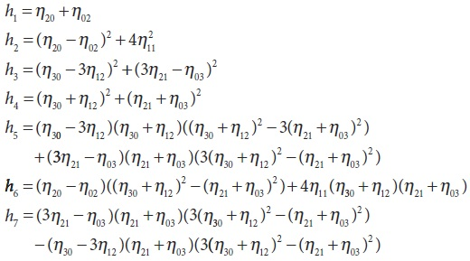
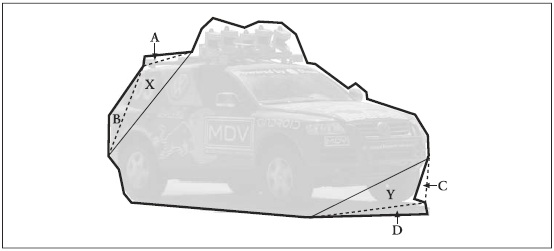
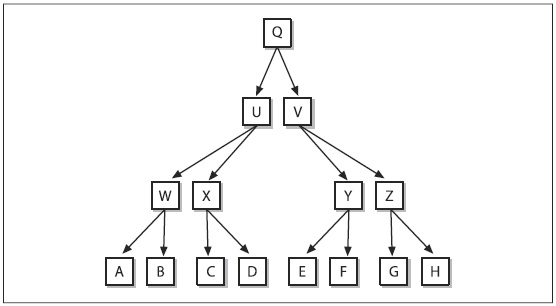
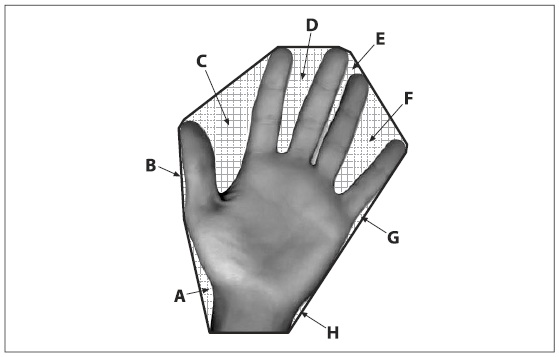

## (П]|(РС)|(РП) Сопоставление контуров

Теперь, имея довольно таки хорошее представление о том, что такое контур и как с ними работать, можно перейти к рассмотрению применения этих знаний на практике. Наиболее распространённой задачей является *сопоставление контуров* тем или иным способом. Может потребоваться сравнить два вычисленных контура между собой или сравнить вычисленный контур с каким-то абстрактным шаблон. Собственно далее пойдет речь именно об этих двух случаях.

### Моменты

Наиболее простым способом сравнения двух контуров является вычисление *моментов контура*. Грубо говоря, момент – это грубая характеристика контура, вычисляемая путем интегрирования (или суммирования) по всем пикселям контура. В общем, момент контура (p, q) определяется следующим образом:


где *p* порядок *x*, *q* порядок *y*, а термин *порядок* означает степень, в которую возводится компонента суммы. Суммирование ведется по всем пикселям границы контура (обозначено в уравнение как *n*). Если *p* и *q* равны 0, то момент  равен длине пикселей контура. (Математики-пуристы могут возразить, что  на самом деле не длина, а площадь контура. Но так как в рассмотрение берется только контур, а не весь многоугольник, длина и площадь, на самом деле, одно и тоже в дискретном пространстве пикселей (по крайней мере, для соответствующего дистанционного критерия в данном пространстве пикселей). Так же существует функция для вычисления моментов *IplImage* изображения; в этом случае,  будет фактически равен площади ненулевых пикселей).

Следующая функция вычисляет моменты контура:

```cpp
void cvContoursMoments(
 CvSeq* contour
,CvMoments* moments
)
```

Первый аргумент это контур, а второй это указатель на структуру, который необходимо создать для хранения возвращаемых данных. Структура *CvMoments* выглядит следующим образом:

```cpp
typedef struct CvMoments {

// пространственные моменты
double m00, m10, m01, m20, m11, m02, m30, m21, m12, m03;

// центральные моменты
double mu20, mu11, mu02, mu30, mu21, mu12, mu03;

// m00 != 0 ? 1/sqrt(m00) : 0
double inv_sqrt_m00;

} CvMoments;
```

Функция *cvContoursMoments()* использует только элементы *m00, m01, . . ., m03*; элементы с именами * mu00, . . .* используются при работе с другой функцией.

При работе со структурой *CvMoment*можно использовать вспомогательную функцию, которая будет возвращать конкретный момент из структуры:

```cpp
double cvGetSpatialMoment(
CvMoments*	moments
int 		x_order
int 		y_order
);
```

При первом вызове функция *cvContoursMoments()* вычисляет все моменты до третьего порядка (т.е.  и  будут вычислены после  и , но перед ).

### Подробнее о моментах

Только что описанное вычисление моментов дает некоторые элементарные характеристики контура, которые могут быть использованы для сравнения двух контуров. Тем не менее, моменты, получаемые из этих вычислений, в большинстве практических приложений не являются наилучшим способом для сравнения контуров. В частности, наиболее популярным подходом является использование *нормированных моментов* (так, объекты одинаковой формы, но разных размеров дают схожие значения). 

OpenCV предоставляет функции для вычисления нормированных моментов, а также *Hu инвариантного момента*. Структура *CvMoments* может быть вычислена при помощи *cvMoments()* или *cvContourMoments()*. Более того, для данного случая * cvContourMoments()* является псевдонимом для *cvMoments()*.

Стоит отметить один трюк, связанный с использованием *cvDrawContours()*: вызов одной из функций для работы с моментами на результате применения функции рисования контура позволяет контролировать заполнение контура.

```cpp
void cvMoments(
 const CvArr* image
,CvMoments* moments
,int isBinary = 0
);

double cvGetCentralMoment(
 CvMoments* moments
,int x_order
,int y_order
);

double cvGetNormalizedCentralMoment(
 CvMoments* moments
,int x_order
,int y_order
);

void cvGetHuMoments(
 CvMoments* moments
,CvHuMoments* HuMoments
);
```

Первая функция аналогична *cvContoursMoments()* за исключением того, что принимает изображение (вместо контура) и один дополнительный аргумент. Этот дополнительный аргумент, если он установлен в *CV_TRUE*, говорит *cvMoments()* рассматривать все пиксели либо как 1, либо как 0, где 1 присваивается любому пикселю отличному от нуля. При вызове этой функции все моменты вычисляются сразу, в том числе и центральные (см. следующий параграф).

*Центральные моменты* вычисляются почти так же, как и пространственные, за исключением того, что значения *x* и *y* имеют смещение на значение их среднего:


где  и .

Нормированные моменты вычисляются почти так же, как и центральные, за исключением того, что необходимо еще разделить на соответствующую степень  (под «соответствующей» подразумевается, что момент масштабируется за счет степени  в результате чего нормированный момент не зависит от масштаба объекта):


И в завершении, *Hu инвариантные моменты* являются линейными комбинациями центральных моментов. Идея заключается в том, чтобы комбинируя различными нормированными центральными моментами можно было бы создать инвариантные функции, представляющие различные аспекты изображения таким образом, чтобы они были инварианты к масштабированию, вращению и отражению (для всех, кроме )

Функция *cvGetHuMoments()* вычисляет *Hu* моменты на основе центральных моментов. Для полноты картины, ниже приведены фактические определения *Hu* моментов:



Глядя на рисунок 8-9 и таблицу 8-1 можно понять, как ведут себя *Hu* моменты. Не трудно заметить, что моменты уменьшаются по мере продвижения к более высоким порядкам. Это не должно вызывать удивления, т.к. по определению *Hu* моменты высших порядков имеют большее разнообразие нормированных коэффициентов. Т.к. каждый из этих коэффициентов меньше 1, их произведение и  увеличение их количества дает в результате меньшее число. 


Рисунок 8-9. Изображение пяти простых символов; глядя на их Hu моменты можно интуитивно определить их поведение

Таблица 8-1. Значения Hu моментов для пяти простых символов показанных на рисунке 8-9


Коэффициенты, вызывающие интерес: символ «I» симметричен при вращении на 180 градусов и отображении и значение моментов равно 0 для  - ; для символа «O», имеющий аналогичную симметрию, все моменты равны 0. 

### Сопоставление при помощи Hu моментов

```cpp
double cvMatchShapes(
 const void* object1
,const void* object2
,int method
,double parameter = 0
);
```

Потребность в сравнении двух объектов при помощи Hu моментов, так или иначе, может возникнуть. При этом есть множество определений "похожести". Чтобы сделать этот процесс несколько проще, в OpenCV есть функция *cvMatchShapes()*, которой необходимо просто передать два объекта и метод их сравнения.

Эти объекты могут быть серыми изображениями или контурами. Если будут переданы изображения, то функция сначала вычислит их моменты и только после это приступит к сравнению. Аргумент ** может иметь одно из значений, перечисленных в таблицы 8-2.

Таблица 8-2. Методы сравнения, используемые в cvMatchShapes()

| Значение method | Возвращаемое значение |
| -- | -- |
| CV_CONTOURS_MATCH_I1 |  |
| CV_CONTOURS_MATCH_I2 |  |
| CV_CONTOURS_MATCH_I3 |  |

В этой таблице  и  это:


Где  и  это Hu моменты *A* и *B* соответственно.

Каждая из трех констант, перечисленная в таблице 8-2, имеет разное значение в плане того, как вычисляются метрики сравнения. В конечном счете, эта метрика определяет возвращаемое функцией значение. Последний аргумент *parameter* на момент написания книги не использовался, поэтому смело можно присвоить ему значение по умолчанию равное 0.

### Иерархическое сравнение

Довольно таки часто будет возникать необходимость сравнения двух контуров, а так же придумывание признаков подобия, которые бы принимали во внимание всю структуру сопоставляемых контуров. Методы, использующие сводную характеристику (такие как моменты) довольно таки быстро, однако они могут задействовать не так много информации.

Для более точного сравнения будет полезно сначала рассмотреть структуру известную как *дерево контура*. Дерево контура не следует путать с иерархическим представлением контура, возвращаемое такими функциями, как *cvFindContours()*. Вместо этого они являются иерархическим представлением формы какого-то одного контура.

Понять что такое дерево контура проще, если сначала понять, как оно устроено. Построение дерева контура начинается снизу (конечные узлы) и заканчивается сверху (корневой узел). Процесс начинается с поиска периметра треугольных выступов и углублений (точки контура не всегда коллинеарны со своими соседями). Каждый такой треугольник замещается линией, которая соединяет две не смежные точки на кривой, таким образом, треугольник либо отсекается (треугольник D, рисунок 8-10), либо заполняется (треугольник C). Каждое такое замещение удаляет одну вершину из контура и добавляет одну вершину в дерево. Если такой треугольник имеет две стороны, соответствующие оригинальной части контуру, то это лист дерева; если одна из сторон данного треугольника является стороной существующего треугольника, то существующий треугольник является родителем для данного треугольника. Повторение данного процесса в конечном итоге сводит фигуру до четырех угольника, который в последующем разделяется пополам; получившиеся в результате треугольники являются детьми корневой вершины. 



Рисунок 8-10. Построение дерева контура: в первом проходе вокруг автомобиля создаются конечные узлы A, B, C, и D; во втором проходе создаются X и Y (X является родителем для A и B, а Y является родителем для C и D)

Результирующее бинарное дерево (рисунок 8-11) в конечном счете, кодирует информацию о форме исходного контура. Каждый узел несет в себе информацию о треугольнике, с которым он связан (размер, а так же способ создания: отсечение или заполнение).

После того, как деревья построены, они могут быть использованы для эффективного сравнения двух контуров. 
Процесс сравнения начинается с попыток установки соответствия между узлами двух деревьев, а затем сравнения характеристик соответствующих узлов. Конечным результатом является степень сходства двух деревьев.

На практике не обязательно понимать все тонкости этого процесса. OpenCV предоставляет процедуры, позволяющие автоматически создавать деревья контуров из обычных *CvContour* объектов и конвертировать их обратно; так же имеется метод для сравнения двух деревьев. Но, к сожалению, данные деревья не очень надежные (так, незначительные изменения в контуре могут существенно изменить дерево). Кроме того, первоначальный треугольник (корень дерева) выбирается произвольно. В результате, чтобы получить лучшее представление вначале необходимо применить функцию *cvApproxPoly()*, а затем выровнять контур (выполняя циклический сдвиг), чтобы начальный треугольник стал значительно менее зависимым от вращений.

```cpp
CvContourTree* cvCreateContourTree(
 const CvSeq* contour
,CvMemStorage* storage
,double threshold
);

CvSeq* cvContourFromContourTree(
 const CvContourTree* tree
,CvMemStorage* storage
,CvTermCriteria criteria
);

double cvMatchContourTrees(
 const CvContourTree* tree1
,const CvContourTree* tree2
,int method
,double threshold
);
```



Рисунок 8-11. Бинарное представление двоичного дерева, которое может соответствовать контуру с рисунка 8-10

Этот код ссылается на структуру *CvTermCriteria*, о которой более подробно пойдет речь в главе 9. А пока достаточно будет знать, что эту структуру можно создать при помощи *cvTermCriteria()* с использованием следующих значений по умолчанию:

```cpp
CvTermCriteria termcrit = cvTermCriteria( CV_TERMCRIT_ITER | CV_TERMCRIT_EPS, 5, 1 )
);
```

### Выпуклость контура и дефекты выпуклости

Ещё один полезный способ, позволяющий понять, что такое форма объекта или контур это вычислить каркас выпуклости для объекта, а затем вычислить *дефект выпуклости*. Формы многих сложных объектов хорошо характеризуются такими дефектами.

Рисунок 8-12 иллюстрирует концепцию дефекта выпуклости, используя изображение человеческой руки. Каркас выпуклости изображен тёмной линией вокруг руки, а дефекты, относящиеся к этому каркасу, помечены буквами от A до H. Как можно было заметить, эти дефекты позволяют характеризовать не только саму руку, но так же и её состояние.

```cpp
#define CV_CLOCKWISE 1
#define CV_COUNTER_CLOCKWISE 2
 
CvSeq* cvConvexHull2(
 const CvArr* input
,void* hull_storage = NULL
,int orientation = CV_CLOCKWISE
,int return_points = 0
);
 
int cvCheckContourConvexity(
 const CvArr* contour
);
 
CvSeq* cvConvexityDefects(
 const CvArr* contour
,const CvArr* convexhull
,CvMemStorage* storage = NULL
);
```


Рисунок 8-12. Дефекты выпуклости: черная линия это каркас выпуклости вокруг руки; сетчатые регионы (A-H) это дефекты выпуклости контура руки по отношению к выпуклой оболочке

В OpenCV есть три наиболее важных метода, которые занимаются сложными каркасами и выпуклостями. Первый просто вычисляет каркас контура, а второй позволяет проверить является ли контур выпуклым. Третий метод вычисляет дефекты выпуклости в контуре, для которого уже известен каркас выпуклости.

Функция *cvConvexHull2()* в качестве первого аргумента принимает массив точек. Этот массив обычно является матрицей из двух столбцов и n строк (т.е. nx2) или контуром. Точки должны быть 32-битным целым (*CV_32SC1*) или вещественным (*CV_32FC1*) числом. Следующий аргумент уже привычное хранилище памяти, в котором можно выделить место под результат. Следующий аргумент может быть либо *CV_CLOCKWISE*, либо *CV_COUNTER_CLOCKWISE*, определяющий ориентацию точек, которые будут возвращены функцией. Последний аргумент *returnPoints* может быть 0 или 1. Если установлен в 0, то в возвращаемом массиве будут сохранены только индексы (при этом, если аргумент имеет тип  *CvSeq** или *CvContour**, то результатом будут указатели на точки), которые ссылаются на записи в массиве, переданного в *cvConvexHull2()*.

В этом месте внимательный читатель может спросить: "Если аргумент *hull_storage* это хранилище памяти, то почему он имеет тип *void**?". Это хороший вопрос. Так вот причина в том, что во многих случаях удобнее, если точки каркаса были размещены в массиве, а не в последовательности. Принимая это во внимание, появляется возможность для передачи указателя на матрицу *CvMat** через аргумент *hull_storage*. В этом случае матрица должна быть одномерной и иметь столько же записей, сколько входных точек. На самом деле при вызове *cvConvexHull2()* заголовок матрицы будет меняться в соответствии с требуемым количеством столбцов. (Память выделенная под данные матрицы не перераспределяется в любом случае. Так как массивы являются C-массивами, то при удалении матриц память будет освобождаться верно).

Иногда уже при наличии контура, не известно является ли он выпуклым. В этом случае можно воспользоваться функцией *cvCheckContourConvexity()*. Тестирование данной функцией выполняется просто и быстро (на самом деле это занимает O(N) времени, что немного быстрее, чем O(N logN) времени, необходимого для построения каркаса выпуклости), однако данная функция будет некорректно работать, если контур содержит самопересечения.

