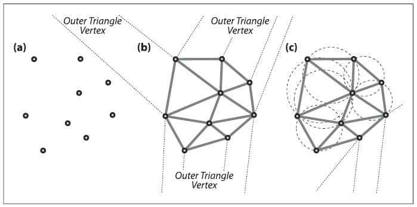

## (П]|(РС)|(РП) Триангуляция Delaunay, тесселяция Voronoi

*Триангуляция Delaunay* - это техника, изобретенная в 1934 для соединения точек в пространстве в треугольную группу таким образом, чтобы минимальный угол среди всех углов в триангуляции был максимальным. Это означает, что триангуляция Delaunay пытается избегать "тонких" треугольников при триангуляции точек. Для того чтобы понять суть триангуляции посмотрите на рисунок 9-12: любая окружность, описанная вокруг вершин любого треугольника не содержит других вершин. Это называется *свойство описанной окружности* (часть c на рисунке).

Для вычислительной эффективности, алгоритм Delaunay начинает свою работу с самого далекого внешне ограничивающего треугольника. На рисунке 9-12(b) фиктивный внешний треугольник представлен пунктирными линиями, сходящимся в вершине. На рисунке 9-12(c) представлено несколько примеров описанных окружностей, при этом один из них связывает две реальные вершины и одну из вершин фиктивного внешнего треугольника.

Рисунок 9-12. Триангуляция Delaunay: (a) множество точек; (b) Триангуляция Delaunay для набора точек, с пунктирными линиями до внешнего ограничивающего треугольника; (c) пример описанных окружностей

На сегодняшний день существует множество алгоритмов для расчета триангуляции Делоне; некоторые из них очень эффективные, но со сложными деталями реализации. Суть одного из наиболее простых алгоритмов в следующем:

1. Добавить внешний треугольник и начать с одной из его вершин (это дает точную внешнюю отправную точку)
2. Добавить внутреннюю точку; затем "пройтись" по всем треугольникам с описанной окружностью содержащих эту точку и удалить эти триангуляции
3. Re-triangulate график, включая новые точки в описанную окружность простым удалением триангуляций.
4. Возвращаться к шагу 2 до тех пор, пока не останется точек для добавления.

Сложность этого алгоритма составляет O(). Наиболее эффективные алгоритмы (в среднем) имеют сложность O(n log log n).

Отлично – но для чего все это нужно? С одной стороны, нужно помнить, что этот алгоритм начинает свою работу с фиктивного внешнего треугольника, поэтому все настоящие внешние точки, на самом деле, соединены с двумя вершинами этого треугольника. Так, а описанная окружности - это окружность, проходящая через две реальные внешние точки и одну фиктивную внешнюю вершину, не содержит других внутренних вершин. Это означает, что компьютер сможет определить, какие реальные точки образуют внешний контур набора точек, просто просмотрев те точки, которые соединены с тремя внешними фиктивными вершинами. Другими словами, можно найти скелет набора точек сразу после того, как будет выполнена триангуляция Delaunay. 

Так же можно определить, кто "владеет" пространством между точками, а именно, чьи координаты являются ближайшими соседями до вершин Delaunay. Таким образом, используя триангуляцию Delaunay, можно найти ближайшего соседа для новой точки. Такое разбиение на плоскости называется *тесселяция Voronoi*. Тесселяция является двойным образом триангуляции Delaunay, потому что линии Delaunay определяют расстояние между существующими точками, а линии Voronoi  «знают», где они должны пересекаться с линиями Delaunay для сохранения равного расстояния между точками. Эти два метода для нахождения выпуклой оболочки и ближайшего соседа, являются основными операциями кластеризации и классификации точек и наборов точек.

Рисунок 9-13. Тесселяция Voronoi, в результате которой все точки в пределах данной ячейки Voronoi являются ближайшими к своим точкам Delaunay, чем к любым другим точкам Delaunay: (a) триангуляция Delaunay жирными линиями и соответствующая тесселяции Voronoi тонкими линиями, (b) ячейки Voronoi вокруг каждой точки Delaunay.

Все те, кто знаком с 3D графикой может заметить, что триангуляция Delaunay зачастую используется как основа для представления 3D фигур. Если имеется 3D представление объекта, то можно создать 2D представление этого объекта с помощью проекции, а затем использовать триангуляцию Delaunay для анализа и идентификации объекта и/или для сравнения его с реальным объектом. Триангуляция Delaunay это связующее звено между компьютерным зрением и компьютерной графикой. Однако, триангуляция Delaunay в OpenCV выполняется только для двумерного измерения (в дальнейшем планируется это исправить, глава 14). Если бы существовала возможность триангулировать множество 3D точек – скажем для стереозрения (глава 11) – то можно было бы плавно переходить между 3D графикой и компьютерным зрением. Тем не менее, 2D триангуляция Delaunay часто используется в компьютерном зрении для того, чтобы зарегистрировать пространственное расположение особенностей на объекте или сцене для отслеживания движений, распознавания объектов или для сравнения проекций с двух разных камер (при выводе глубины стереозрения). На рисунке 9-14 показано, как можно отслеживать и распознавать объекты при помощи триангуляции Delaunay, где ключевые точки лица пространственно классифицированы в соответствии с их триангуляцией.

Рисунок 9-14. Точки Delaunay могут быть использованы для слежения за объектами; здесь лицо отслеживается с помощью точек, по которым можно также определить эмоции

Теперь, когда установлена потенциальная полезность триангуляции Delaunay, но как собственно получить эту триангуляцию? Для решения этого задачи, OpenCV поставляется вместе с примером *.../opencv/samples/c/delaunay.c*. OpenCV ссылается на триангуляцию Delaunay как на подраздел Delaunay, критические и многоразовые части который будут рассмотрены в следующих разделах.

