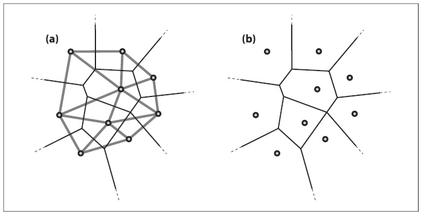
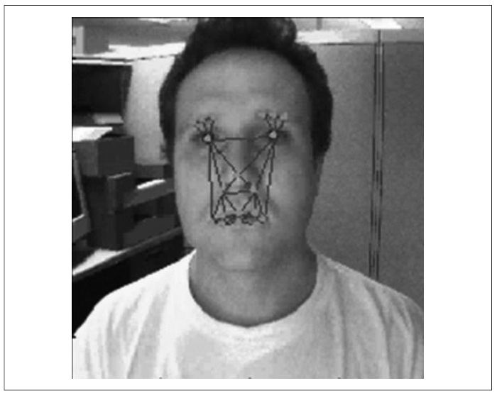
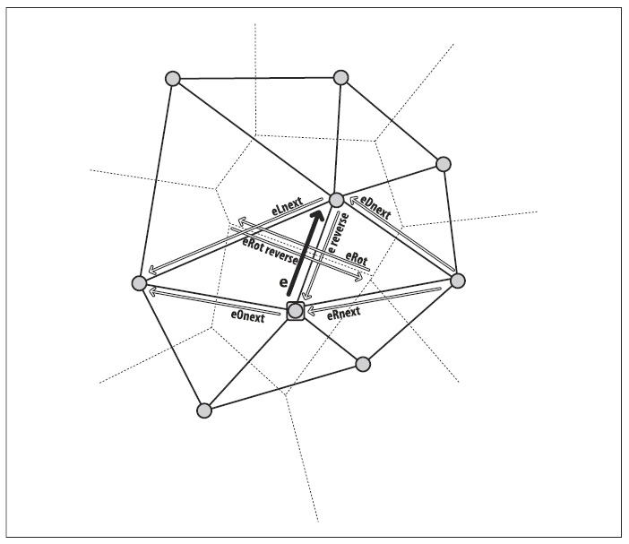
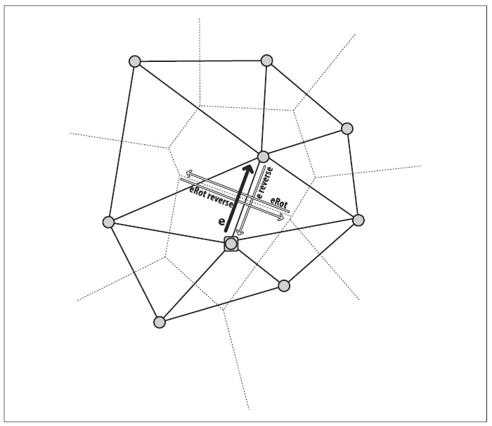
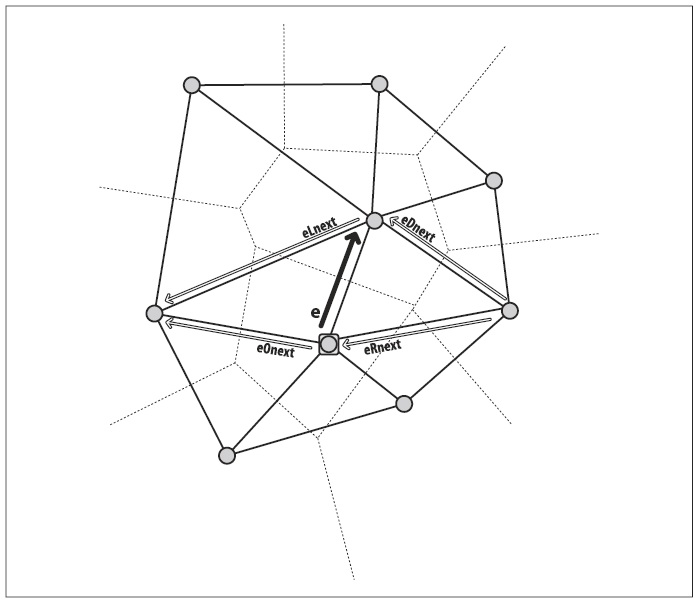

## (П]|(РС)|(РП) Триангуляция Delaunay, тесселяция Voronoi

*Триангуляция Delaunay* - это техника, изобретенная в 1934 для соединения точек в пространстве в треугольную группу таким образом, чтобы минимальный угол среди всех углов в триангуляции был максимальным. Это означает, что триангуляция Delaunay пытается избегать "тонких" треугольников при триангуляции точек. Для того чтобы понять суть триангуляции посмотрите на рисунок 9-12: любая окружность, описанная вокруг вершин любого треугольника не содержит других вершин. Это называется *свойство описанной окружности* (часть c на рисунке).

Для вычислительной эффективности, алгоритм Delaunay начинает свою работу с самого далекого внешне ограничивающего треугольника. На рисунке 9-12(b) фиктивный внешний треугольник представлен пунктирными линиями, сходящимся в вершине. На рисунке 9-12(c) представлено несколько примеров описанных окружностей, при этом один из них связывает две реальные вершины и одну из вершин фиктивного внешнего треугольника.


Рисунок 9-12. Триангуляция Delaunay: (a) множество точек; (b) Триангуляция Delaunay для набора точек, с пунктирными линиями до внешнего ограничивающего треугольника; (c) пример описанных окружностей

На сегодняшний день существует множество алгоритмов для расчета триангуляции Делоне; некоторые из них очень эффективные, но со сложными деталями реализации. Суть одного из наиболее простых алгоритмов в следующем:

1. Добавить внешний треугольник и начать с одной из его вершин (это дает точную внешнюю отправную точку)
2. Добавить внутреннюю точку; затем "пройтись" по всем треугольникам с описанной окружностью содержащих эту точку и удалить эти триангуляции
3. Re-triangulate график, включая новые точки в описанную окружность простым удалением триангуляций.
4. Возвращаться к шагу 2 до тех пор, пока не останется точек для добавления.

Сложность этого алгоритма составляет O(). Наиболее эффективные алгоритмы (в среднем) имеют сложность O(n log log n).

Отлично – но для чего все это нужно? С одной стороны, нужно помнить, что этот алгоритм начинает свою работу с фиктивного внешнего треугольника, поэтому все настоящие внешние точки, на самом деле, соединены с двумя вершинами этого треугольника. Так, а описанная окружности - это окружность, проходящая через две реальные внешние точки и одну фиктивную внешнюю вершину, не содержит других внутренних вершин. Это означает, что компьютер сможет определить, какие реальные точки образуют внешний контур набора точек, просто просмотрев те точки, которые соединены с тремя внешними фиктивными вершинами. Другими словами, можно найти скелет набора точек сразу после того, как будет выполнена триангуляция Delaunay. 

Так же можно определить, кто "владеет" пространством между точками, а именно, чьи координаты являются ближайшими соседями до вершин Delaunay. Таким образом, используя триангуляцию Delaunay, можно найти ближайшего соседа для новой точки. Такое разбиение на плоскости называется *тесселяция Voronoi*. Тесселяция является двойным образом триангуляции Delaunay, потому что линии Delaunay определяют расстояние между существующими точками, а линии Voronoi  «знают», где они должны пересекаться с линиями Delaunay для сохранения равного расстояния между точками. Эти два метода для нахождения выпуклой оболочки и ближайшего соседа, являются основными операциями кластеризации и классификации точек и наборов точек.



Рисунок 9-13. Тесселяция Voronoi, в результате которой все точки в пределах данной ячейки Voronoi являются ближайшими к своим точкам Delaunay, чем к любым другим точкам Delaunay: (a) триангуляция Delaunay жирными линиями и соответствующая тесселяции Voronoi тонкими линиями, (b) ячейки Voronoi вокруг каждой точки Delaunay.

Все те, кто знаком с 3D графикой может заметить, что триангуляция Delaunay зачастую используется как основа для представления 3D фигур. Если имеется 3D представление объекта, то можно создать 2D представление этого объекта с помощью проекции, а затем использовать триангуляцию Delaunay для анализа и идентификации объекта и/или для сравнения его с реальным объектом. Триангуляция Delaunay это связующее звено между компьютерным зрением и компьютерной графикой. Однако, триангуляция Delaunay в OpenCV выполняется только для двумерного измерения (в дальнейшем планируется это исправить, глава 14). Если бы существовала возможность триангулировать множество 3D точек – скажем для стереозрения (глава 11) – то можно было бы плавно переходить между 3D графикой и компьютерным зрением. Тем не менее, 2D триангуляция Delaunay часто используется в компьютерном зрении для того, чтобы зарегистрировать пространственное расположение особенностей на объекте или сцене для отслеживания движений, распознавания объектов или для сравнения проекций с двух разных камер (при выводе глубины стереозрения). На рисунке 9-14 показано, как можно отслеживать и распознавать объекты при помощи триангуляции Delaunay, где ключевые точки лица пространственно классифицированы в соответствии с их триангуляцией.



Рисунок 9-14. Точки Delaunay могут быть использованы для слежения за объектами; здесь лицо отслеживается с помощью точек, по которым можно также определить эмоции

Теперь, когда установлена потенциальная полезность триангуляции Delaunay, но как собственно получить эту триангуляцию? Для решения этого задачи, OpenCV поставляется вместе с примером *.../opencv/samples/c/delaunay.c*. OpenCV ссылается на триангуляцию Delaunay как на подраздел Delaunay, критические и многоразовые части который будут рассмотрены в следующих разделах.

### Построение триангуляции Delaunay и тесселяции Voronoi

Для начала необходимо выделить место под хранение результатов триангуляции и тесселяции. Так же нужен внешний ограничивающий прямоугольник (чтобы ускорить вычисления, алгоритм должен работать с фиктивным внешним треугольником, расположенным за пределами ограничивающего прямоугольника). Что бы все это сделать, предположим, что точки располагаются внутри изображения 600x600:

```cpp
// Хранилище и структура для DELAUNAY SUBDIVISION
//
CvRect rect = { 0, 0, 600, 600 }; // Внешний ограничивающий прямоугольник
CvMemStorage* storage; // Хранилище
storage = cvCreateMemStorage(0); // Инициализация хранилища
CvSubdiv2D* subdiv; // The subdivision itself
subdiv = init_delaunay( storage, rect);
```

Код использует вызов функции *init_delaunay()*, которая является удобной "упаковкой" нескольких функций OpenCV:

```cpp
// инициализация удобной функции для DELAUNAY SUBDIVISION
//
CvSubdiv2D* init_delaunay(
    CvMemStorage* storage,
    CvRect rect
    ) {
        CvSubdiv2D* subdiv;
        subdiv = cvCreateSubdiv2D(
            CV_SEQ_KIND_SUBDIV2D,
            sizeof(*subdiv),
            sizeof(CvSubdiv2DPoint),
            sizeof(CvQuadEdge2D),
            storage
        );
        cvInitSubdivDelaunay2D( subdiv, rect ); // установка ограничительного прямоугольника
        return subdiv;
}
```

Далее необходима логика добавления точек. Эти точки должны быть типа float, 32F:

```cpp
CvPoint2D32f fp; // This is our point holder
for( i = 0; i < as_many_points_as_you_want; i++ ) {
    // However you want to set points
    //
    fp = your_32f_point_list[i];
    cvSubdivDelaunay2DInsert( subdiv, fp );
}
```

Можно конвертировать целые точки в 32f точки с помощью удобного макроса *cvPoint2D32f(double x, double y)* или *cvPointTo32f(CvPoint point)*, расположенного в *cxtypes.h*. Теперь, когда можно добавлять точки в триангуляцию Делоне, можно создавать и удалять соответствующую тесселяцию Вороного:

```cpp
cvCalcSubdivVoronoi2D( subdiv ); // Занести данные Voronoi в subdiv
cvClearSubdivVoronoi2D( subdiv ); // Удалить данные Voronoi из subdiv
```

В обеих функциях *subdiv* имеет тип *CvSubdiv2D**. Теперь можно создавать триангуляции Delaunay из 2-х мерных наборов точек с последующим созданием и удалением тесселяций Voronoi. Однако, как получить нужные данные из этих структур? Это можно сделать, шагая от ребра к вершине или от ребра к ребру в *subdiv*; на рисунке 9-15 показаны основные манёвры, начиная с данного ребра и его точки отсчета. Далее можно найти первые ребра или вершины двумя разными способами: (1) используя внешнюю точку для обнаружения ребра или вершин; или (2) шагая по последовательности вершин или рёбер. 

### Перемещение по подразделам Delaunay

Рисунок 9-15 сочетает в себе две структуры данных, которые будут использованы для перемещения по подразделам графа. 

Структура *cvQuadEdge2D* содержит набор из двух точек Delaunay и двух точек *Voronoi*, и связанные с ними рёбра (предполагается, что точки Voronoi и рёбра были рассчитаны с помощью *cvCalcSubdivVoronoi2D()*); рисунок 9-16. Структура *CvSubdiv2DPoint* содержит ребро Delaunay с сопутствующей вершиной, как показано на рисунке 9-17. Структура из четырёх рёбер определена в соответствии с рисунком.



Рисунок 9-15. Ребра относительно данного ребра, с меткой "e", и его вершина (отмечена квадратом)



Рисунок 9-16. Quad edges, к которым можно получить доступ при помощи cvSubdiv2DRotateEdge(), включая ребро Delaunay и противоположное ему ребро, а также соответствующие рёбра и вершины Voronoi



Рисунок 9-17. CvSubdiv2DPoint вершина и связанное с ней ребро e, вместе с другими связанными рёбрами, которые могут быть получены с помощью cvSubdiv2DGetEdge()

```cpp
// Рёбра представляют собой длинные целые числа. Младшие два бита
// это их индекс (0..3), а старшие - quad-edge указатель.
// 
typedef long CvSubdiv2DEdge;

// поля структуры quad-edge
//
#define CV_QUADEDGE2D_FIELDS() 
    int flags; 
    struct CvSubdiv2DPoint* pt[4]; 
    CvSubdiv2DEdge next[4];
 
typedef struct CvQuadEdge2D {
    CV_QUADEDGE2D_FIELDS()
} CvQuadEdge2D;
```

Точки подраздела Delaulay и соответствующая структура ребра определяется следующим образом:

```cpp
#define CV_SUBDIV2D_POINT_FIELDS() 
    int flags; 
    CvSubdiv2DEdge first; /*The edge "e" in the figures.*/
    CvPoint2D32f pt;
 
#define CV_SUBDIV2D_VIRTUAL_POINT_FLAG (1 << 30)
 
typedef struct CvSubdiv2DPoint
{
    CV_SUBDIV2D_POINT_FIELDS()
}
CvSubdiv2DPoint;
```

С помощью этих структур, можно рассмотреть различные способы перемещения по вершинам и рёбрам.

**Обход рёбер**

